

  

© 2017 by Bruno Luvizotto Carli

 

 

 

Esta obra é licenciada sob a Licença Creative Commons
Atribuição–Não Comercial 2.5 Brasil. Você pode
compartilhar e adaptar o conteúdo deste material desde
que os devidos créditos sejam dados ao autor do trabalho.
Para ver uma cópia desta licença, visite
http://creativecommons.org/licenses/by-ncsa/2.5/br/ ou
envie uma carta para Creative Commons, 171 Second
Street, Suite 300, San Francisco, California 94105, USA.

Índices para catálogo sistemático:

1. Computadores: Programação;
2. Programação de computadores;
3. Algoritmos;
4. Linguagem de Programação;

    

2˚ Edição

  

CAPA: Bruno L. Carli.
Adaptado de: https://pixabay.com/pt/animal-a-fotografiaanimal-close-up-1853944/

       

Contato: brunolcarli@gmail.com

           

 

       

BRUNO LUVIZOTTO CARLI

      

Algoritmos e lógica de
programação com Python

      

2˚ Edição 

      

Curitiba, PR

Edição do Autor

2018

  

      
      

> <small>Para meu pai, que me disse
que computação era besteira...</small>

      
      

 

# Sumário

__inprogress

* [Apresentação](sessions/apresentacao.md)
* [Capítulo 1](sessions/ch1.md)
    - [Conceito de Algoritmo](sessions/ch1.md##conceito-de-algoritmo)
    - [Algoritmos para a lógica de programação](##algoritmos-para-a-logica-de-programacao) 
    - [Tipos de algoritmo](sessions/ch1.md##tipos-de-algoritmos)
    - [Python](sessions/ch1.md##python)
* [Capítulo 2](#capitulo-2)
    - [Construindo algoritmos com Python](##construindo-algoritmos-com-python)
    - [Variáveis e tipos de dados](##variaveis-e-tipos-de-dados)
    - [Variáveis em Python](##variaveis-em-python)
    - [Constantes](##constantes)
    - [Expressões](##expressões)
    - [Funções Intrínsecas](##funcões-intrinsecas)
    - [Entrada de dados](##entrada-de-dados)
* [Capítulo 3](#capitulo-3)
    - [Comentários](##comentarios)
    - [Estruturas Condicionais](##estruturas-condicionais)
    - [Estrutura condicional simples](##estrutura-condicional-simples)
    - [Estrutura condicional composta](##estrutura-condicional-composta)
    - [Estrutura condicional aninhada](##estrutura-condicional-aninhada)
* [Capítulo 4](#capitulo-4)

# Capítulo 2

## Construindo algoritmos com Python

Antes de efetivamente construir nossos algoritmos é
importante sabermos como elaborar um algoritmo. Ascencio e Campos (2010, p. 3) definem um método para construção de algoritmos, sendo estruturado a partir de alguns elementos básicos, dentre eles:

1. Compreender o problema a ser resolvido;
2. Definir os dados de entrada que deverão ser fornecidos;
3. Definir o processamento, quais operações deverão ser executadas sobre os dados;
4. Definir a saída final, exibindo o resultado obtido através do processamento dos dados;
5. Construir o algoritmo;
6. Testar o algoritmo através de simulações;

Vamos realizar cada uma destas etapas e comparar o
último exemplo de algoritmo fornecido (soma de dois
números) em Pseudocódigo e Python para ter uma boa visão de como seria um algoritmo implementado em Python 3:

1. **Problema a ser resolvido**: Somar dois números;
2. **Dados de entrada**: numero1 e numero2;
3. **Processamento**: Somar o numero1 com o numero2;
4. **Saída**: Exibir o resultado da soma;
5. **Construção do algoritmo**:

| Pseudocódigo | Python |
| ------------ | ------ |
| ALGORITMO: soma | |
| VAR num1,num2,soma:inteiro | |
| INICIO | |
| LEIA(num1) | num1 = input("Insira o primeiro numero ") | 
| LEIA(num2) | num2 = input("Insira o segundo numero ")|
|soma ← num1 + num2 | soma = int(num1) + int(num2)|
| ESCREVA(soma) | print("Resultado: ", soma)|
| FIM. | |

Perceba de acordo com a tabela acima que algumas declarações feitas em pseudocódigo não são necessárias em Python.

Para testar o algoritmo abra seu IDLE e selecione na
parte superior a opção <i>File</i> então <i>New File</i>, uma nova janela se abrirá para que você possa escrever o algoritmo, escreva o algoritmo Python apresentado (recomenda-se fortemente que você <b>escreva</b> os comandos ao invés de copiar e colar) então selecione a opção <i>Run</i> e então <i>Run Module</i> na caixa de ferramentas na parte superior da tela, ao executar o algoritmo no IDLE será solicitado que você salve seu programa, então selecione um diretório de sua preferência e salve o arquivo com a extensão .py (uma sugestão é que salve este primeiro algoritmo como soma.py). Após salvar o arquivo, o Python irá executar seu algoritmo e se tudo ocorrer bem sua saída deve ser
parecida com a da Figura 7:

Figura 7 – Saída do algoritmo soma.py

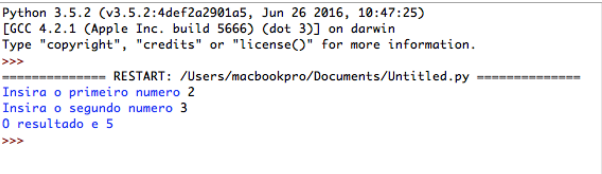

Fonte: O autor.

Agora vamos entender os comandos utilizados nesse
algoritmo Python, primeiro criamos uma variável num1 (vamos ver mais sobre variáveis adiante) e atribuímos a ela o valor de entrada recebido em input(). O comando input() em Python 3 permite que o usuário entre com um valor que será tratado como string (veremos mais sobre tipos de dados adiante), este comando também permite que um texto seja passado como argumento e exibido na tela, neste caso passamos o texto “Insira o primeiro numero ” como argumento. Quando o interpretador Python ler esta instrução ele vai primeiro exibir o texto ao usuário e ficará aguardando uma entrada, logo que o usuário do sistema fornecer um valor de entrada e confirmar, o interpretador executará a próxima instrução do algoritmo, que será, neste caso, a atribuição de mais um valor de entrada para a variável num2, da mesma forma como fizemos na primeira instrução.

A terceira instrução do algoritmo soma.py irá realizar a operação de processamento que soma num1 e num2 e armazena seu resultado em uma variável chamada soma, para isto utilizamos um método chamado int() que irá dizer ao interpretador Python que durante este processamento as variáveis num1 e num2 devem ser tratadas como números inteiros<small>1</small>.

Por fim a instrução print() diz ao Python para escrever na tela, este é um comando de saída de dados, e exibirá na tela os argumentos que forem fornecido à instrução print(). Neste caso fornecemos um argumento em forma de texto dizendo “O resultado da soma e ” e adicionamos uma vírgula (,) para separar o próximo argumento que foi a variável soma, desta forma o comando de saída exibirá o texto fornecido e o valor guardado na variável soma.

<small>1</small> : 
<small>Uma observação importante é que, em Python 3 o comando input( ) vai receber sempre os
dados em formato de cadeia de caracteres (string), sendo tratada como um texto, por este
motivo a necessidade de converter para números os valores isneridos através da instrucão
int( ), em Python 2 o comando input( ) receberia apenas valores numéricos e caso o
usuário entrasse com uma letra ou simbolo o Python retornaria um erro. Em python 2 há
um comando específico para receber entradas de texto chamado raw_input( ). Não se
preocupe com isso por enquanto, mais para frente quando você estiver mais familiarizado
com os tipos de dados isto se tornará mais simples de compreender.</small>

 

## Variáveis e tipos de dados

Variáveis em Algoritmos e Lógica de Programação são
valores que podem sofrer alterações no decorrer do algoritmo. Ascencio e Campos (2010, p. 7) afirma que “Um algoritmo e, posteriormente, um programa, recebem dados, que precisam ser armazenados no computador para serem posteriormente utilizados no processamento. Esse armazenamento é feito na
memória”, logo, sempre que declaramos uma variável em
nosso algoritmo o computador irá separar um espaço na
memória para que um dado possa ser armazenado ali. Segundo Ascencio e Campos(Op. Cit) uma variável “possui nome e tipo, e seu conteúdo pode variar ao longo do tempo, durante a execução de um programa. Embora uma variável possa assumir diferentes valores, ela só pode armazenar um valor a cada instante”.

Agora vamos fazer uma pequena abstração, imagine um
garoto chamado Pedrinho. Pedrinho possui uma variável
chamada idade que neste exato momento possui o valor 7, representando que Pedrinho tem 7 anos. No seu próximo aniversário Pedrinho completará mais um ano de vida então o valor da sua variável idade será incrementado em um, passando agora a representar o valor 8. Esta pequena analogia demonstra a mutabilidade dos valores guardados em uma variável, que recebe este nome justamente por seus valores variarem ao longo de um algoritmo.

As variáveis sempre guardam valores de um respectivo
tipo de dado, que de acordo com Ascencio e Campos (2010, p.8) os mais comuns são numéricos, lógicos e literais.

*Numéricos*

Os dados do tipo numérico são divididos em duas
categorias: Inteiros e Reais. “Os números inteiros podem ser positivos ou negativos e não possuem parte
fracionária”(ASCENCIO; CAMPOS, 2010), como exemplo de
números inteiros temos:

12, -7, 154, 0, -98

Os números Reais são aqueles que possuem uma parte
fracionária e podem ser positivos ou negativos, como por exemplo:

3.14, 2.9876, -1.98,  0.765

Uma observação importante deixada por Ascencio e
Campos (2010) é que “os números reais seguem a notação da língua inglesa, ou seja, a parte decimal é separada da parte inteira por um . (ponto) e não por uma , (vírgula)” é importante compreender isso desde o início pois poderá evitar complicações futuras quando implementar seu algoritmo.

 

*Lógicos*

Os valores lógicos, também chamados de booleanos
(ASCENCIO; CAMPOS, 2010), somente podem assumir dois
valores: verdadeiro ou falso. Estes são utilizados muitas vezes em comparações lógicas e verificações condicionais (veremos mais sobre isto nos próximos capítulos).

 

*Literais*

Os dados do tipo literal são formados por sequências de caracteres (letras maiúsculas, minúsculas e símbolos) ou por um único caractere(ASCENCIO; CAMPOS, 2010). Este tipo de dado é popularmente chamado de string, sendo representado pelo texto envolto por “aspas”, como no exemplo a seguir:

 “aluno” 

 “Carro”

 “Minha casa é azul”

 “fulano@email.com”

 “12 x 10 =”

 “F$0c!3^y

Perceba que mesmo os numerais que estiverem entre
aspas serão identificados como dados literais, e Puga e Rissetti (2010, p. 37) afirmam que “Os números armazenados em uma variável cujo tipo de dado é literal não poderão ser utilizadas
para cálculo”, somente sendo possível realizar operações matemáticas com as variáveis do tipo numérico, desta forma é importante conhecer os tipos de dados que estamos trabalhando.

><small>Definir o tipo de dado mais adequado para ser armazenado em uma variável é uma questão de grande importância para garantir a resolução do problema. Ao desenvolver um algoritmo, é necessário que se tenha conhecimento prévio do tipo de informação (dado) que será utilizado para resolver o problema proposto. Daí, escolhe-se o tipo adequado para a variável que representa esse valor. (PUGA; RISSETTI, 2010, p. 36)</small>

As variáveis também possuem identificadores, que nada
mais são do que o seu próprio nome. Sempre que definimos
uma variável a declaramos com um nome, este nome chama-se
identificador, praticamente todos os comandos possuem
identificadores, o print( ) é um identificador para uma rotina
de exibição de dados por exemplo.

É importante saber que existem algumas regras para
formação dos identificadores, segundo Ascencio e
Campos(2010, p. 9), sendo elas:

+ Somente podem ser utilizadas letras maiúsculas,
minúsculas, números e o caracter sublinhado ( _ ) no
nome das variáveis;

+ O caractere inicial deve obrigatoriamente ser uma letraou o caractere sublinhado, não se deve começar o nome da variável por números;

+ Não são permitidos espaços em branco nem caracteres especiais (!@#$%^&*+-<>=...) com exceção do
sublinhado ( _ );

+ Não podemos utilizar palavras reservadas, estas são
nomes iguais a outros identificadores como comandos
da linguagem de programação que você estiver
utilizando, nomes de variáveis já declaradas no escopo, etc.

Tabela 3 – Identificadores válidos e inválidos

| FORMA VALIDA | Razão | FORMA INVÁLIDA | Razão |
| ------------ | ----- | -------------- | ----- |
| Joao12 | Começa com letras | 8C | Não pode começar com números|
| cpf | Contém somente letras | nome usuario | Não pode conter espaços em branco|
| _nome | Pode começar com *underscore* (_)| True | Não pode conter nomes de palavras reservadas da linguagem (True é uma palavra reservada para um tipo de dado booleano) |
| registro_usuario | Liga duas palavras através de um *underscore* | id-paciente | Não pode conter careacteres especiais (- é um caractere que representa a subtração) |
| NOTA | Caixa alta é permitido | bot@ao | Não é permitido o uso de caracteres especiais (exceto o underscore) |

Fonte: O autor.

 

## Variáveis em Python

As variáveis em Python são bem flexíveis, se adaptando
ao tipo de dado e alocando espaço dinamicamente na memória. Para atribuir um valor à uma variável utilizamos o operador de atribuição, representado pelo careactere <b>=</b>

    nome = "Edgar Morin"
    idade = 97
    peso = 67.24

Diferentemente do pseudocódigo e de algumas
linguagens de programação não precisamos declarar o tipo de variável para que o Python a reconheça. Vamos a um exemplo, abra seu IDLE e crie um novo arquivo (<i>File</i> então <i>New File</i>), insira o pequeno trecho a seguir:

    mensagem = "Ola Mundo"
    print(mensagem)

Salve seu arquivo e execute em <i>run module</i>. Sua saída deve ser parecida com esta:

Tome cuidado ao escrever o identificador da variável,
pois o Python diferencia letras maiúsculas e minúsculas, assim a variável <b>Carro</b> é diferente de <b>carro</b>. Da mesma forma, caso o identificador esteja escrito incorretamente, nosso interpretador
retornará um erro. Tente reescrever o programa anterior omitindo uma letra da variável mensagem na instrução print( ), desta forma:

    mensagem = "Ola Mundo"
    print(mesagem)

Perceba que criamos uma variável chamada mensagem,
mas passamos para a instrução print() um identificador chamado <b>mesagem</b>. O interpretador Python irá retornar um erro parecido com este:

Não se preocupe com os erros, eles irão aparecer muitas vezes nas suas simulações de algoritmo. O Python é muito eficiente ao informar para o programador onde está o erro e que tipo de erro foi encontrado. Veja, na primeira linha temos
um <i>Traceback</i>, que segundo Matthes(2016, p. 52) “um traceback é um registro do ponto em que o interpretador se deparou com problemas quando tentou executar seu código”. 

Na próxima linha, o interpretador indica qual foi o arquivo e a linha do arquivo em que o programa parou. Neste caso vemos que o arquivo <b>exemplo1.py</b> possui um erro na linha 2. 

A terceira linha tenta nos mostrar aproximadamente a instrução onde o Python encontrou o erro, que foi na instrução <i>print(mesage)</i>.

Por fim, na quarta linha da mensagem de erro temos o tipo de erro encontrado, que neste caso é um <i>NameError</i> que é um erro comum gerado quando tentamos operar um identificador não existente. Como não declaramos nenhuma variável chamada <b>mesagem</b> o interpretador retornou um erro avisando <strike>(em trocadilhos)</strike> <i>“Olha Sr. Programador, o sr. me pediu para escrever o conteúdo identificado por 'mesagem' mas eu não encontrei nada na memória com esse identificador, tem certeza que é isso mesmo?”</i>. Se o Python pudesse falar ele
diria algo como isto, mas as informações que ele mostra já são suficientes pra nos informar onde foi que erramos<small>2</small>.

<small>2</small> : 
<small>No Python você verá que os erros são chamados de exceptions, a maioria deles estão listados na
<a href="https://docs.python.org/2/library/exceptions.html">documentação oficial do Python</a></small>

Ao declarar uma variável em Python, também devemos respeitar as palavras reservadas da linguagem, ou seja os identificadores já existentes. Segundo a documentação do Python temos dispostos alguns exemplos de palavras reservadas (<i>keywords</i>):

Figura 8 – Palavras reservadas em Python:

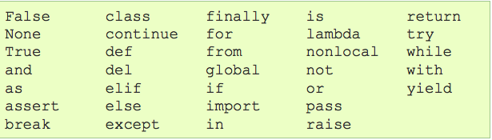

Fonte: https://docs.python.org/3.5/reference/lexical_analysis.html#identifiers

 

Vamos exercitar mais um pouco e criar uma variável
para cada tipo de dado que acabamos de conhecer:

    texto = "mensagem com texto"
    numero_inteiro = 9
    fracionario = 1.29
    dado_logico = True

    print(texto, numero_inteiro, fracionario, dado_logico)

Os dados do tipo literal em Python podem ser
declarados entre 'aspas simples' ou “aspas duplas”, desde que se abra e feche as mesmas aspas, não sendo possível abrir um aspa simples e fechar com uma dupla ('exemplo”) e nem ao contrário (“exemplo'), mas pode-se abrir uma aspa simples dentro de uma aspa dupla e vice-versa (“Assim 'por exemplo'”, ou ainda, 'Assim “por exemplo”'). “Python chama qualquer número com um ponto decimal de número de ponto flutuante (float). Esse termo é usado na maioria das linguagens de programação e refere-se ao fato de um ponto decimal poder aparecer em qualquer posição de um número” (MATTHES, 2016, p. 63), ressalta-se aqui a importância de declarar os números reais (<i>float</i>) utilizando-se o ponto ( . ) para representar a parte fracionária e não a virgula ( , ) do contrário o Python irá
retornar um erro.

Os dados lógicos ou booleanos devem ser declarados
com a primeira letra maiúscula (<b>True</b> ou <b>False</b>), se você inserir o valor true, ou inserir o valor false, o Python não irá reconhecer e irá enviar um traceback indicando um <i>NameError</i> como vimos anteriormente, sua desculpa é que nenhum identificador com o nome 'true' ou 'false' foi definido, isto porque assim como muitas outras linguagens, o Python é Case Sensitive, o que significa que ele diferencia letras
maiúsculas e minúsculas, logo, True e true são duas coisas completamente distintas para nosso interpretador, sempre que escrevermos um algoritmo devemos ser muito claros e específicos.

Podemos passar as variáveis separadas por vírgula para
a instrução print( ) como no exemplo anterior, ou podemos fazer uma instrução para cada variável:

    print(texto)
    print(numero_inteiro)
    print(fracionario)
    print(dado_logico)

Há outras formas de imprimir na tela pulando linhas, e formas mais eficientes de se trabalhar com os dados de forma que o desempenho do algoritmo seja superior, porém em nível de aprendizado estas instruções demonstram muito bem o comportamento do interpretador Python.

Vimos no inicio deste capítulo que uma variável
somente pode guardar um valor por vez, isso quer dizer que se eu declarar uma variável chamada surpresa e atribuir diferentes valores para ela, cada vez que um novo valor for atribuído, o
anterior será esquecido, veja:

    surpresa = 9
    surpresa = 16.78
    surpresa = 'doce de goiaba'
    surpresa = "CWB City Rocks"

    print(surpresa)

Atribuímos inicialmente o o valor inteiro 9 para a
variável surpresa, então logo em seguida atribuímos o valor real 16.78, então a próxima instrução diz ao Python para atribuir uma string à mesma variável, e em seguida pede para atribuir outra string. No final dizemos ao Python para escrever
o valor da variável surpresa.

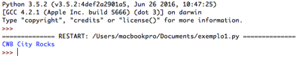

O valor exibido na tela foi o último valor a ser atribuído à variável, todos os outros valores foram desconsiderados, isso porque uma variável somente pode guardar um valor de cada
vez. Esta sequência de instruções também demonstra como o Python consegue atribuir diferentes tipos de dados em uma mesma variável, o que não aconteceria em muitas outras linguagens de programação.

Lembra-se do algoritmo soma.py que construímos no
início do capítulo? Neste algoritmo o a instrução input( ) irá esperar o usuário entrar com um tipo de dado, porém independente do tipo de dado fornecido, o Python irá armazenar a entrada como uma string (dado do tipo literal), então para realizar a soma tivemos que fazer uma conversão utilizando uma instrução int( ). Quando passamos um tipo de dado para a instrução int( ) o Python tentará realizar uma conversão do tipo de dado fornecido para um tipo inteiro. Vamos ver um exemplo:

    numero = '12'
    print(numero)
    numero = int(numero)
    print(numero)

Primeiro declaramos uma variável chamada numero e
pedimos para mostrá-la na tela, então realizamos a conversão para inteiro e pedimos para mostrar na tela. Na saída não conseguimos identificar a diferença, observe o resultado:

Mas se tentarmos realizar uma operação matemática,
como a soma, em variáveis do tipo literal o que acontece é um evento chamado concatenação, e não a adição em si, veja o exemplo:

    numero = '12'
    numero2 = '3'
    print(numero + numero2)

    numero = int(numero)
    numero2 = int(numero2)
    print(numero + numero2)

Primeiro declaramos duas strings e tentamos exibir a
soma de ambas, depois convertemos as strings para inteiro e exibimos a soma das variáveis:

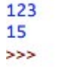

Observe os resultados, na primeira linha obtivemos o
resultado da concatenação, que nada mais é do que juntar a segunda string ao final da primeira, resultando não na soma, mas na junção das duas variáveis literais em um único texto. Ja no segundo resultado pudemos obter o resultado da operação de adição, pois a instrução int() converteu os dados literais para numéricos e o Python compreendeu que deveria realizar uma operação aritmética com estes dados.

Mas o que aconteceria se você tentasse converter uma
letra para número?

    fruta = "banana"
    banana = int(fruta)
    print(fruta)

Ao criarmos uma variável literal com caracteres não
numéricos e forçarmos uma conversão, o Python logo retornará um erro, pois não é possível converter letras para números, o mesmo aconteceria se tentássemos converter um dado do tipo
real ou lógico.

O erro retornado é um ValueError, dizendo que
os valores expressados na tentativa de execução não são válidos, por isto devemos tomar muito cuidado ao trabalhar com os tipos de dados para não levantar erros inesperados.

Caso você tenha dúvida quanto ao tipo de dado que
você está lidando, o Python tem a instrução type( ). Quando você passar uma variável para a instrução type(variavel) ele ira informar o tipo de dado dessa variável, como no exemplo a seguir:

    fruta = "banana"
    numero = 78
    God = False
    PI = 3.1415

    print(type(fruta))
    print(type(numero))
    print(type(God))
    print(type(PI))

Saida:

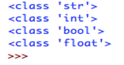

Vemos que que cada tipo de dado pertence a uma classe
que representa um tipo de dado específico: Literal (str), Inteiro (int), Lógico (bool) e Real (float).<small>3</small>

<small>3</small> : 
<small>O Python também tem o tipos de dados complex, mas não será abordado
nesta obra, você pode conferir o modelo de dados do Python <a href="https://docs.python.org/3/reference/datamodel.html#">aqui.</a></small>

 

## Constantes

Da mesma forma que possuímos valores variáveis,
também temos valores constantes, ou seja, que não se
modificam ao longo do seu algoritmo. No Python, por questões de boas práticas, sempre definimos uma constante com todas as letras do identificador em CAIXA ALTA, ou seja, letras maiúsculas, dessa forma:

    PI = 3.1215
    ALTURA = 600
    LARGURA = 600

Porém escrever uma variável em caixa alta não a torna realmente uma "constante", o que quer dizer que ainda se pode modificar o valor desta variável atribuindo outro valor à mesma. Escrever com letras maiúsculas é apenas uma boa prática para facilitar a legibilidade do código e distinção das variáveis pelo programador. Em Python é muito comum declarar valores constantes em formas de tuplas, que nada mais são que listas imutáveis, o que torna a alteração do valor contido na variável impossível de ser realizado.

Declarando uma tupla:

    QUANTIDADE = (100)

Para acessar o valor da tupla:

    qt = QUANTIDADE[0]
    print(qt)

Não se preocupe quanto a isto neste momento, veremos mais sobre tuplas em seções futuras deste livro.

## Expressões

Quando estivermos elaborando nossos algoritmos,
muitas vezes teremos que utilizar expressões aritméticas para
processar os dados, as expressões são formadas por operadores
aritméticos e possuem, assim como na matemática, uma
prioridade de execução, denominada precedência. Segue um
quadro com os operadores em Python:

Tabela 4 – Operadores aritméticos mais comuns em Python e sua
precedência

| OPERADOR | OPERAÇÃO | PRECEDÊNCIA | DESCRIÇÃO |
| :------: | :------: | :---------: | --------- |
| + | Adição | 0 | Realiza a soma dos operandos. Ex: a + b |
| - | Subtração | 0 | Realiza a subtração dos operandos. Ex: total - desconto |
| / | Divisão | 1 | Realiza a divisão dos operandos. Ex: 12 / 2 |
| // | Divisão inteira | 1 | Retorna a parte inteira da divisão. Ex: 3 // 2 (resulta em 1) |
| * | Multiplicação | 1 | Multiplica os operandos. Ex: 2 * 5 |
| ** | Exponenciação | 2 | Eleva o operando a esquerda pelo operando a direita. Ex: 5**2 (cinco ao quadrado) |
| % | Módulo | 2 | Obtém o resto da divisão dos operandos. Ex: 7%2 (Resulta em 1) |

As operações com menor precedência são executadas
por último, neste caso ao observar a expressão 2 + 3 * 5, assim como na matemática, a primeira operação a ser realizada é a multiplicação (3 * 5), somente então a adição será realizada (2 + 15). Estas precedências podem ser alteradas fazendo uso do
parêntese ( ), dando precedência para a expressão que estiver dentro do parêntese, desta forma:

    a = 2 + 3 * 5
    b = (2 + 3) * 5

    print("O valor de a: ", a)
    print("O valor de b: ", b)

Saída:

Nós também temos os operadores relacionais, que
permitem realizar comparações entre valores:

Tabela 5 – Operadores relacionais em Python

| OPERADOR | COMPARAÇÃO | DESCRIÇÃO |
| :------: | :--------: | --------- |
| == | Igualdade | Dois sinais de = compara se dois valores são idênticos. Ex: a == b | 
| != | Diferença | Compara se dois valores são diferentes. Ex: a != b |
| > | Maior | Compara se o primeiro valor é maior que segundo. Ex: a > b |
| < | Menor | Compara se o primeiro valor é menor que o segundo. Ex: a < b |
| >= | Maior igual | Compara se o primeiro valor é maior ou igual ao segundo valor. Ex: a >= b |
| <= | Menor igual | Compara se o primeiro valor é menor ou igual ao segundo. Ex: a <= b |

Fonte: O autor.

As expressões relacionais sempre retornarão um valor
lógico (**True** ou **False**), veja no exemplo a seguir:

    a = 2
    b = 3

    print(a == b)
    print(a != b)
    print(a > b)
    print(a < b)
    print(a >= a)
    print(a <= b)

Saída:

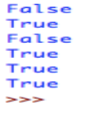

Existem mais operadores que não cobriremos aqui, mas
você pode conferir a lista completa na documentação do Python.<small>4</small>

<small>4</small> : <small>
Disponível <a href="https://docs.python.org/3.5/reference/lexical_analysis.html#operators"> aqui </a>.
</small>

Uma aplicação interessante em Python é a multiplicação de strings, veja:

    chaves = "pi"
    print(chaves * 10)

Saída:

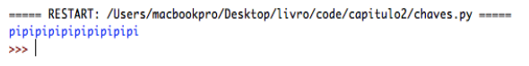

Temos também os operadores lógicos que podem ser
utilizados juntamente com os relacionais fazendo comparações, a seguir os operadores lógicos:

Tabela 6 – Operadores lógicos em Python

| OPERADOR | OPERAÇÃO | PRECEDÊNCIA | DESCRIÇÃO |
| :------: | :------: | :---------: | --------- |
| or | Disjunção | 1 | A disjunção entre duas operações resultara verdadeiro se um dos valores for verdadeiro |
| and | Conjunção | 2 | A conjunção resultará em verdadeiro se, e somente se, todos os valores examinados forem verdadeiros |
| not | Negação | 3 | A negação inverte o valor lógico da variável examinada. Se o valor for verdadeiro ele se tornará falso, e vice-versa. |

Fonte: O autor 

Vamos examinar estas operações com o Python:

    a = 2
    b = 3
    c = 4

    print(a > b or a > c)
    print(a < b and a < c)
    print(not a == b)

Saída:

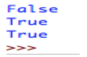

Veja que definimos as variáveis a = 2, b = 3 e c =4.
Então fizemos um pergunta ao Python como que “Python, a é maior que b OU a é maior que c?” então na primeira linha da saída temos a resposta False, pois a não é nem maior que b e nem maior que c, a na disjunção somente obtemos uma saída verdadeira se pelo menos uma expressão resultar em verdadeiro, como nossas duas expressões resultaram falso, a disjunção resultou falso.

Então perguntamos ao Python: “a é menor que b E a é
menor que c?”, o Python responde: True, pois na conjunção obtemos resultado verdadeiro se todas as expressões resultarem verdadeiro, como 2 é menor que 3 e também é menor que 4, nossa avaliação lógica retornou verdadeiro.

Por fim perguntamos ao Python se a e b são idênticos e informar o valor lógico inverso (como assim? você pergunta), temos que 2 não é igual a 5, então o resultado da avaliação seria Falso, mas como dissemos ao Python para nos informar o inverso ele respondeu Verdadeiro (True). Um detalhe interessante é que sempre que uma variável estiver inicializada com o valor 0 ela retornará Falso.

## Funções Intrínsecas

Funções intrínsecas são funções (instruções) prédefinidas
em uma linguagem de programação. Estas funções
auxiliam o programador para não ter que reinventar a roda em
seus algoritmos. Por exemplo, a instrução print( ) é uma
função pré-definida (built-in function de acordo com BARRY,
2015) da linguagem que permite exibir uma mensagem na tela.
No site oficial do Python encontramos uma tabela com as
funções intrínsecas existentes no Python 3:

Tabela 7 – Funções intrínsecas no Python 3

Fonte: https://docs.python.org/3/library/functions.html

Você não precisa decorar todas estas funções, mas a
medida que for construindo seus algoritmos vai utilizar
algumas delas, existem outras funções que não estão presentes
nesta lista mas você poderá conhece-las na documentação do
Python, outras apresentaremos no decorrer deste livro. A
descrição destas pode ser encontrada na documentação do
Python. Algumas destas você já utilizou aqui em alguns
exemplos, como por exemplo print( ), int( ), input( ) e type( ).
Lembra-se do int( ) para converter números em dados literais
para números inteiros? Também temos as funções str( ) e
float( ) para converter dados em literais e números reais
respectivamente.

    a = 2
    print(str(a))
    print(float(a))

Saída:

    2
    2.0

## Entrada de dados

Como vimos, o Python possui uma função interna
chamada input( ) que recebe uma entrada do usuário. Nesta
instrução podemos fornecer uma string para ajudar o usuário a
saber que tipo de dado ele deve fornecer, como no exemplo a
seguir:

    nome = input("Insira seu nome ")
    print("Ola ", nome, " como esta hoje?")

Saída:

Como vimos, a instrução input( ) recebe uma string por
padrão, e caso precisemos que a entrada seja de outro tipo de
dado temos que fazer a conversão com int( ) ou float( ), desta
forma:

    nome = input("Insira seu nome ")
    idade = int(input("Insira sua idade "))
    altura = float(input("Insira sua altura "))
    print("Seu nome e ", nome)
    print("Voce tem ", idade, " anos de idade")
    print("Voce mede ", altura, " de altura")

Perceba que ao obter a idade, primeira declaramos a
variável então atribuímos a ela a instrução int( ) pois ela deve
ser um número inteiro, e dentro da instrução int( ) inserimos o
input( ). Lembra quando dissemos que tudo que estiver dentro
do parêntese acontece antes? É exatamente isto, primeiro
ocorre a chamada da função input( ) que irá fazer uma
solicitação de entrada ao usuário. Quando ele realizar esta
entrada o valor fornecido será processado pela função int( ),
convertendo o valor para um dado do tipo inteiro, que então será armazenado na variável idade. O mesmo acontece com a
altura, primeiro um valor é solicitado, então convertido para o
tipo de dados float e então atribuído à variável altura. Quando
acessarmos estas variáveis elas já estarão com o tipo de dado
que convertemos. A saída para o algoritmo acima seria parecida
com esta:

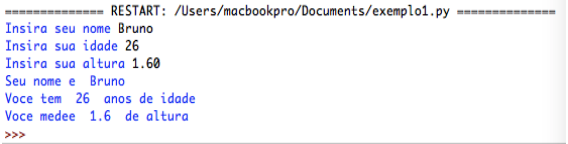

## Exercícios elaborados

Primeiramente será mostrado alguns problemas e suas
soluções em Python, vamos explicar a elaboração dos
exercícios e alguns exercícios para que você leitor resolva
sozinho utilizando os conhecimentos aprendidos até aqui.

1. Formular um algoritmo que leia e apresente os dados de
uma pessoa: nome, idade, endereço, telefone de contato
e mostre as informações obtidas na tela.
Problema a ser resolvido: Obter informações de uma
pessoa e exibir as informações na tela;

**Dados de entrada**: nome, idade, endereco, telefone;

**Processamento**: Não há processamento, apenas entrada e saída de informações;

**Saída**: Exibir os dados da pessoa;

Figura 9 – Fluxograma Atividade 1

Fonte: O autor.

    nome = input("Insira seu nome ")
    idade = int(input("Insira sua idade "))
    endereco = input("Insira seu endereco ")
    telefone = input("Insira seu telefone ")

    print("Nome: ", nome)
    print("Idade: ", idade)
    print("Endereço ", endereco)
    print("Telefone para contato: ", telefone)

Primeiramente declaramos a variável nome e atribuímos
a ela uma string informada pelo usuário, em seguida a variável idade irá receber um valor de entrada do usuário que será
convertido em um inteiro. Então atribuímos um valor de
entrada para a variável endereco e mais uma para a variável
telefone. Como não temos processamento as próximas
instruções são comandos de saída, exibindo as informações
obtidas correspondentes aos dados da pessoa.

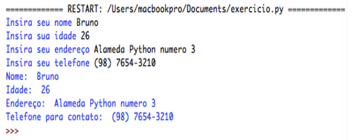

<b>Observações</b>: É muito comum obtermos o valor de um
telefone como string, pois o usuário pode entrar com caracteres
especiais como parêntese ( ) e o traço -. Também recomenda-se
que nas variáveis que possuem acento ou cedilha este caractere
seja substituído ou omitido como no caso de endereço
(declaramos como endereco). Salienta-se ainda o cuidado ao
declarar instruções dentro de instruções como no caso de
int(input( )) onde abrimos dois parênteses então precisamos
fechar dois parênteses, do contrário você receberá um erro.

 

2) Sua professora de matemática pediu que você
calculasse a área e o perímetro de um quadrado e lhe
passou as fórmulas para o cálculo da área sendo A = L x
L (o tamanho do lado do quadrado vezes ele mesmo) e
o perímetro deve ser obtido através da soma dos quatro
lados do quadrado. Vamos escrever um algoritmo que
faça seu dever de casa:

**Problema a ser resolvido**: Calcular a área e o
perímetro de um quadrado;

**Dados de entrada**: area, perimetro, lado

**Processamento**: calcular a área (A = lado x lado ou lado**2) e calcular o perímetro (b x 4 ou b + b + b + b);

**Saída**: Exibir o resultado do cálculo;

Figura10 – Fluxograma Atividade 2

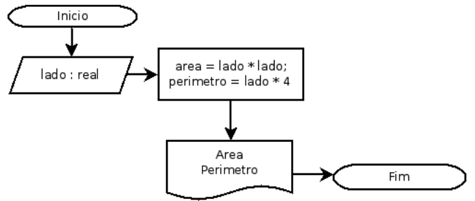

Fonte: O autor.

    lado = float(input("Insira o tamanho dos lados do quadrado: "))
    area = lado * lado
    perimetro = lado * 4
    print("A area do quadrado e de: ", area)
    print("O perimetro do quadrado e de: ", perimetro)

Primeiro precisamos do valor correspondente ao
tamanho dos lados do quadrado então declaramos a variável
lado e atribuímos a ela o valor que for inserido pelo usuário
convertido em um número real, em seguida fazemos o
processamento, multiplicando o lado por ele mesmo e
atribuindo o resultado à variável area, a variável perímetro
recebe o valor de lado multiplicado por 4. Em seguida temos as
saídas exibindo os resultados.

Observação: Como o valor de area deveria ser lado ao
quadrado poderia-se ter utilizado lado**2 que funcionaria da
mesma forma, o operador ** eleva o valor da esquerda à potência do valor da direita, tente fazer isto no seu IDLE.

 

3) Sua professora gostou tanto do seu algoritmo
computacional que lhe pediu para elaborar outro
algoritmo, dessa vez um que realize o cálculo da área
de um triângulo, sabendo que a área do triângulo é igual
o quociente da base vezes a altura por 2, vamos elaborar este algoritmo:

**Problema a ser resolvido**: Calcular a área de um
triângulo;

**Dados de entrada**: base, altura;

**Processamento**: calcular a área A = (base x altura) / 2;

**Saída**: Exibir o resultado do cálculo;

Figura 11 – Fluxograma atividade 3
</b>

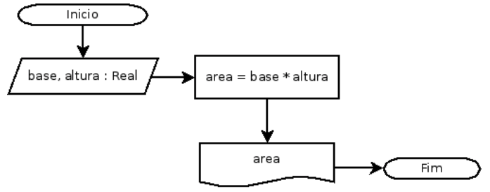

Fonte: O autor.

    base = float(input("Insira o valor da base do triangulo: "))
    altura = float(input("Insira o valor da altura do triangulo: "))
    print("A area do triangulo e: ", (base * altura) / 2)

Primeiro vamos receber a entrada necessária.
Declaramos uma variável base e atribuímos a ela o valor
inserido pelo usuário convertido em número real, depois
fazemos o mesmo com a variável altura. Desta vez inserimos o
processamento diretamente no comando de saída através de
uma expressão, assim economizamos uma variável fazendo
com que o algoritmo tenha um melhor desempenho. Em um
pequeno programa como este pode não fazer nenhuma
diferença, mas a medida que for construindo algoritmos mais
complexos o número de linhas e comandos pode impactar no desempenho do seu programa.

Observação: Se você andou brincando com o Python pode já
ter percebido que em alguns cálculos com números reais o
Python pode retornar um valor com várias casas decimais, isso
é normal não se assuste, veremos como lidar com isso no
decorrer do livro. Caso você ainda não tenha visto isso tente
calcular 2.90 x 1.43.

*Exercícios propostos*

1) Elabore um algoritmo em Python que leia, calcule e
escreva a média aritmética entre quatro números;
2) Elabore um algoritmo em Python que receba um número
inteiro e escreva na tela o número fornecido, o antecessor
desse número e o sucessor desse número;
3) Elabore um algoritmo em Python que:

+ Primeiro exiba uma mensagem de boas vindas;
+ Pergunte o nome do usuário;
+ Exiba uma mensagem dizendo uma mensagem de olá,
seguida pelo nome do usuário, seguida por outra mensagem
fazendo um elogio.
4) Elabore um algoritmo em Python que calcule a área e o
perímetro de um círculo, sabendo que A = π.r² e P=2π.r.

# Capítulo 3

## Comentários

É muito comum nas linguagens de programação a
utilização de comentários em certas partes do algoritmo. Estes comentários servem para documentar o código e possibilitar o entendimento de certas sessões do algoritmo por outros programadores que venham a ler seu código posteriormente. Em Python declaramos um comentário ao inserir o caractere #. Quando o Python se deparar com um comentário durante a interpretação do código, ele ignorará a linha comentada, ou seja, o Python não liga para os seus comentários.

    # Este é um comentário
    # Sempre que o Python encontrar o símbolo # ele irá descartar
    # tudo que houver depois dele
    print("Esta instrucao sera executada")
    # print("esta instrucao nao sera executada")

Saída:

Perceba que tudo que estava depois do # não foi
executado, pois o Python identificou como um comentário e logo passou para a próxima instrução válida. Este é o comentário de uma linha, porém também é possível inserir comentários de várias linhas desde que estejam entre aspas triplas (''' comentário ''' ou “““comentário”””) como no exemplo a seguir:

    '''
    Este é um comentário de 
    várias linhas
    '''

    """
    Nada disso será
    executado
    pelo Python
    """

Vamos comentar nosso código de agora em diante para facilitar o entendimento do contexto.

## Estruturas Condicionais

Grande parte das vezes em nossos algoritmos, teremos
que optar por executar uma tarefa ou outra, dependendo de uma condição específica. As estruturas condicionais, também denominadas estruturas de seleção ou decisão (PUGA; RISSETI, 2010 – p.56) são dos tipos simples e composta (ASCENCIO; CAMPOS, 2010; LEAL, 2016; PUGA; RISSETTI, 2010). Vamos ver cada um deles.

## Estrutura condicional simples

Vamos exemplificar com um algoritmo bem prático dos
nossos dias, acender a luz. Geralmente para acender uma
lâmpada em um cômodo na sua casa, é bem comum que se
aperte um interruptor. Se a lâmpada estiver desligada ela se
ligará. Vamos fazer um algoritmo Python bem simplificado
para demonstrar o funcionamento da estrutura condicional
simples.

    luz = False # luz apagada

    acender_luz = input("Gostaria de acender a luz?[s/n] ")

    if acender_luz == "s": # se a entrada for s
        luz = True         # a luz acende
    
    # verificamos o estado da luz
    print(luz)

Veja que a instrução if irá analisar a variável
acender_luz, e se o conteúdo armazenado nesta variável for igual a string “s” ele executará os comandos abaixo do if. Se o conteúdo da variável for diferente da comparação o Python irá pular para a próxima instrução que não estiver dentro do if

    if acender_luz == "s":
    → → luz = True # observe a indentação

Caso o código pertencente ao if não esteja tabulado à
direita o Python não irá compreender e irá lhe informar algo como isto:

Figura 12 - Erro de indentação

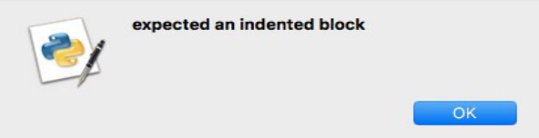

Fonte: O autor

Vamos melhorar o algoritmo anterior para verificar se a luz está acesa ou apagada:

    luz = False # a luz começa apagada
    acender_luz = input("Gostaria de acender a luz? [s/n] ")

    if acender_luz == "s":
        luz = True
    
    if luz:    # se o valor de luz for True
        print("A luz esta acesa")

Perguntar ao Python <b>if luz</b> é o mesmo que perguntar <b>if luz == True</b>. Se você quiser verificar se o valor é falso basta perguntar:

    if not luz:
        print("A luz está apagada")

Que é o mesmo que perguntar:

    if luz == False:
        print("A luz está apagada")

## Estrutura condicional composta

Na estrutura condicional composta nós temos mais de
uma opção de desvio para uma condição a ser analisada. Vamos melhorar ainda mais o algoritmo da luz:

    # a luz começa apagada
    luz = False

    # perguntamos se o usuário quer acender a luz
    acender_luz = input("Gostaria de acender a luz?[s/n] ")

    if acender_luz == "s":
        luz = True
    
    # se acendeu a luz
    if luz:
        print("A luz está acesa")
    
    # se não
    else:
        print("A luz esta apagada")

O else é um segmento do if que diz ao Python, “caso a
condição anterior for falsa, faça isto aqui ok?”, como uma alternativa que será realizada em oposição a outra. Leal (2016b, p. 65) afirma que a estrutura de decisão composta é melhor utilizada “Quando uma condição implica a execução de um ou outro bloco. Em situações que há duas condições mutuamente exclusivas”, ou seja, só pode acontecer uma das escolhas, as outras serão ignoradas pelo interpretador.

Seguindo para mais um exemplo, vamos imaginar que
seu professor comentou na aula que para que você seja
aprovado na disciplina você precisa ter uma média igual ou superior à 7.0, para descobrir a média você somaria as quatro notas de cada bimestre e dividiria por quatro e Se a média for igual ou superior a 7.0 você é aprovado, Senão, você fica de recuperação.

Figura 13 – Fluxograma para media do aluno

Fonte: O autor.

Vamos implementar um algoritmo em Python para
calcular sua média, primeiro vamos receber o nome da
disciplina então as quatro notas e o programa deve informar sua média nesta disciplina.

    # solicitamos o nome da disciplina
    disciplina = input("Insira o nome da disciplina: ")

    # solicitamos as notas de cada bimestre
    nota1 = float(input("Insira a nota do 1 Bimestre: "))
    nota2 = float(input("Insira a nota do 2 Bimestre: "))
    nota3 = float(input("Insira a nota do 3 Bimestre: "))
    nota4 = float(input("Insira a nota do 4 Bimestre: "))

    # calculamos a media
    media = (nota1 + nota2 + nota3 + nota4) / 4

    # exibimos a media e a disciplina
    print("Disciplina: ", disciplina)
    print("Media: ", media)

    # se a media for menor que 7.0 o aluno e reprovado
    if (media < 7.0):
        print("Reprovado")

    # senão, é aprovado
    else: 
        print("Aprovado")

As instruções if e else em Python analisam uma
condição, no caso de if(media < 7.0) nós passamos para o Python uma expressão relacional (media < 7.0), o Python vai analisar se a média é menor que 7.0 e verificar se é verdade ou mentira, caso seja verdade ele executará o comando logo abaixo do if, tabulado à direita, e caso a expressão se revele falsa ele irá ignorar e pular para os comandos abaixo do else.
As saídas:

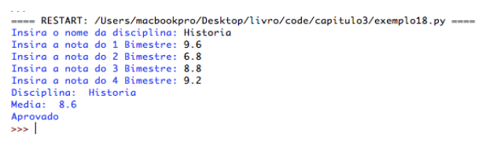

Seu professor gostou do programa, mas agora ele disse
que esqueceu de lhe avisar que caso a nota esteja entre 6.0 e 6.9 o aluno ficará de recuperação;

Bem, na verdade o Python tem mais um comando de
decisão composta para não precisarmos ficar repetindo if's toda hora. Quando o Python encontra um <b>if</b> ele obrigatóriamente irá realizar a verificação, mesmo que o if anterior tenha resultado em Verdadeiro. Com elif caso isso ocorra ele não executará a verificação, o que poupa processamento ao computador. O comando elif pode ser utilizado depois do if e antes do else, desta forma:

    # solicitamos o nome da disciplina
    disciplina = input("Insira o nome da disciplina: ")

    # solicitamos as notas de cada bimestre
    nota1 = float(input("Insira a nota do 1 Bimestre: "))
    nota2 = float(input("Insira a nota do 2 Bimestre: "))
    nota3 = float(input("Insira a nota do 3 Bimestre: "))
    nota4 = float(input("Insira a nota do 4 Bimestre: "))

    # calculamos a media
    media = (nota1 + nota2 + nota3 + nota4) / 4

    # exibimos a media e a disciplina
    print("Disciplina: ", disciplina)
    print("Media: ", media)

    # se a media for maior que 7.0 o aluno é aprovado
    if media >= 7.0: 
        print("Aprovado")

    # media entre 6.0 e 6.9 ele está em recuperação
    elif media >= 6.0 and media <= 6.9: 
        print("Recuperacao")

    # seão, está reprovado
    else:
        print("Reprovado")

Tivemos que fazer algumas mudanças no nosso
programa, primeiro trocamos o primeiro if que verificava se a media era menor que 7.0, se a média fosse menor que 7.0 o aluno seria reprovado, mas como temos alunos que ainda podem ficar de recuperação vamos ver somente as médias que estão acima ou igual a 7.0, do contrario se a média for entre 6.0 e 6.9 será exibido uma mensagem dizendo que o aluno está em recuperação, e se ele não for aprovado nem estiver de recuperação, então ele está reprovado.

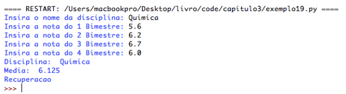

A diferença está no desempenho do algoritmo. Quando
temos varias instruções do tipo if (estrutura condicional simples), o interpretador irá checar cada uma delas. Se tivermos uma estrutura composta por if, elif e else o interpretador irá checar o primeiro if e caso seja verdadeiro ele irá ignorar o resto da composição, ou seja, se a primeira verificação for verdadeira as seguintes serão descartadas, lembrando que você pode inserir quantos elif's quiser. Em um algoritmo complexo, demasiadas verificações de if podem comprometer o desempenho do algoritmo, tornando sua execução mais lenta. Então como saber qual tipo de instrução utilizar? Simples, como dito anteriormente, se você tiver diferentes situações onde somente uma poderá ocorrer, deve-se utilizar a estrutura de decisão composta, pois as alternativas são mutuamente excludentes. Caso você precise fazer uma única verificação utiliza-se a estrutura simples.

É preciso ficar atento à um aspecto muito importante
para o funcionamento do seu código, a indentação. A
indentação é o recuo à direita da margem pelo texto, no caso do Python a indentação é OBRIGATÓRIA, pois o interpretador irá considerar como pertencente à instrução if tudo o que estiver indentado, do contrário o comando poderá ser executado em uma hora inoportuna do programa ou pior gerar um erro.

Figura 14 – Indentação do código

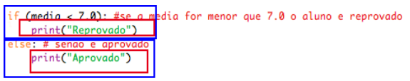

Fonte: O autor.

Veja na figura acima que o if é cercado por um
retângulo azul que representa um bloco de comandos, os  comandos pertencentes a este bloco estão indentados quatro espaços à direita da margem (basta pressionar o botão tab uma vez), cercados por um retângulo vermelho. Os comando que estiverem dentro do vermelho somente serão executadas se as verificações feitas no azul forem verdadeiras do contrário o interpretador passará para o próximo bloco de comandos.

A estrutura condicional em Python nos permite uma
gama de verificações, inclusive verificar se determinadas letras ou palavras existem em uma string, veja:

    frase = "Quem ensina aprende o que ensina e quem aprende ensina ao aprender - FREIRE"

    # se existir a palavra FREIRE na frase
    if "FREIRE" in frase:
        print("Graaaaaande Mestre Paulo Freire")
    else:
        print("Frase de outra autoria")

Perguntamos ao Python se uma determinada palavra ou
letra existe em uma string, ele irá analisar a string e se existir ele irá retornar verdadeiro, noutro caso ele retorna falso. Lembra-se da instrução type( )? Vamos fazer um algoritmo que recebe uma variável e verifica qual o tipo da variável escrevendo na tela:

    # definimos uma variavel com um valor
    caixa = 72 

    # verificamos seu tipo e guardamos como string
    caixa = str(type(caixa))

    if 'str' in caixa:
        print("Essa varivel e do tipo String (Literal)")
        
    elif 'int' in caixa:
        print("Essa variavel e do tipo Inteiro")
        
    elif 'float' in caixa:
        print("Essa variavel e do tipo float")
        
    elif 'bool' in caixa:
        print("Essa variavel e do tipo bool")
        
    else:
        print("Outro")

Lembra que a instrução type( ) retorna um texto
esquisito dizendo algo tipo &lt;class 'int'>? Então, o que fizemos foi adicionar um valor a uma variável, depois nessa mesma variável adicionamos esta mensagem esquisita através da instrução type( ) convertida para string através da instrução
str( ), você também deve se recordar que as instruções que estão nos parênteses mais internos acontecem primeiro, certo? Depois verificamos se a variável contém a abreviatura correspondente ao seu tipo no nome e escrevemos uma mensagem um pouco mais elegante do que &lt;class 'int'> para informar o tipo da variável que estamos lidando.

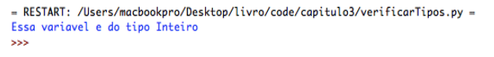

Tente mudar o tipo de variável para testar os outros
resultados. Pesquise sobre o tipo complex em Python e
implemente o algoritmo para reconhecer este tipo de dado.

## Estrutura condicional aninhada

Na estrutura condicional aninhada, também conhecida
por encadeamento (PUGA; RISSETTI, 2010) são estruturas condicionais dentro de outras estruturas condicionais. Desta forma ao realizar uma verificação condicional que retorne verdadeiro, o interpretador poderá encontrar com outros testes condicionais.

Vamos exemplificar melhor em um algoritmo que verifica o maior dentre 3 números escolhidos:

    # primeiro recebemos a entrada
    num1 = int(input("Insira o primeiro numero "))
    num2 = int(input("Insira o segundo numero "))
    num3 = int(input("Insira o terceiro numero "))

    # estrutura condicional externa
    if num1 > num2:

        # estrutura condicional interna (aninhada)
        if num1 > num3: 
            print("O primeiro numero foi o maior, ", num1)
        else:
            print("O terceiro numero e o maior, ", num3)
    else: 
        
        if num2 > num3:
            print("O segundo numero e o maior, ",num2)
        else:
            print("O terceiro numero e o maior, ", num3)

Neste exemplo primeiro recebemos três entradas que
devem ser números inteiros, então verificamos se o num1 é maior que o num2, caso isso seja verdade partimos para uma outra verificação, que analisa se o num1 é maior que o num3, e se for verdade isso significa que o primeiro número foi o maior, do contrário o terceiro número é o maior. Se a primeira condição for falsa, partimos para outra verificação, que analisa se o num2 é maior que o num3.

Existem sim formas diferentes e até mais eficazes de se implementar este algoritmo, porém para nível de exemplo este algoritmo é capaz de demonstrar o funcionamento da estrutura condicional aninhada. A grande diferença entre usar as condições aninhadas, de acordo com Leal (2016a, p. 70) “é que o uso destes encadeados melhora o desempenho do algoritmo, isto é, torna o algoritmo mais rápido por realizar menos testes e comparações. Ou ainda, executar um menor número de passos para chegar à solução do problema.”

## Exercícios elaborados

4) Elabore um algoritmo que receba o nome e a idade de uma pessoa e informe se é menor de idade, maior de idade ou idoso.

**Objetivo**: Informar se a pessoa é menor de idade, maior de idade ou idoso;

**Entrada**: nome e idade;

**Processamento**: Verificar se a idade é menor que 18 (menor de idade), maior que 18 e menor que 65 (adulto) ou maior que 65 (idoso);

**Saída**: escrever se a pessoa é menor, maior ou idoso;

Figura 15 – Fluxograma atividade 4

Fonte: O Autor.

    # ler nome
    nome = input("Insira seu nome: ")

    # ler idade
    idade = int(input("Insira sua idade: ")) 

    # verifica se a idade e menor que 18
    if idade < 18:
        print(nome, " voce e menor de idade")

    # senao verifica se a idade est entre 18 e 65
    elif idade >= 18 and idade < 65: 
        print(nome, " voce e maior de idade")
    
    # senao for nenhuma das acima, entao e idoso
    else:
        print(nome, " voce ja e idoso")

 

5) Elabore um algoritmo que calcule o IMC (Índice de
Massa Corporal) de uma pessoa de acordo com seu peso
e altura. O programa deve informar se a pessoa está
abaixo do peso (IMC menor que 20), normal (IMC entre
20 e 25), excesso de peso (entre 26 e 30), obesa (IMC
entre 31 e 35) ou com obesidade mórbida (acima de 35 .
 O cálculo do IMC é dado por:

 

**Objetivo**: Verificar o Índice de Massa Corporal de um indivíduo;

**Entrada**: Valores de peso e altura;

**Processamento**: Calcular o IMC, verificar em que faixa o IMC se encontra;

**Saída**: Mostrar o IMC e a faixa em que a pessoa se encontra;

Figura 16 – Fluxograma atividade 5

Fonte: O autor.

    # receber o valor do peso
    peso = float(input("Insira seu peso: "))

    # receber o valor da altura
    altura = float(input("Insira sua altura: ")) 

    # calcular o imc
    imc = peso/(altura**2)

    # se o imc for menor que 20
    if imc < 20:
        print("Abaixo do peso ideal")

    # senao
    else:
        # se for menor que 25
        if imc <= 25:
            print("Seu imc esta normal")
        # senao
        else:
            # se for menor que 30
            if imc <= 30:
                print("Excesso de peso")

            # ou se for maior que 30 e menor que 35  
            elif imc > 30 and imc <= 35: 
                print("Obesidade")
            # ou entao se for mairo que isso
            else:
                print("Obesidade morbida")
    
    # finalmente mostramos o imc
    print("Seu imc e: ", imc) 

*Exercícios propostos*

1) Elabore um algoritmo que leia o percurso em quilômetros, o tipo de automóvel e informe o consumo estimado de combustível, sabendo que um automóvel do tipo A faz 26 Km com um litro de gasolina, um automóvel do tipo B faz 20 Km e um automóvel do tipo C faz 7 Km.

2) Formule um algoritmo que leia cinco números e conte quantos deles são negativos.

3) Escreva um algoritmo que recebe uma letra e verifica se é uma vogal ou uma consoante.

4) Formule um algoritmo que leia o código do produto e a quantidade desse produto que o cliente está adquirindo, informe os produtos que o cliente comprou, a quantidade e o total a pagar:

| Código | Produto | Valor |
| :----: | :-----: | :---: |
| 1 | Refrigerante | R$ 4.50 |
| 2 | Água Mineral | R$ 3.00 |
| 3 | Feijão | R$ 8.00 |
| 4 | Arroz | R$ 7.25 |

# Capítulo 4