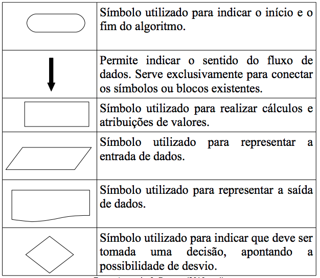
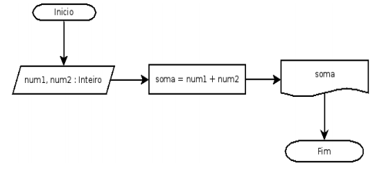
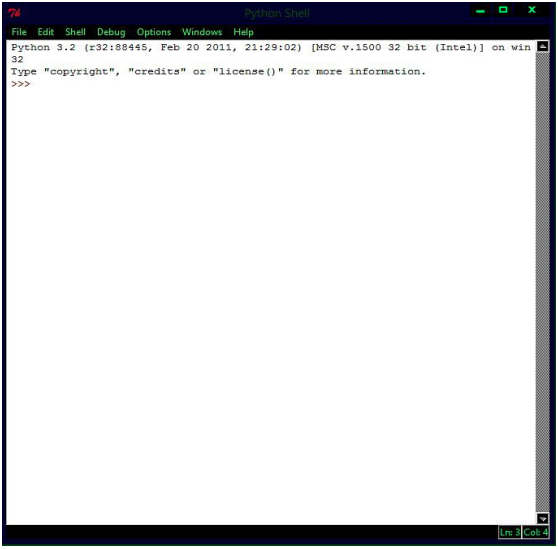
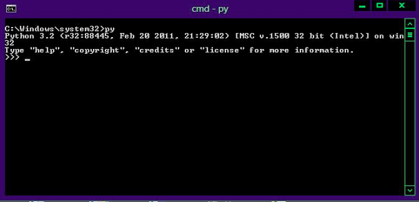

# Capítulo 1

## Conceito de Algoritmo

Quando falamos em algoritmo é comum pensar em algo
relacionado à matemática, o que de certa forma não está errado, pois quando pequenos na escola primária éramos incitados a resolver diversas contas utilizando algoritmos matemáticos necessários à resolução dos exercícios. Puga e Rissetti (2010,
p. 9) comentam que “A matemática clássica é, em grande parte o estudo de determinados algoritmos”, isso pode a uma primeira vista assustar iniciantes no estudo da lógica de programação, mas vale salientar que não necessariamente o estudo de algoritmos envolve o estudo da matemática.

Para Puga e Rissetti (Op cit.) um algoritmo nada mais é que “uma sequência lógica de instruções que devem ser seguidas para a resolução de um problema ou execução de uma tarefa”. Ascencio e Campos (2010, p.2) vão ainda mais profundamente na conceituação de algoritmos citando diversas fontes definindo o que são algoritmos, dentre algumas pode-se
citar: “sequência de passos que visa atingir um objetivo bem definido” (FORBELLONE, 1999 apud ASCENCIO; CAMPOS, 2010), “sequência finita de instruções ou operações cuja execução, em tempo finito, resolve um problema computacional, qualquer que seja sua instância” (SALVETTI, 1999 apud ASCENCIO & CAMPOS, 2010).

Etimologicamente, de acordo com Abbagnano (2007, p.
27), a palavra Algoritmo deriva do nome de Mohammed alKhuwarizmi que foi um astrólogo e matemático árabe do século IX, responsável por introduzir o sistema de numeração indiano no Ocidente, esta notação durante a Idade Média tornou-se conhecida como algorísmos, sendo conhecida hoje pelo sistema numérico decimal que utilizamos no nosso dia a dia.

Para finalizar a conceituação de algoritmo de uma
forma, simples e entendível, um algoritmo é um passo a passo ou ainda, uma sequência de instruções para se chegar a um determinado objetivo, simples assim. Para exemplificar vamos demonstrar um algoritmo de uma tarefa corriqueira que todos fazemos diariamente: Beber água.

*Passo a passo para beber água:*

1. Pegar um copo ou recipiente;

2. Colocá-lo sob a torneira ou filtro de água;

3. Abrir a torneira/filtro;

4. Quando o copo estiver suficientemente cheio, fechar a torneira/filtro;

5. Beber a água do copo/recipiente;

Simples, não é? Pode-se perceber que não temos nada
de muito matemático nisso, é um simples passo a passo, ou ainda, uma sequência finita de instruções que são seguidas para realizar uma tarefa (beber água). Vale-se ressaltar que não existe uma única forma de beber água, poderia-se beber água da fonte ou de um rio utilizando as mãos ou outros procedimentos, e isso é válido para todos os algoritmos, pois podem haver diferentes formas de realizar uma mesma tarefa desde que respeitem a lógica do processo, a exemplo disso pode-se dizer que não seria coerente fechar a torneira para depois colocar o copo abaixo da torneira para encher. Vamos demonstrar um outro exemplo de algoritmo: Uma ligação
telefônica.

*Passo a passo para realizar uma ligação:*

1. Pegar o telefone;

2. Inserir o número para quem deseja-se telefonar;

3. Aguardar ser atendido;

4. Depois de realizar a conversação, colocar o telefone no gancho (ou apertar o botão de desligar no caso de alguns telefones);

## Algoritmos para a lógica de programação

Certo, já sabemos o que são algoritmos e de onde essa
palavra surgiu. Mas e a relação entre os algoritmos e a programação de computadores?

Os computadores não compreendem instruções humanas como estas citadas anteriormente, os computadores só conhecem um tipo de linguagem: binária (zeros e uns) ou como define Tanenbaum (2010, p. 1) linguagem de máquina, mas se acalme, não há necessidade de se tornar um expert em linguagem binária para programar um computador, para isso existem as linguagens de alto nível ou linguagens de programação, que de acordo com Pressman (2010, p. 677) “são veículos de comunicação entre os seres humanos e os computadores”, as quais permitem que o programador possa elaborar um roteiro de instruções passo a passo (algoritmo) para que o computador execute uma determinada tarefa, estas linguagens de alto nível ou popularmente conhecidas como linguagens de programação, das quais pode-se citar o C, C++, Java, Cobol, Fortran, Python, dentre muitas outras linguagens existentes. Cada linguagem possui sua própria estrutura sintática porém sua essência reside na coerência lógica em que as instruções são fornecidas ao computador, sendo assim, o algoritmo escrito em uma linguagem de programação recebe o nome de programa (TANENBAUM, 2010).

## Tipos de algoritmo

Os algoritmos podem ser descritos em diferentes
formas, Ascencio e Campos (2010, p.3-4) apresentam a
Descrição Narrativa, o Fluxograma e o Pseudocódigo. Cada um desses será analisado nesta seção:

*Descrição Narrativa*

A descrição narrativa já foi apresentada no início deste capitulo, nos exemplos de beber água e no exemplo de realizar uma ligação telefônica. Consiste em descrever em linguagem natural a sequência de eventos que se sucederão. Vamos exemplificar com mais um algoritmo em descrição narrativa:

Somar dois números:

1. Definir o primeiro número;

2. Definir o segundo número;

3. Realizar a operação de soma entre os dois números;

4. Obter e demonstrar o resultado;

Esse tipo de algoritmo nos lembra muito de receitas de
bolo por exemplo, porém possui uma grande desvantagem, por se tratar de uma linguagem natural, suas instruções podem ser ambíguas abrindo espaço para diferentes interpretações, dificultando sua transcrição em programa(ASCENCIO; CAMPOS, 2010), fazendo com que este modelo de algoritmo
não seja muito utilizado em programação.

*Fluxograma*

O fluxograma é uma forma de representar a sequência
de instruções através de figuras geométricas, sendo elas: 

Tabela 1 – Símbolos utilizados no fluxograma e seus significados

Fonte: Ascencio & Campos (2010, p. 4)

Vamos exemplificar a utilização do fluxograma em um
algoritmo cujo objetivo é realizar a soma de dois números, o mesmo algoritmo apresentado anteriormente:

Figura 1. Fluxograma representando um algoritmo para soma de dois números

Fonte: O autor.

As desvantagens do fluxograma segundo Ascencio e
Campos(2010) são a necessidade de aprender os significados dos símbolos do fluxograma, que muitas vezes podem diferir, como por exemplo podemos ver na Figura 2 duas representações diferentes para o símbolo de saída de dados. Outra desvantagem apresentada é que o fluxograma não apresenta muitos detalhes, o que também dificulta a implementação deste algoritmo em um programa de computador.

Figura 2: Representações para a Saída de Dados

Fonte: Figura do lado esquerdo, Ascencio & Campos (2010). Figura do lado direito, Puga &
Rissetti (2010).

*Pseudocódigo*

O Pseudocódigo, também conhecido como Portugol
(ASCENCIO; CAMPOS, 2010) ou Português Estruturado
(PUGA; RISSETTI, 2010) é um modelo de algoritmo muito
semelhante a um código escrito em linguagem de programação de alto nível, tornando sua implementação em um programa uma tarefa muito simples para o programador. Para Puga e Rissetti (2010, p. 11) este é uma representação de algoritmo em uma linguagem intermediária entre linguagem de programação
e a linguagem natural humana, mais especificamente, o nosso Português. De acordo com Puga & Rissetti (Op. Cit.) o nome “Pseudocódigo” significa “falso código”, justamente por ser extremamente parecido com um algoritmo implementado em linguagem de alto nível. Vamos ver o mesmo exemplo anterior (soma de dois números) representado em Pseudocódigo:

<pre>
    ALGORITMO: soma
    VAR
        num1, num2, soma : Inteiro
    INICIO
        LEIA(num1)
        LEIA(num2)
        soma ← num1 + num2
        ESCREVA(soma)
    FIM.
</pre>

Este exemplo pode ser facilmente transcrito em
qualquer linguagem de programação e executado por um
computador. Vamos analisar a estrutura do pseudocódigo:

Tabela 2 – Estrutura do pseudocódigo

| Psudocódigo | Descrição |
| ----------- | --------- |
| ALGORITMO: soma | Esta primeira seção declara o nome do algoritmo |
| VAR: num1, num2, soma : inteiro | Esta seção é chamada de declaração de variáveis, onde todas as variáveis que serão utilizadas no algoritmo devem ser fornecidas, neste caso precisamos de três delas, o primeiro número, o segundo número e o resultado da soma. Todas elas são do tipo inteiro então declaramos uma após a outra, separando-as por vírgulas. Veremos mais sobre variáveis mais adiante.|
| INICIO LEIA(num1) LEIA(num2) soma ← num1 + num2 ESCREVA(soma) FIM |  Esta seção é o corpo principal do algoritmo, onde todas as instruções serão declaradas. Neste caso temos duas instruções, LEIA( ) e ESCREVA( ). A instrução LEIA( ) é um comando de entrada de dados, o que significa que um valor será fornecido para a variável num1 e num2. Então temos a atribuição do resultado para a variável soma, esta atribuição é representada pelo simbolo “← “. O comando ESCREVA( ) representa uma saída de dados, que neste caso demonstra a exibição do valor guardado na variável “soma”. FIM. Indica que chegamos ao fim do algoritmo. |

Fonte: O autor.

Algumas desvantagens do pseudocódigo apresentadas
por Ascencio e Campos (2010) é que deve-se aprender as
regras do pseudocódigo, da mesma forma que se aprenderia os
significados dos símbolos do fluxograma ou as regras sintáticas
de uma linguagem de programação, além do mais não é
possível implementar programas reais em pseudocódigo, por
estes motivo vamos conceber a linguagem de programação
Python como forma de implementação e aprendizado dos
nossos algoritmos por sua facilidade de compreensão, ao final
deste livro você não somente saberá os princípios básicos da
construção e interpretação de algoritmos assim como terá os
conhecimentos básicos de uma poderosa linguagem de
programação e estará escrevendo seus próprios programas de
computador.

## Python

<quote><small>Python é uma linguagem extremamente eficiente: seus programas farão mais com menos linhas de código, se comparado ao que muitas outras linguagens exigiriam. A sintaxe de Python também ajudará você a escrever um código “limpo”. Seu código será fácil de ler, fácil de depurar, fácil de estender e de expandir, quando comparados com outras linguagens. (MATTHES, 2016. p. 28) </small></quote>

 

Para a metodologia deste livro, pretende-se utilizar a
Linguagem Python como forma de aprendizado de algoritmos,
visto que as formas mais populares de algoritmos apresentam
desvantagens relacionadas ao aprendizado das regras próprias
de cada modelo, utilizaremos a Linguagem de Programação
Python por sua alta legibilidade, o que quer dizer que um
programa escrito nesta linguagem é facilmente compreendido,
sem haver muito esforço da parte do programador em entender
seus comandos, além do mais, um algoritmo implementado em
Python é facilmente executado em qualquer sistema
operacional com um interpretador Python instalado. Isto
possibilitará aos iniciantes na lógica de programação não
somente a compreender a implementação dos algoritmos mas
também a familiarizar-se com as regras de uma simples, porém
extremamente poderosa linguagem de programação de
propósito geral, permitindo que escreva programas eficientes
com poucas linhas de comando em qualquer ambiente
operacional. Finalizando esta justificativa, é fundamental no
aprendizado de algoritmos que se pratique muito, e nada
melhor do que ver resultados instantâneos através de atividades
práticas, logo o Python se demonstrará uma excelente
ferramenta para se iniciar no mundo da programação, então
vamos colocar a mão na massa.

Primeiramente será necessário a instalação de um
Interpretador Python no seu computador, o download pode ser
feito pelo website oficial do Python:
<https://www.python.org/downloads/>.

O Python é disponibilizado em duas versões, Python 2.x
e Python 3.x, não tendo grandes diferenças entre si, porém para
fins de praticidade recomenda-se que o leitor utilize a mesma
versão apresentada no livro, neste caso utilizaremos a versão
Python 3.x, mais especificamente 3.5.2. Qualquer versão do
Python 3.x poderá ser utilizada para executar os algoritmos
deste livro.

Após fazer o download e instalação do Python 3 para o
seu Sistema Operacional você notará que um editor chamado
“IDLE” foi instalado juntamente com sua versão do Python.

<quote><small>Quando você instala o Python 3, também terá o
IDLE, o ambiente simples – mas surpreendentemente útil – de desenvolvimento integrado do Python. O IDLE inclui um editor de destaque da sintaxe, um depurador, o Python Shell e uma cópia completa do conjunto de documentação online do Python 3. (BARRY, 2015) </small></quote>

Este é um editor padrão do Python porém você também
poderá escrever os programas em um editor de sua preferência,
para este livro, por motivos didáticos será utilizado o próprio
IDLE

Figura 3 – Aparência do IDLE no Mac Os

Fonte: O autor.

Figura – 4 – Aparência do IDLE no Windows.

Fonte: O autor.

As Figuras 3 e 4 apresentam a aparência do IDLE no
Sistema Operacional Mac Os e Windows. “Quando você iniciar
o IDLE pela primeira vez, será apresentado ao prompt com 'três
divisas' (>>>) no qual você insere o código e imediatamente a
executa para você, exibindo qualquer resultado produzido na
tela” (BARRY, 2015. p. 4). Outro modo de chamar o Python é
abrir seu Terminal (no Windows é muito conhecido como
prompt ou cmd) e escrever o comando python e se as três
divisas aparecerem significa que o Python está corretamente
instalado no seu computador e você está pronto para escrever
programas de verdade.

Figura 5 – Chamar o Python pelo terminal no Mac Os

Fonte: O autor.

Figura 6 – Chamando Python no terminal Windows

Fonte: O autor.

Uma observação importante é que, caso sua máquina já
possua outras versões do Python instalada (como no MacOs e
Linux onde o Python 2 já vem instalado por padrão) o
comando necessário para chamar o Python pelo Terminal pode
vir a ser diferente, dentre alguns exemplos estão <b>python,
python3, py, python3.3, python3.5 </b> (ou a versão específica
que você instalou). Agora que você já sabe o que são
algoritmos e já tem o Python 3 instalado no seu computador
podemos dar continuidade ao nosso estudo da Lógica de
Programação.

Os algoritmos em Python apresentados nesta obra
poderão ser encontrados através <a href="https://github.com/brunolcarli/AlgoritmosELogicaDeProgramacaoComPython">deste link</a>.