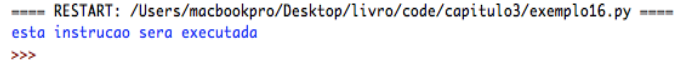
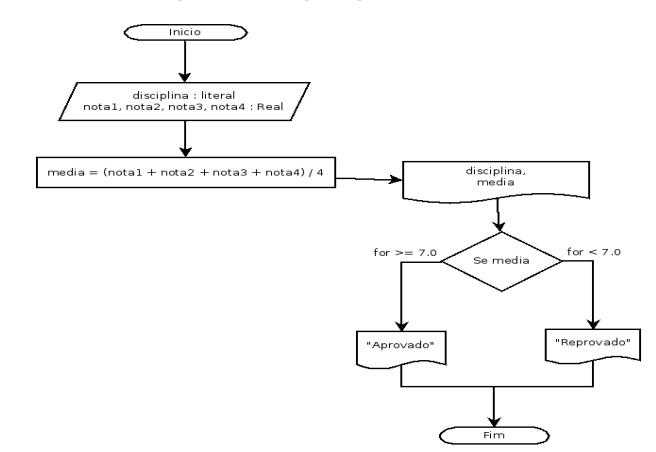
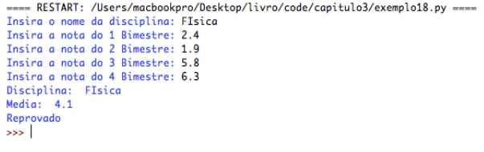
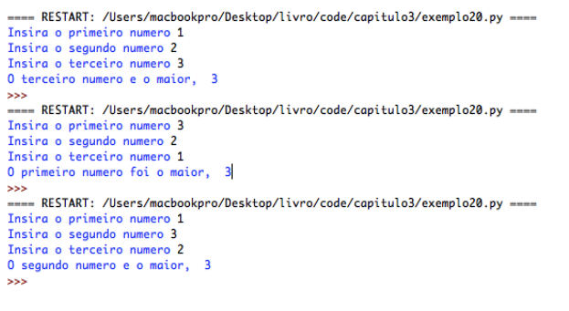
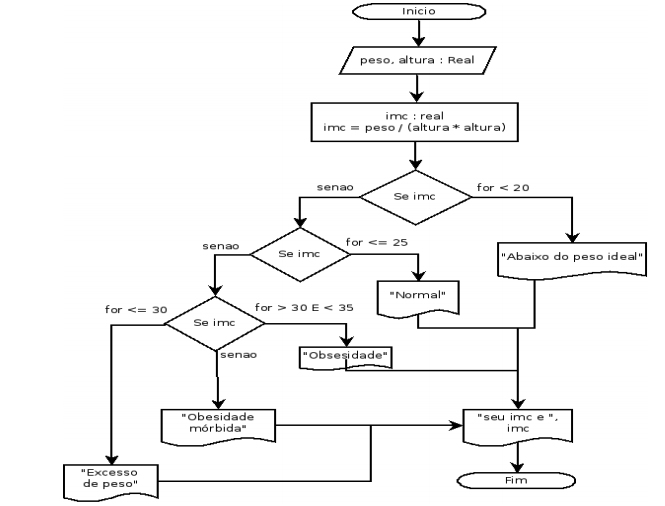

# Capítulo 3

## Comentários

É muito comum nas linguagens de programação a
utilização de comentários em certas partes do algoritmo. Estes comentários servem para documentar o código e possibilitar o entendimento de certas sessões do algoritmo por outros programadores que venham a ler seu código posteriormente. Em Python declaramos um comentário ao inserir o caractere #. Quando o Python se deparar com um comentário durante a interpretação do código, ele ignorará a linha comentada, ou seja, o Python não liga para os seus comentários.

<pre>
    # Este é um comentário
    # Sempre que o Python encontrar o símbolo # ele irá descartar
    # tudo que houver depois dele
    print("Esta instrucao sera executada")
    # print("esta instrucao nao sera executada")
</pre>

Saída:

Perceba que tudo que estava depois do # não foi
executado, pois o Python identificou como um comentário e logo passou para a próxima instrução válida. Este é o comentário de uma linha, porém também é possível inserir comentários de várias linhas desde que estejam entre aspas triplas (''' comentário ''' ou “““comentário”””) como no exemplo a seguir:

<pre>
    '''
    Este é um comentário de 
    várias linhas
    '''

    """
    Nada disso será
    executado
    pelo Python
    """
</pre>

Vamos comentar nosso código de agora em diante para facilitar o entendimento do contexto.

## Estruturas Condicionais

Grande parte das vezes em nossos algoritmos, teremos
que optar por executar uma tarefa ou outra, dependendo de uma condição específica. As estruturas condicionais, também denominadas estruturas de seleção ou decisão (PUGA; RISSETI, 2010 – p.56) são dos tipos simples e composta (ASCENCIO; CAMPOS, 2010; LEAL, 2016; PUGA; RISSETTI, 2010). Vamos ver cada um deles.

## Estrutura condicional simples

Vamos exemplificar com um algoritmo bem prático dos
nossos dias, acender a luz. Geralmente para acender uma
lâmpada em um cômodo na sua casa, é bem comum que se
aperte um interruptor. Se a lâmpada estiver desligada ela se
ligará. Vamos fazer um algoritmo Python bem simplificado
para demonstrar o funcionamento da estrutura condicional
simples.

<pre>
    luz = False # luz apagada

    acender_luz = input("Gostaria de acender a luz?[s/n] ")

    if acender_luz == "s": # se a entrada for s
        luz = True         # a luz acende
    
    # verificamos o estado da luz
    print(luz)
</pre>

Veja que a instrução if irá analisar a variável
acender_luz, e se o conteúdo armazenado nesta variável for igual a string “s” ele executará os comandos abaixo do if. Se o conteúdo da variável for diferente da comparação o Python irá pular para a próxima instrução que não estiver dentro do if

<pre>
    if acender_luz == "s":
    → → luz = True # observe a indentação
</pre>

Caso o código pertencente ao if não esteja tabulado à
direita o Python não irá compreender e irá lhe informar algo como isto:

Figura 12 - Erro de indentação

Fonte: O autor

Vamos melhorar o algoritmo anterior para verificar se a luz está acesa ou apagada:

<pre>
    luz = False # a luz começa apagada
    acender_luz = input("Gostaria de acender a luz? [s/n] ")

    if acender_luz == "s":
        luz = True
    
    if luz:    # se o valor de luz for True
        print("A luz esta acesa")
</pre>

Perguntar ao Python <b>if luz</b> é o mesmo que perguntar <b>if luz == True</b>. Se você quiser verificar se o valor é falso basta perguntar:

<pre>
    if not luz:
        print("A luz está apagada")
</pre>

Que é o mesmo que perguntar:

<pre>
    if luz == False:
        print("A luz está apagada")
</pre>

## Estrutura condicional composta

Na estrutura condicional composta nós temos mais de
uma opção de desvio para uma condição a ser analisada. Vamos melhorar ainda mais o algoritmo da luz:

<pre>
    # a luz começa apagada
    luz = False

    # perguntamos se o usuário quer acender a luz
    acender_luz = input("Gostaria de acender a luz?[s/n] ")

    if acender_luz == "s":
        luz = True
    
    # se acendeu a luz
    if luz:
        print("A luz está acesa")
    
    # se não
    else:
        print("A luz esta apagada")
</pre>

O else é um segmento do if que diz ao Python, “caso a
condição anterior for falsa, faça isto aqui ok?”, como uma alternativa que será realizada em oposição a outra. Leal (2016b, p. 65) afirma que a estrutura de decisão composta é melhor utilizada “Quando uma condição implica a execução de um ou outro bloco. Em situações que há duas condições mutuamente exclusivas”, ou seja, só pode acontecer uma das escolhas, as outras serão ignoradas pelo interpretador.

Seguindo para mais um exemplo, vamos imaginar que
seu professor comentou na aula que para que você seja
aprovado na disciplina você precisa ter uma média igual ou superior à 7.0, para descobrir a média você somaria as quatro notas de cada bimestre e dividiria por quatro e Se a média for igual ou superior a 7.0 você é aprovado, Senão, você fica de recuperação.

Figura 13 – Fluxograma para media do aluno

Fonte: O autor.

Vamos implementar um algoritmo em Python para
calcular sua média, primeiro vamos receber o nome da
disciplina então as quatro notas e o programa deve informar sua média nesta disciplina.

<pre>
    # solicitamos o nome da disciplina
    disciplina = input("Insira o nome da disciplina: ")

    # solicitamos as notas de cada bimestre
    nota1 = float(input("Insira a nota do 1 Bimestre: "))
    nota2 = float(input("Insira a nota do 2 Bimestre: "))
    nota3 = float(input("Insira a nota do 3 Bimestre: "))
    nota4 = float(input("Insira a nota do 4 Bimestre: "))

    # calculamos a media
    media = (nota1 + nota2 + nota3 + nota4) / 4

    # exibimos a media e a disciplina
    print("Disciplina: ", disciplina)
    print("Media: ", media)

    # se a media for menor que 7.0 o aluno e reprovado
    if (media < 7.0):
        print("Reprovado")

    # senão, é aprovado
    else: 
        print("Aprovado")
</pre>

As instruções if e else em Python analisam uma
condição, no caso de if(media < 7.0) nós passamos para o Python uma expressão relacional (media < 7.0), o Python vai analisar se a média é menor que 7.0 e verificar se é verdade ou mentira, caso seja verdade ele executará o comando logo abaixo do if, tabulado à direita, e caso a expressão se revele falsa ele irá ignorar e pular para os comandos abaixo do else.
As saídas:

Seu professor gostou do programa, mas agora ele disse
que esqueceu de lhe avisar que caso a nota esteja entre 6.0 e 6.9 o aluno ficará de recuperação;

Bem, na verdade o Python tem mais um comando de
decisão composta para não precisarmos ficar repetindo if's toda hora. Quando o Python encontra um <b>if</b> ele obrigatóriamente irá realizar a verificação, mesmo que o if anterior tenha resultado em Verdadeiro. Com elif caso isso ocorra ele não executará a verificação, o que poupa processamento ao computador. O comando elif pode ser utilizado depois do if e antes do else, desta forma:

<pre>
    # solicitamos o nome da disciplina
    disciplina = input("Insira o nome da disciplina: ")

    # solicitamos as notas de cada bimestre
    nota1 = float(input("Insira a nota do 1 Bimestre: "))
    nota2 = float(input("Insira a nota do 2 Bimestre: "))
    nota3 = float(input("Insira a nota do 3 Bimestre: "))
    nota4 = float(input("Insira a nota do 4 Bimestre: "))

    # calculamos a media
    media = (nota1 + nota2 + nota3 + nota4) / 4

    # exibimos a media e a disciplina
    print("Disciplina: ", disciplina)
    print("Media: ", media)

    # se a media for maior que 7.0 o aluno é aprovado
    if media >= 7.0: 
        print("Aprovado")

    # media entre 6.0 e 6.9 ele está em recuperação
    elif media >= 6.0 and media <= 6.9: 
        print("Recuperacao")

    # seão, está reprovado
    else:
        print("Reprovado")
</pre>

Tivemos que fazer algumas mudanças no nosso
programa, primeiro trocamos o primeiro if que verificava se a media era menor que 7.0, se a média fosse menor que 7.0 o aluno seria reprovado, mas como temos alunos que ainda podem ficar de recuperação vamos ver somente as médias que estão acima ou igual a 7.0, do contrario se a média for entre 6.0 e 6.9 será exibido uma mensagem dizendo que o aluno está em recuperação, e se ele não for aprovado nem estiver de recuperação, então ele está reprovado.

A diferença está no desempenho do algoritmo. Quando
temos varias instruções do tipo if (estrutura condicional simples), o interpretador irá checar cada uma delas. Se tivermos uma estrutura composta por if, elif e else o interpretador irá checar o primeiro if e caso seja verdadeiro ele irá ignorar o resto da composição, ou seja, se a primeira verificação for verdadeira as seguintes serão descartadas, lembrando que você pode inserir quantos elif's quiser. Em um algoritmo complexo, demasiadas verificações de if podem comprometer o desempenho do algoritmo, tornando sua execução mais lenta. Então como saber qual tipo de instrução utilizar? Simples, como dito anteriormente, se você tiver diferentes situações onde somente uma poderá ocorrer, deve-se utilizar a estrutura de decisão composta, pois as alternativas são mutuamente excludentes. Caso você precise fazer uma única verificação utiliza-se a estrutura simples.

É preciso ficar atento à um aspecto muito importante
para o funcionamento do seu código, a indentação. A
indentação é o recuo à direita da margem pelo texto, no caso do Python a indentação é OBRIGATÓRIA, pois o interpretador irá considerar como pertencente à instrução if tudo o que estiver indentado, do contrário o comando poderá ser executado em uma hora inoportuna do programa ou pior gerar um erro.

Figura 14 – Indentação do código

Fonte: O autor.

Veja na figura acima que o if é cercado por um
retângulo azul que representa um bloco de comandos, os  comandos pertencentes a este bloco estão indentados quatro espaços à direita da margem (basta pressionar o botão tab uma vez), cercados por um retângulo vermelho. Os comando que estiverem dentro do vermelho somente serão executadas se as verificações feitas no azul forem verdadeiras do contrário o interpretador passará para o próximo bloco de comandos.

A estrutura condicional em Python nos permite uma
gama de verificações, inclusive verificar se determinadas letras ou palavras existem em uma string, veja:

<pre>
    frase = "Quem ensina aprende o que ensina e quem aprende ensina ao aprender - FREIRE"

    # se existir a palavra FREIRE na frase
    if "FREIRE" in frase:
        print("Graaaaaande Mestre Paulo Freire")
    else:
        print("Frase de outra autoria")
</pre>

Perguntamos ao Python se uma determinada palavra ou
letra existe em uma string, ele irá analisar a string e se existir ele irá retornar verdadeiro, noutro caso ele retorna falso. Lembra-se da instrução type( )? Vamos fazer um algoritmo que recebe uma variável e verifica qual o tipo da variável escrevendo na tela:

<pre>
    # definimos uma variavel com um valor
    caixa = 72 

    # verificamos seu tipo e guardamos como string
    caixa = str(type(caixa))

    if 'str' in caixa:
        print("Essa varivel e do tipo String (Literal)")
        
    elif 'int' in caixa:
        print("Essa variavel e do tipo Inteiro")
        
    elif 'float' in caixa:
        print("Essa variavel e do tipo float")
        
    elif 'bool' in caixa:
        print("Essa variavel e do tipo bool")
        
    else:
        print("Outro")
</pre>

Lembra que a instrução type( ) retorna um texto
esquisito dizendo algo tipo &lt;class 'int'>? Então, o que fizemos foi adicionar um valor a uma variável, depois nessa mesma variável adicionamos esta mensagem esquisita através da instrução type( ) convertida para string através da instrução
str( ), você também deve se recordar que as instruções que estão nos parênteses mais internos acontecem primeiro, certo? Depois verificamos se a variável contém a abreviatura correspondente ao seu tipo no nome e escrevemos uma mensagem um pouco mais elegante do que &lt;class 'int'> para informar o tipo da variável que estamos lidando.

Tente mudar o tipo de variável para testar os outros
resultados. Pesquise sobre o tipo complex em Python e
implemente o algoritmo para reconhecer este tipo de dado.

## Estrutura condicional aninhada

Na estrutura condicional aninhada, também conhecida
por encadeamento (PUGA; RISSETTI, 2010) são estruturas condicionais dentro de outras estruturas condicionais. Desta forma ao realizar uma verificação condicional que retorne verdadeiro, o interpretador poderá encontrar com outros testes condicionais.

Vamos exemplificar melhor em um algoritmo que verifica o maior dentre 3 números escolhidos:

<pre>
    # primeiro recebemos a entrada
    num1 = int(input("Insira o primeiro numero "))
    num2 = int(input("Insira o segundo numero "))
    num3 = int(input("Insira o terceiro numero "))

    # estrutura condicional externa
    if num1 > num2:

        # estrutura condicional interna (aninhada)
        if num1 > num3: 
            print("O primeiro numero foi o maior, ", num1)
        else:
            print("O terceiro numero e o maior, ", num3)
    else: 
        
        if num2 > num3:
            print("O segundo numero e o maior, ",num2)
        else:
            print("O terceiro numero e o maior, ", num3)
</pre>

Neste exemplo primeiro recebemos três entradas que
devem ser números inteiros, então verificamos se o num1 é maior que o num2, caso isso seja verdade partimos para uma outra verificação, que analisa se o num1 é maior que o num3, e se for verdade isso significa que o primeiro número foi o maior, do contrário o terceiro número é o maior. Se a primeira condição for falsa, partimos para outra verificação, que analisa se o num2 é maior que o num3.

Existem sim formas diferentes e até mais eficazes de se implementar este algoritmo, porém para nível de exemplo este algoritmo é capaz de demonstrar o funcionamento da estrutura condicional aninhada. A grande diferença entre usar as condições aninhadas, de acordo com Leal (2016a, p. 70) “é que o uso destes encadeados melhora o desempenho do algoritmo, isto é, torna o algoritmo mais rápido por realizar menos testes e comparações. Ou ainda, executar um menor número de passos para chegar à solução do problema.”

## Exercícios elaborados

4) Elabore um algoritmo que receba o nome e a idade de uma pessoa e informe se é menor de idade, maior de idade ou idoso.

**Objetivo**: Informar se a pessoa é menor de idade, maior de idade ou idoso;

**Entrada**: nome e idade;

**Processamento**: Verificar se a idade é menor que 18 (menor de idade), maior que 18 e menor que 65 (adulto) ou maior que 65 (idoso);

**Saída**: escrever se a pessoa é menor, maior ou idoso;

Figura 15 – Fluxograma atividade 4

Fonte: O Autor.

<pre>
    # ler nome
    nome = input("Insira seu nome: ")

    # ler idade
    idade = int(input("Insira sua idade: ")) 

    # verifica se a idade e menor que 18
    if idade < 18:
        print(nome, " voce e menor de idade")

    # senao verifica se a idade est entre 18 e 65
    elif idade >= 18 and idade < 65: 
        print(nome, " voce e maior de idade")
    
    # senao for nenhuma das acima, entao e idoso
    else:
        print(nome, " voce ja e idoso")
</pre>

 

5) Elabore um algoritmo que calcule o IMC (Índice de
Massa Corporal) de uma pessoa de acordo com seu peso
e altura. O programa deve informar se a pessoa está
abaixo do peso (IMC menor que 20), normal (IMC entre
20 e 25), excesso de peso (entre 26 e 30), obesa (IMC
entre 31 e 35) ou com obesidade mórbida (acima de 35 .
 O cálculo do IMC é dado por:

 

**Objetivo**: Verificar o Índice de Massa Corporal de um indivíduo;

**Entrada**: Valores de peso e altura;

**Processamento**: Calcular o IMC, verificar em que faixa o IMC se encontra;

**Saída**: Mostrar o IMC e a faixa em que a pessoa se encontra;

Figura 16 – Fluxograma atividade 5

Fonte: O autor.

<pre>
    # receber o valor do peso
    peso = float(input("Insira seu peso: "))

    # receber o valor da altura
    altura = float(input("Insira sua altura: ")) 

    # calcular o imc
    imc = peso/(altura**2)

    # se o imc for menor que 20
    if imc < 20:
        print("Abaixo do peso ideal")

    # senao
    else:
        # se for menor que 25
        if imc <= 25:
            print("Seu imc esta normal")
        # senao
        else:
            # se for menor que 30
            if imc <= 30:
                print("Excesso de peso")

            # ou se for maior que 30 e menor que 35  
            elif imc > 30 and imc <= 35: 
                print("Obesidade")
            # ou entao se for mairo que isso
            else:
                print("Obesidade morbida")
    
    # finalmente mostramos o imc
    print("Seu imc e: ", imc) 
</pre>

*Exercícios propostos*

1) Elabore um algoritmo que leia o percurso em quilômetros, o tipo de automóvel e informe o consumo estimado de combustível, sabendo que um automóvel do tipo A faz 26 Km com um litro de gasolina, um automóvel do tipo B faz 20 Km e um automóvel do tipo C faz 7 Km.

2) Formule um algoritmo que leia cinco números e conte quantos deles são negativos.

3) Escreva um algoritmo que recebe uma letra e verifica se é uma vogal ou uma consoante.

4) Formule um algoritmo que leia o código do produto e a quantidade desse produto que o cliente está adquirindo, informe os produtos que o cliente comprou, a quantidade e o total a pagar:

| Código | Produto | Valor |
| :----: | :-----: | :---: |
| 1 | Refrigerante | R$ 4.50 |
| 2 | Água Mineral | R$ 3.00 |
| 3 | Feijão | R$ 8.00 |
| 4 | Arroz | R$ 7.25 |
