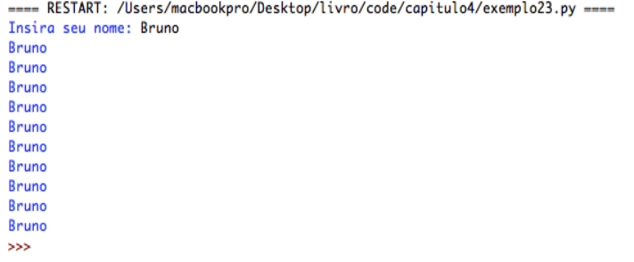
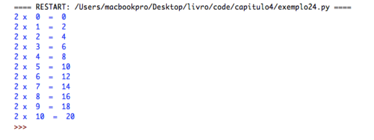
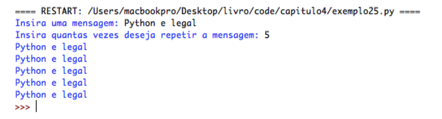
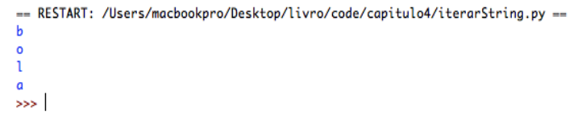
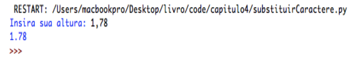

# Capítulo 4

## Estruturas de repetição

<p align="justify">
As estruturas de repetição fornecem meios para que
possamos repetir determinada parte do algoritmo sem que tenhamos que reescrever os comandos necessários para isso. Já pensou em um algoritmo que recebe cem números? Ou então mil números? Como você acha que faria isto? Com mil comandos de input? Neste capítulo vamos conhecer as estruturas de de repetição, também denominadas como laço de repetição ou loop. Para Ascencio e Campos (2010, p.93) “uma estrutura de repetição é utilizada quando um trecho do algoritmo ou até mesmo o algoritmo inteiro precisa ser repetido” e Leal (2016b, p.82) afirma que “a vantagem da estrutura de repetição é que não precisamos reescrever trechos de código idênticos, reduzindo assim o tamanho do algoritmo”, a mesma autora ainda enfatiza que as estruturas de repetição podem ser de dois tipos: Laços contados e laços condicionais, vamos conhecer cada um deles.
</p>

## Estrutura for

<p align="justify">
A estrutura for em Python é uma instrução do tipo laço
contado, que significa que vamos repetir um determinado conjunto de instruções um determinado número de vezes já preestabelecido. De acordo com Leal (2016a, p. 90) “os laços contados são aqueles que utilizamos quando sabemos previamente quantas vezes o trecho do código precisa ser repetido. Por exemplo, realizar a leitura de 100 números, efetuar o somatório dos números entre 500 e 700 e outros.” Vamos ver como funciona o laço for em Python construindo um algoritmo que escreva seu nome dez vezes na tela:
</p>


```python

    # primeiro recebemos o nome
    nome = input("Insira seu nome")

    """
    Queremos mostrar o nome 10 vezes
    ao invés de escrever dez vezes
    print(bome), então podemos
    fazer simplesmente o seguinte:
    """

    for contagem in range(10):
        print(nome)

```

<p align="justify">
Primeiro damos a instrução for que irá analisar uma
variável chamada contagem em um alcance (range) de 10
números. Como isso funciona? Bem, a variável contagem
somente será utilizada para fazer a contagem do laço, essa contagem se dará após o comando in que avaliará quantas vezes o laço se repetirá através do comando range() que recebe um número inteiro. Veja que na instrução for também é necessário que se faça a indentação do código que deseja-se repetir.
</p>

<p align="center">

</p>

<p align="justify">
Veja que o laço repete a instrução print(nome) o
número de vezes que pedimos que fizesse. Vamos exemplificar novamente pedindo ao Python que escreva na tela a tabuada do 2:
</p>


```python

    # a variável i é o nosso contador
    for i in range(11):
        # perceba com i muda a cada repetição
        print("2 x ", i, " = ", 2 * i)

```


<p align="justify">
Aqui ao invés de nomear a variável contadora com o
identificador de contador, demos o nome de i, é muito comum em linguagem de programação que as variáveis dos laços de repetição assumam um identificador como este, pois ela somente será utilizada para contar o laço, porém você poderá inserir o identificador desejar. Nosso range( ) agora é 11 pois o
Python começa a contar do zero, para que o último número a ser calculado seja o 10 precisamos fornecer um número acima para o range( ), do contrário ele iria mostrar a tabuada do zero ao nove (tente fazer isso, repita esse algoritmo com range(10)).
Dentro de nosso print temos uma string que diz “2 x ” (repare nos espaços em branco na string, sem eles a escrita na tela deixaria os caracteres colados uns nos outros) então passamos após a vírgula o valor de i. Cada vez que o laço for executar as instruções em seu bloco de comandos, a variável i será incrementada em 1, até que chegue a 11. Então a cada execução a variável i assumirá o valor do número de vezes em
que o laço foi repetido. Então fornecemos outra string “ = ” e então uma expressão que multiplica o valor de i por 2. Veja a saída:
</p>

<p align="center">

</p>

<p align="justify">
Observe como o valor de <b>i</b> se inicia em zero e a cada vez que a instrução print é executada ela é incrementada, depois do sinal de = temos a multiplicação de <b>i</b> por 2. Tente mudar o número dentro da instrução range para ver como o algoritmo se comporta. Dizemos que a instrução for é uma
estrutura do tipo laço contado porque sabemos exatamente quantas vezes devemos repetir os comandos, neste caso apresentado o laço deve ser percorrido o número de vezes que for passado para o comando range( ). Neste comando range( ) não precisamos passar um número diretamente, também podemos passar um valor numérico guardado em uma variável<small><sup>5</sup></small>. Veja este próximo exemplo:
</p>


```python

    mensagem = input("Insira uma mensagem")
    repeticoes = int(input("Insira o numero de repetições: "))

    for i in range(repeticoes):
    print(mensagem)

```

<p align="justify">
Primeiro recebemos uma mensagem do usuário através
do comando input( ), esta mensagem ficará guardada na
variável mensagem, depois recebemos um valor numérico do usuário que é armazenado na variável repeticoes. No laço for repetimos a mensagem do usuário o número de vezes que ele informou. 
</p>

<p align="center">

</p>

<hr>
<small><sup>5</sup></small> : <small>
Na instrução range() também é possível passar um valor mínimo e um máximo separados por virgula assim range(10, 21). Desta forma o contador iniciará em 10 e contará até 20.</small>

<small>
Um terceiro parâmetro pode ser fornecido para indicar o passo da contagem, range(0, 11, 2) irá contar até  10 pulando de 2 em 2.
</small>
<hr>

<p align="justify">
Em Python, a instrução for também pode ser utilizada
para iterar pelos caracteres de uma string. Iterar pela string quer dizer que o Python vai passar verificando caracter por caracter da string que você quer analisar, veja no exemplo a seguir:
</p>


```python

    # definimos uma string
    palavra = 'bola'

    # para cada letra na string
    for letra in palavra():
        # escreva a letra na tela
        print(letra)

```


<p align="justify">
A cada repetição do laço for o Python vai escrever a
letra que ele identificou, uma de cada vez até chegar ao fim da string, quando o Python identificar que já não há mais caracteres para ele verificar o loop se encerra.
</p>


<p align="center">

</p>

<p align="justify">
Lembra quando verificamos a existência de um
determinado caractere em uma string com a instrução if? Vamos fazer um algoritmo que leia um número de ponto flutuante e caso este tenha sido inserido com vírgula (,) ao invés de ponto (.) o Python substitua os caracteres para nós:
</p>

```python

    # pedimos uma altura
    entrada = input("Insira sua altura: ")

    # para cada caractere na entrada
    for caractere in entrada:
        # se houver vigula na entrada
        if caracter == ',':
            # substituimos por um ponto
            entrada = float(entrada.replace(',', '.'))
    
    print(entrada)

```


<p align="justify">
Neste exemplo recebemos uma entrada referente a
altura do usuário, é muito comum que o usuário ao inserir um número fracionário digite uma vírgula ao invés de ponto, e se isso ocorrer durante o processamento de um cálculo, ou mesmo durante a conversão para float, o Python retornará um erro. Com este algoritmo conseguimos contornar esta situação, recebemos a entrada em forma de string, analisamos cada um dos caracteres da string e se algum deles for uma vírgula, substituímos a virgula por um ponto com a instrução replace( ). A instrução replace( ) recebe dois parâmetros, o primeiro deles é o caractere que queremos remover e o segundo é o caractere que vamos inserir no lugar, desta forma:
</p>

`variavel.replace(caracter_a_substituir, caracter_a_inserir)`

<p align="justify">
Também fazemos a conversão de string para float
através da instrução float() e atribuímos o resultado da conversão para a entrada. Quando o loop encerrar escrevemos na tela o novo valor da variável entrada que está pronto para ser utilizado em qualquer cálculo de números fracionários:
</p>

<p align="center">

</p>

A mesma tarefa pode ser realizada também utilizando o operador **in**, desta forma:


```python

    entrada = input("Insira sua altura: ")
    if "," in entrada:
        entrada = float(entrada.replace(",", "."))
```


## Estrutura while

<p align="justify">
A instrução while é uma estrutura de repetição do tipo condicional, o que significa que os comandos inseridos no bloco de instruções while se repetirão até que uma determinada
condição se satisfaça. Lembra da instrução if? Ela analisa uma condição e caso seja verdadeira executa um bloco de instruções. A instrução while funciona de maneira similar, porém ela ficará executando os comandos enquanto a condição
for verdadeira. Acompanhe no exemplo:
</p>

```python

# definimos uma variavel com valor zero
num = 0
# definimos uma string qualquer
nome = "String"

# enquanto num tiver valor menor que cinco
while num < 5:
    # escreva a string na tela
    print(nome)
    # incrementamos a variavel num
    num += 1

```

Saída:

```
String
String
String
String
String
>>>
```

<p align="justify">
Na estrutura de repetição condicional é muito
importante que a variável analisada seja modificada dentro do bloco while, nesse caso analisamos a variável num, e dissemos ao Python “Repita essas instruções enquanto num for menor que 5 ok?”, e dentro do bloco while, após a instrução print, nós temos num += 1, que é equivalente a num = num + 1. Sem esse incremento o loop ficaria repetindo infinitamente a mensagem, pois num seria sempre menor que 5.
</p>

<p align="justify">
Outro adendo importante a se ressaltar a respeito desta estrutura é a inicialização da variável avaliada. A inicialização de uma variável quer dizer que antes de avaliarmos esta variável devemos atribuir um valor a ela. Diferentemente da estrutura for onde declaramos uma variável contadora no próprio comando, a instrução while precisa que a variável possua um valor inicial atribuído antes de chegar no loop, ou então nosso interpretador Python irá retornar um erro:
</p>

```python

nome  = "wubalubadubdub"

while num < 5:
    print(nome)

```

<p align="justify">
Veja no exemplo acima que dissemos ao Python para
repetir o conteúdo da variável nome enquanto o valor de num for menor que 5. Mas a variável num não foi declarada em lugar algum, então o Python não saberá o que você quer analisar exatamente, devolvendo este erro:
</p>

```
Traceback (most recent call last):
  File "<stdin>", line 1, in <module>
NameError: name 'num' is not defined
>>>
```

<p align="justify">
Lembra-se do Traceback? Sim exatamente, é a forma
que o Python tem de dizer que houve um erro no seu algoritmo, nesse caso ele retornou um NameError, informando que o identificador num não foi definido. Se você se recordar, já vimos este erro no capitulo 2, é muito comum este tipo de erro quando tentamos manipular uma variável que não foi declarada ou quando erramos o nome de um identificador.
</p>

<p align="justify">
A estrutura de repetição condicional é caracterizada por repetir uma determinada sequência de comandos indefinidamente (LEAL, 2016a p. 96) , ou seja, não sabemos quantas vezes o loop deve se repetir. Para exemplificar vamos supor que temos que escrever um algoritmo que receba vários números do usuário, e continuará recebendo números até que seja digitado o valor zero (0). Neste algoritmo vamos contar quantos números foram inseridos pelo usuário e mostrar na tela depois de sair do loop. Veja:
</p>

```python

# variavel que conta quantos numeros são inseridos
inseridos = 0

# variavel que controla o loop
num = 1

# o loop vai persistir enquanto o loop não for zero
while num:
    
    # pedimos um numero
    num = int(input("Insira um numero ou 0 oara sair: "))

    # caso a entrada nao seja zero incrementamos
    # o contador
    if num:
        inseridos += 1

# no final escrevemos o resultado na tela
print("Voce inseriu ", inseridos, " numeros")

```

<p align="justify">
Perceba que nesse loop while não temos um incremento para sair do loop, mas uma condição bem específica que é tratada dentro do loop, nesse caso, a entrada do usuário. Toda
vez que o usuário inserir uma entrada diferente de zero fazemos uma verificação if num, e se for diferente de zero incrementamos o contador.
Quando o usuário inserir 0 o loop while irá realizar novamente a análise, nesse ponto o Python irá detectar que num é igual a zero, então ele não executará o while. Depois do loop, temos
outra instrução informando quantos números o usuário inseriu, esta instrução está fora do loop como podemos ver pela indentação. A saída deve ser parecida com esta:
</p>

```
Insira um numero ou 0 oara sair: 4
Insira um numero ou 0 oara sair: 6
Insira um numero ou 0 oara sair: 4
Insira um numero ou 0 oara sair: 8
Insira um numero ou 0 oara sair: 1
Insira um numero ou 0 oara sair: 9079
Insira um numero ou 0 oara sair: 012
Insira um numero ou 0 oara sair: 0
Voce inseriu  7  numeros
>>>
```

<p align="justify">
Podemos criar um laço while diretamente com
booleanos (True ou False) e para saírmos do loop basta utilizar a instrução break:
</p>

```python
# enquanto for verdade
while True:
    # solicite um nome
    nome = input("Insira seu nome: ")

    # se o nome for fim
    if nome == "fim":
        # saimos do loop
        break
    else:
        # senão diga oi
        print("Oi ", nome)

# esta instrução contece quando o loop encerra
print("fim do loop")
```

<p align="justify">
Criamos a condição True no laço que continuará sempre a executar, dentro do loop criamos uma condição de saída que quando satisfeita freia o loop e parte para a próxima instrução depois do laço, neste caso uma instrução print( ) informando que o laço acabou, veja a saída:
</p>

```
Insira seu nome: Bruno
Oi  Bruno
Insira seu nome: Joana
Oi  Joana
Insira seu nome: André
Oi  André
Insira seu nome: fim
fim do loop
>>>
```

## Estruturas de repetição aninhadas