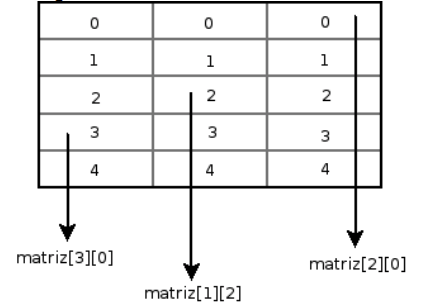
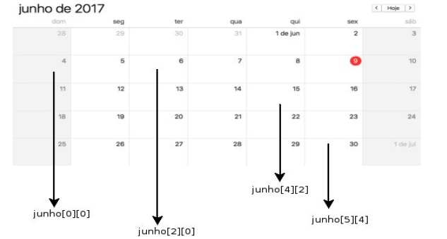
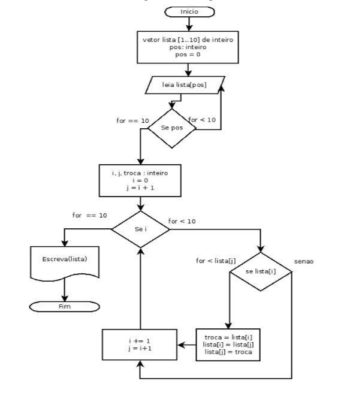

# Capítulo 5

## Estruturas de dados

<p align="justify">
As estruturas de dados em lógica de programação são
responsáveis por permitir que agrupemos diversos tipos de dados em uma única variável, em outras linguagens é comum que estas estruturas sejam divididas em homogêneas e heterogêneas, pois há estruturas específicas para agrupar um
único tipo de dado (como uma lista enorme de números inteiros), porém no Python é possível misturar diferentes tipos em uma única lista, desta forma pode-se dizer que as estruturas
de dados em Python são praticamente todas heterogêneas, mas nada lhe impede de criar listas somente de inteiros ou somente
de literais.
</p>

<p align="justify">
Até agora estávamos armazenando os valores em
variáveis separadas, mas existem momentos em que
precisamos armazenar muitos dados, o que nos exigiria a declaração de inúmeras variáveis. “Suponha, por exemplo, o caso de um treino de classificação de uma corrida de Fórmula 1, em que é necessário verificar os tempos obtidos por todos os pilotos para avaliar qual será o primeiro no grid de largada. Para fazer essa ordenação, é necessário armazenar o tempo de todos os pilotos e, depois, realizar a ordenação desses tempos.”(PUGA; RISSETTI, 2010 p. 83), já pensou quantas variáveis precisaríamos criar? Uma para cada piloto, mais uma para cada tempo, isso exigiria muito consumo de memória do computador, e seria desnecessário já que possuímos as estruturas de dados para agrupar todos estes valores. Vamos conhecer as estruturas de dados em Python.
</p>

## Estruturas de dados unidimensionais

<p align="justify">
Em lógica de programação, as estruturas
unidimensionais são popularmente conhecidas como vetores, vetor é uma estrutura de dados unidimensional (ASCENCIO; CAMPOS, 2010), unidimensional porque ela possui apenas uma dimensão linear onde os dados serão listado um após o outro em sequência.
</p>
<p align="justify">
Em Python estas estruturas são denominadas listas, e assim como uma lista comum os itens serão incluídos e identificados por um índice que corresponde à sua localização na lista.
</p>

<quote><small><p align="justify">
Uma lista é uma coleção de itens em uma ordem em particular. Podemos criar uma lista que inclua as letras do alfabeto, os dígitos de 0 a 9 ou os nomes de todas as pessoas de sua família. Você pode colocar qualquer informação que quiser em uma lista, e os itens de sua lista não precisam estar relacionados de nenhum modo em particular. (MATTHES, 2016 p. 70)
</p></small></quote>

<p align="justify">
Vamos exemplificar isto com uma situação bem
comum. Suponha que sua mãe pediu para que você fosse ao mercado e comprasse bananas, queijo, trigo e uma lata de azeite. Logo você pega um pedaço de papel e anota:
</p>

1 – Banana;

2 – Queijo;

3 – Trigo;

4 – Azeite;

Vamos fazer a mesma lista em Python agora:

```python
# criamos nossa lista
lista = ['banana', 'queijo', 'trigo', 'azeite']

# exibe o conteúdo da lista
print(lista)
```

Saída:

```
['banana', 'queijo', 'trigo', 'azeite']
>>>
```

A sintaxe para criar uma lista em Python é:

`identificador = [conteúdo]`

<p align="justify">
Em Python as listas são definidas por um par de [ ], e os itens que estiverem dentro dos colchetes pertencem a lista, mais de um item deve ser separado por vírgula. Veja no exemplo anterior que guardamos quatro valores literais dentro
de uma única variável e quando chamamos esta variável na instrução print( ) o Python nos diz todos os valores que existem nessa variável. Nós podemos verificar quantos itens existem em uma lista com a instrução len( ).
</p>

```python
# criamos nossa lista
lista = ['banana', 'queijo', 'trigo', 'azeite']

# exibe o número de itens na lista
print(len(lista))
```

Saída:

```
4
>>>
```

<p align="justify">
Desta forma ao trabalharmos com listas muito extensas em que precisamos verificar a quantidade de itens nesta lista basta passarmos a lista como parâmetro para a instrução len( ).
</p>

<p align="justify">
Agora vamos supor que antes de você sair para o
mercado sua mãe lhe diz que esqueceu de dizer que é pra você trazer cenouras também, então você precisa adicionar mais um item em sua lista, para fazer isto no Python basta utilizar o comando .append( ) com o nome do item a ser adicionado entre os parênteses, desta forma:
</p>

```python
# lista inicial
lista = ['banana', 'queijo', 'trigo', 'azeite']

# verifique o tamanho da lista
print(len(lista))
# verifique os itens da lista
print(lista)

# adicione a cenoura no fim da lista
lista.append("cenoura")

# verifique novamente o tamanho da lista
print(len(lista))

# verifique novamente os itens da lista
print(lista)
```
<p align="justify">
Utilizamos as instruções len( ) para verificar que a lista aumentou de tamanho, escrevemos antes e depois de adicionar o item para verificar que as alterações foram feitas com sucesso. Agora você já pode ir ao mercado comprar as coisas para sua mãe.
</p>

```
4
['banana', 'queijo', 'trigo', 'azeite']
5
['banana', 'queijo', 'trigo', 'azeite', 'cenoura']
>>>
```

<p align="justify">
Ao chegar no mercado você colocou em sua cestinha a
banana e o azeite, e resolveu riscar da sua lista os itens que você já pegou para não acabar se perdendo. Para remover um item conhecido de sua lista basta escrever o item a ser removido como parâmetro na instrução .remove( ), desta forma:
</p>

```python
lista = ['banana', 'queijo', 'trigo', 'azeite', 'cenoura']

# removemos a banana
lista.remove('banana')
# removemos o azeite
lista.remove('azeite')

# verificamos quais itens ainda estão na lista
print(lista)
```
Saída:

```
['queijo', 'trigo', 'cenoura']
>>>
```

<p align="justify">
No começo deste capítulo foi dito que as estruturas de dados em Python são heterogêneas, o que significa que podemos misturar tipos de dados em uma única lista. Nos exemplos anteriores fizemos uma lista de literais, mas é possível inserir dados de tipos distintos em uma mesma lista Python. Veja neste exemplo:
</p>

```python
# criamos um vetor vazio
meus_dados = []

# solicitamos que o usuário insira o nome
nome = input("Insira seu nome: ")

# inserimos o nome no vetor
meus_dados.append(nome)

# solicitamos a idade
idade = int(input("Insira sua idade: "))

# inserimos a idade no vetor
meus_dados.append(idade)

# solicitamos a altura
altura = float(input("Insira sua altura: "))

# inserimos a altura no vetor
meus_dados.append(altura)

# exibimos o conteúdo do vetor
print(meus_dados)
```

<p align="justify">
Primeiro criamos uma lista vazia com o identificador meus_dados, para criar uma lista vazia basta atribuir os colchetes vazios [], então fazemos as solicitações de entrada de três tipos de dados diferentes um literal (nome) um inteiro (idade) e um real (altura), adicionando cada um deles em nossa lista, no final do algoritmo escrevemos o conteúdo da lista.
</p>

```
Insira seu nome: Bruno
Insira sua idade: 27
Insira sua altura: 1.63
['Bruno', 27, 1.63]
>>>
```

<p align="justify">
Veja como as listas em Python suportam diferentes tipos de dados, por este motivo são caracterizadas como heterogêneas, diferentemente dos vetores em algumas linguagens de programação como C por exemplo, que somente aceitam dados de um único tipo. Dissemos também no início deste capítulo que os itens da lista são identificados por um índice, assim podemos pedir para o Python um determinado elemento da lista pelo índice. Se você se lembrar bem, o Python começa a contar do zero, isso também se aplica as listas, logo o primeiro índice da lista é 0, e todos os elementos na sequência seguem a numeração do índice. A nossa lista de compras dos primeiros exemplos possui no índice 0 o item “banana”, no índice 1 o item “queijo”, no índice 2 o item “trigo” e assim por diante. Para que o Python identifique o item pelo índice basta escrever o nome da lista seguido pelo índice entre colchetes, desta forma:
</p>

```python
lista = ['banana', 'queijo', 'trigo', 'azeite', 'cenoura']

# exibe o item com indice 0
print(lista[0])

# exibe o item com indice 4
print(lista[4])
```

Saída:

```
banana
cenoura
>>>
```

<p align="justify">
Perceba que apesar de nossa lista possuir 5 elementos, o último elemento da lista é representado pelo índice 4, é bem comum o Python retornar um erro ao passarmos um índice inexistente para ele, necessitando um pouco de cuidado ao solicitar os elementos pelo índice. No exemplo anterior pedimos que o Python escrevesse o item da posição 0 e da posição 4, e caso não existisse uma posição 4, o Python retornaria um erro:
</p>

```python
lista = ['banana', 'queijo', 'trigo', 'azeite', 'cenoura']

# exibe o item com indice 0
print(lista[0])

lista.remove("cenoura")

# exibe o item com indice 4
print(lista[4])
```

Saída:

```
banana
Traceback (most recent call last):
  File "x.py", line 10, in <module>
    print(lista[4])
IndexError: list index out of range
>>>
```

<p align="justify">
Neste exemplo, ao pedirmos que o Python escreva a
posição 0 ocorre tudo bem, ele escreve “banana”, mas quando o algoritmo chegar a instrução que solicita ao Python para escrever a posição 4 ele retornará um Traceback do tipo IndexError, pois antes desta instrução havíamos removido o
item da posição 4, e como não haviam mais itens na sequência, a posição do índice 4 ficou inexistente. Ao tentar analisar isto o Python tenta nos dizer “ei programador esse índice não existe”.
</p>
<p align="justify">
Quando você não tiver certeza de quantos elementos
possui a lista, mas mesmo assim quiser verificar o último elemento da lista, basta utilizar [-1] como índice, e o Python irá buscar o último item da lista, independente de quantos elementos ela possua:
</p>

```python
lista = ['banana', 'queijo', 'trigo', 'azeite', 'cenoura']

# exibe o item com indice 4
print(lista[0])

lista.remove("cenoura")

# exibe o último item da lista
print(lista[-1])
```

Saída:

```
azeite
>>>
```


<p align="justify">
Através dos índices também é possível alterar o
conteúdo da lista fazendo uma nova atribuição ao índice, isto irá sobrescrever o elemento armazenado naquela posição, veja:
</p>

```python
lista = ['banana', 'queijo', 'trigo', 'azeite', 'cenoura']

lista[0] = "sorvete"
lista[1] = "chocolate"
lista[2] = "pizza"
lista[3] = "coxinha"
lista[4] = "pão de queijo"

print(lista)
```

Saída:

```
['sorvete', 'chocolate', 'pizza', 'coxinha', 'pão de queijo']
>>>
```

<p align="justify">
Modificamos todas as posições da lista e atribuímos
novos valores a cada posição do índice, essa lista parece ter ficado bem mais gostosa, mas infelizmente não é o que sua mãe pediu pra você comprar.
</p>
<p align="justify">
Uma das formas mais comum de se trabalhar com listas é iterar através do laço <b>for</b>, assim podemos analisar item por item da lista, veja:
</p>

```python
lista = ['banana', 'queijo', 'trigo', 'azeite', 'cenoura']

# para cada item na lista
for item in lista:
    # exiba o item da lista na tela
    print(item)
```

Saída:

```
banana
queijo
trigo
azeite
cenoura
>>>
```

<p align="justify">
Com o loop percorremos cada um dos elementos e
vamos escrevendo-o na tela. O for é o mais comum de se utilizar porém é perfeitamente possível fazer o mesmo com o loop while, você saberá quando utilizar um ou outro no decorrer de seus algoritmos. Da mesma forma que podemos percorrer a lista com um laço, também é possível verificar se um determinado item existe na lista com uma estrutura condicional, como no exemplo a seguir:
</p>

```python
lista = ['banana', 'queijo', 'trigo', 'azeite', 'cenoura']

# se houver queijo na lista
if "queijo" in lista:
    # diga que há queijo na lista
    print("Queijo está na lista!")
```

Saída:

```
Queijo está na lista!
>>>
```

<p align="justify">
Viu como é fácil trabalhar com listas em Python?
Vamos ver mais uma função bacana para se utilizar nas listas, o método sort( ). Com este comando podemos ordenar nossa lista de forma organizada, no exemplo a seguir vamos organizar a nossa lista de compras em ordem alfabética:
</p>

```python
lista = ['banana', 'queijo', 'trigo', 'azeite', 'cenoura']

# organiza a lista em ordem alfabética
lista.sort()

# escreve a lista
print(lista)
```

Saída:

```
['azeite', 'banana', 'cenoura', 'queijo', 'trigo']
>>>
```

<p align="justify">
É possível fazer o inverso e organizar os itens da lista de trás para frente com o método .reverse( ), assim a lista será invertida ao contrário, como neste exemplo:
</p>

```python
lista = ['banana', 'queijo', 'trigo', 'azeite', 'cenoura']

# inverte a lista ao contrário
lista.reverse()

# exibe a lista
print(lista)
```

Saída:

```
['cenoura', 'azeite', 'trigo', 'queijo', 'banana']
>>>
```

<p align="justify">
Tanto o método sort( ) como o reverse( ) também
funcionam com listas numéricas, se o conteúdo da sua lista for composto de diversos números aleatórios desordenados, basta chamar o método sort( ) para organiza-los de forma crescente, e caso queira ordena-los em forma decrescente basta chamar o método sort( ) depois o método reverse( ). Tente fazer isto!
</p>
<p align="justify">
Existe uma outra forma de criar uma lista, através da instrução <b>list( )</b> passando como parâmetro a instrução <b>range( )</b> contendo o tamanho desejado para sua lista, desta forma:
</p>

```python
# cria uma lista com 10 elementos
minha_lista = list(range(10))

# exibe o conteúdo da lista
print(minha_lista)
```

<p align="justify">
A instrução list() combinada com a instrução range( ) criam uma lista de números inteiros automaticamente, lembrando que o Python começa a contar do zero, sabendo que nosso range é 10 a lista deverá conter uma sequência de 0 a 9:
</p>

```
[0, 1, 2, 3, 4, 5, 6, 7, 8, 9]
>>>
```

<p align="justify">
Uma outra forma peculiar, e bem eficiente de se criar uma lista é utilizando um loop for dentro da lista. Isso em Python é chamado <i>list comprehension</i>, muito em breve você estará familiarizado com estes conceitos "pythonicos", veja um exemplo:
</p>


```python
# cria uma lista com 10 elementos
minha_lista = [numeros for numeros in range(10)]

# exibe o conteúdo da lista
print(minha_lista)
```

O resultado seria o mesmo que o anterior:

```
[0, 1, 2, 3, 4, 5, 6, 7, 8, 9]
>>>
```

<p align="justify">
Você se recorda do algoritmo de soma? Bom o Python
tem uma função embutida chamada sum( ), que faz exatamente a mesma coisa, soma os números entre parênteses, mas uma característica interessante desta instrução é que ela pode receber uma lista de números e retorna como resultado a soma total de todos os números da lista, veja:
</p>

```python
# lista de números
lista = [2, 3, 5]

# passamos a lista para a instrução sum()
total = sum(lista)

print(total)
```

Saída:

```
10
>>>
```

## Estruturas de dados multidimensionais

<p align="justify">
Uma matriz é uma estrutura de dados
multidimensional, o que quer dizer que ela tem várias dimensões, ou seja uma lista que contém outras listas. Até agora vimos vetores unidimensionais, ou seja, listas com elementos singulares em sequência, já as matrizes podem conter outras listas dando uma característica multidimensional. Para exemplificar melhor, vamos dizer que você estabeleceu uma lista de afazeres do seu dia:
</p>

 1 – Ir na padaria:
- 1.1 – Comprar pão;
- 1.2 - Comprar manteiga;
- 1.3 Comprar queijo;

2 – Passar no posto de gasolina:
- 2.1 – Calibrar os pneus do carro;
- 2.2 Trocar o óleo;

3 – Passar na farmácia:
- 3.1 – Comprar remédio;
- 3.2 - Pesar-se na balança;

4 – Voltar pra casa:
- 4.1 – Fazer café;
- 4.2 - Tomar o remédio;
- 4.3 - Limpar a casa;
- 4.4 - Ler um livro

<p align="justify">
Muitas vezes nossas tarefas são compostas de outras
listas de tarefas, sendo assim nossa lista de atividades do dia é multidimensional. Em Python poderíamos definir essa lista desta forma:
</p>

```python
afazeres = [ # abrimos uma lista
    ['comprar pão', 'comprar manteiga', 'comprar queijo'], # na padaria
    ['calibrar pneu', 'trocar óleo'], # no posto
    ['comprar remédio', 'pesar na balança'], # na farmácia
    ['fazer café', 'tomar remédio', 'limpar a casa', 'ler um livro'], # em casa
] # fechamos a lista

# verificamos as listas
for lista in afazeres:
    print(lista)
```

<p align="justify">
Utilizamos um laço for para percorrer a primeira
dimensão da nossa lista, para cada elemento da lista afazeres será exibido na tela, como o conteúdo de afazeres são quatro listas:
</p>

```
['comprar pão', 'comprar manteiga', 'comprar queijo']
['calibrar pneu', 'trocar óleo']
['comprar remédio', 'pesar na balança']
['fazer café', 'tomar remédio', 'limpar a casa', 'ler um livro']
>>>
```

<p align="justify">
Para referenciar uma um item da lista interna pelo
índice utilizamos dois pares de colchetes passando o índice da lista a ser verificada no primeiro e o índice do elemento no segundo:
</p>

```python
afazeres = [ # abrimos uma lista
    ['comprar pão', 'comprar manteiga', 'comprar queijo'], # na padaria
    ['calibrar pneu', 'trocar óleo'], # no posto
    ['comprar remédio', 'pesar na balança'], # na farmácia
    ['fazer café', 'tomar remédio', 'limpar a casa', 'ler um livro'], # em casa
] # fechamos a lista

# mostra o primeiro item da primeira lista
print(afazeres[0][0])

# mostra o terceiro item da última lista
print(afazeres[-1][2])
```
Saída:

```
comprar pão
limpar a casa
>>>
```
<p align="justify">
Você pode aninhar quantas listas quiser desde que tenha conhecimento da complexidade que estará lidando. Cada linha aninhada será uma dimensão na sua estrutura de dados. Vamos dizer que você tem uma lista que contém uma lista que contém uma lista que contém uma lista...
</p>

<p align="center">

```python
matriz = [
    "1 dimensão da matriz",  # abrimos uma lista
    ["2 dimensão da matriz", # abrimos uma lista dentro da lista
    ["3 dimensao da matriz", # abrimos uma lista na lista da lista
    ["4 dimensao da matriz", # abrimos uma lista na lista da lista na lista
    ]]] # feche todas as listas
] # sim, todas

# vamos acessar as listas pelo índice

# acesso a primeira dimensão da matriz
print(matriz[0])
# acesso a segunda dimensão da matriz
print(matriz[1][0])
# acessa a terceira dimensão da matriz
print(matriz[1][1][0])
# acesso a quarta dimensão da matriz
print(matriz[1][1][1][0])
```

<p align="justify">
Observe atentamente este código para acessar as
camadas mais internas da matriz multidimensional. Para cada
camada mais profunda um novo índice deve ser utilizado entre
colchetes para acessar o elemento existente. Neste exemplo
criamos listas dentro de listas onde o primeiro item de cada
lista é uma string dizendo em qual dimensão da lista estamos,
este elemento pode ser verificado pelo índice 0 desta lista. O
segundo elemento de cada lista é uma nova lista. Veja a saída:
</p>

```
1 dimensão da matriz
2 dimensão da matriz
3 dimensao da matriz
4 dimensao da matriz
>>>
```

<p align="justify">
Recorda-se de como criar uma lista com <i>list
comprehension</i>? Podemos fazer isto para criar uma matriz bidimensional, veja:
</p>

```python
# vamos criar uma lista com 3 listas de cinco números de 0 a 4
matriz = [[numeros for numeros in range(5)] for numeros in range(3)]

print("A matriz")
print(matriz) # podemos acessar a matriz toda

print("As listas")
for lista in matriz: # ou acessar as listas
    print(lista)

print("Os números") # ou acessar os dados nas listas
for lista in matriz:
    for numero in lista:
        print(numero)

# ou acessar pelo índice como ja vimos anteriormente
```

Saída:

```
A matriz
[[0, 1, 2, 3, 4], [0, 1, 2, 3, 4], [0, 1, 2, 3, 4]]
As listas
[0, 1, 2, 3, 4]
[0, 1, 2, 3, 4]
[0, 1, 2, 3, 4]
Os números
0
1
2
3
4
0
1
2
3
4
0
1
2
3
4
>>>
```

<p align="justify">
Você pode pensar em uma matriz multidimensional
como se fosse uma tabela com linhas e colunas, considerando a matriz anterior com 3 listas de 5 inteiros, poderíamos considerar as listas como colunas e as posições dos itens nas listas as linhas:
</p>

<p align="center">Figura 19 - Tabela de matriz bidimensional</p>

<p align="center"></p>

<p align="center">Fonte: O autor.</p>

<p align="justify">
Para exemplificar vamos criar uma matriz
representando o mês de Junho de 2017, nesta matriz haverá
sete listas representando os dias da semana, e nas listas internas
os dias do mês que cairão naquele dia da semana:
</p>

```python

junho = [
    [4, 11, 18, 25],    # domingos
    [5, 12, 19, 26],    # segundas
    [6, 13, 20, 27],    # terças
    [7, 14, 21, 28],    # quartas
    [1, 8, 15, 22, 29], # quintas
    [2, 9, 16, 23, 30], # sextas
    [3, 10, 17, 24],    # sábados 
]

print("Quinta dia ", junho[4][2])
```
Saída:

```
Quinta dia  15
>>>
```

<p align="center">Figura 20 - Matriz representativa do mês de Junho de 2017</p>

<p align="center"></p>

<p align="center">Fonte: O autor.</p>

Agora pense um pouco e tente responder, quais dias
seriam os dias representados por:

` junho[3][3], junho[1][2], junho[6][3], junho[0][2]`

<p align="justify">
Agora que você conhece sobre as listas e os índices,
vamos fazer uma rápida abordagem sobre os índices em
strings. Em Python, os dados do tipo literal (strings) também podem ser analisados por meio de índices da mesma forma como nas listas, veja:
</p>

```python
nome = input("Insira seu nome: ")

print(nome[0]) # primeira letra do nome
print(nome[2]) # terceira letra do nome
print(nome[-1]) # última letra do nome
print(nome[-2]) # penúltima letra do nome
```

Saída:

```
Insira seu nome: bruno
b
u
o
n
>>>
```

<p align="justify">
O <i>slicing</i> (fatiamento) é uma técnica muito prática e
comumente utilizada em Python para trabalhar com strings e listas,
podemos fatiar uma palavra pelo seu índice e depois
concatená-las novamente para formar outras palavras, veja
neste próximo exemplo, vamos pedir uma palavra par ao
usuário e substituir a primeira letra pela última letra.
</p>

```python
# pedimos uma palavra
palavra = input("Insira uma palavra: ")

# slicing
palavra = palavra[-1] + palavra[1:-1] + palavra[0]

# exiba a palavra
print(palavra)
```
<p align="justify">
Começamos pedindo uma palavra ao usuário que ficará
guardada na variável palavra. Então realizamos o slicing para substituir as letras. Nós queremos a última letra no início, então vamos pegá-la pelo índice palavra[-1] vamos concatenar
(somar as strings) com a parte da palavra que não contém nem a primeira nem a última letra, então vamos utilizar o índice [1:-1]. Quando utilizamos o sinal de : estamos dizendo ao Python “Ei queremos somente os caracteres que estão entre a posição 1 e -1 desta string ok?”, então concatenamos no final o primeiro caractere identificado pelo índice [0], como resultado obtemos a palavra com primeira letra substituída pela última:
</p>

```
Insira uma palavra: python
nythop
>>>
```

## Tuplas

<p align="justify">
As tuplas são como as listas, são estruturas de dados
onde podemos agrupar diversos tipos de dados, porém a tupla se caracteriza por ser imutável, o que quer dizer que, uma vez definida, os valores da tupla não poderão ser alterados. Depois de declarada, não podemos adicionar nem remover dados à tupla. Para criar uma tupla em Python basta definirmos um identificador e atribuir os valores entre parênteses e separados por vírgula:
</p>

```python
# declaração da tupla
tupla = ("valor literal", 45, -12, 5.67)

# exibe o conteúdo da tupla
print(tupla)
```

Saída:

```
('valor literal', 45, -12, 5.67)
>>>
```

<p align="justify">
Podemos acessar os valores da tupla pelo índice
da mesma forma como acessamos nas listas. A utilização das tuplas podem estar relacionadas a definição de variáveis constantes, ou seja, valores que não poderão ser modificados no decorrer do algoritmo, como por exemplo a definição de uma altura e largura fixa para uma janela em um programa de computador.
</p>

```python
tamanho = (1280, 720)
print("Altura: ", tamanho[0])
print("Largura: ", tamanho[1])
```

Saída:

```
Altura: 1280
Largura:    720
>>>
```

<p align="justify">
Não podemos modificar os valores da tupla, mas é possível sobrescrever a tupla com novos valores:
</p>

```python
TAMANHO = (1280, 720)

print("Dimensões originais")
for dimensao in TAMANHO: # para cada valor na tupla
    print(dimensao)      # imprime o valor

TAMANHO = (800, 550)     # sobrescrevemos a tupla

print("Novas dimensões")
for dimensao in TAMANHO:
    print(dimensao)
```

Saída:

```
Dimensões originais
1280
720
Novas dimensões
800
550
>>>
```

## Dicionários

<p align="justify">
Dicionários são semelhantes às listas, são estruturas que nos permitem guardar diferentes tipos de dados, porém seu índice não será um número e sim um dado definido pelo próprio programador, este dado será a chave de acesso para um valor qualquer.
</p>

<quote><small>
Entender os dicionários permite modelar uma diversidade de objetos do mundo real de modo mais preciso. Você será capaz de criar um dicionário que representa uma pessoa e armazenar quantas informações quiser sobre ela. Poderá armazenar o nome, a idade, a localização a profissão e qualquer outro aspecto de uma pessoa que possa ser descrito. (MATTHES, 2016 p. 139)
</small></quote>


Para declarar um dicionário utilizamos a seguinte sintaxe:

<p align="center">
    <i>
        identificador = {chave : valor}
    </i>
</p>

<p align="justify">
Onde identificador, como sabemos é o nome da variável que conterá o dicionário, o dicionário é caracterizado por um par de {}, entre as chaves temos um par de dados determinados “par chave-valor” (MATTHES, 2016). Sempre que precisarmos acessar um valor de um dicionário iremos acessar através da chave, da mesma forma que acessávamos um item da lista pelo índice. Vamos começar com este exemplo mesmo dado por Matthes, e elaborar um dicionário que guarda o nome, a idade e localização:
</p>

```python
# Definimos um dicionário
pessoa = {'nome': 'Bruno', 'idade': 28, 'local': 'Curitiba/PR'}

# Acessamos os valores através da chave
print('Nome: ', pessoa['nome'])
print('Idade: ', pessoa['idade'])
print('Localização: ', pessoa['local'])
```

Saída

```
Nome: Bruno
Idade: 28
Localização: Curitiba/PR
>>>
```

Os dicionários assim como as listas, podem ser modificados, basta atribuir um novo valor para a chave:

```python
# Definimos um dicionário
pessoa = {'nome': 'Bruno', 'idade': 28, 'local': 'Curitiba/PR'}

# nome original
print("Nome original: ", pessoa['nome'])

# alteramos o nome
pessoa['nome'] = "Kleber"

# inspecionamos o nome novamente
print("Novo nome: ", pessoa['nome'])
```

Saída:

```
Nome original: Bruno
Novo nome: Kleber
>>>
```

<p align="justify">
Os dicionários podem ser percorridos por um laço for fornecendo a chave o valor para o laço e assim podemos verificar tanto chave quanto valor em um dicionário escrevendo-os na tela, veja um exemplo:
</p>

```python
frutas = {
	'chave1': 'melancia', # definimos um dicionário de frutas
	'chave2': 'laranja',
	'chave3': 'morango'
}

for chave, valor, in frutas.items():
	print(chave + " = " + valor)
```

<p align="justify">
Através do método .items( ) podemos fornecer duas variáveis de busca para o laço for e varrer todos os valores e chaves de um dicionário.
</p>

```
chave1 = melancia
chave2 = laranja
chave3 = morango
>>>
```

<p align="justify">
Recorda-se quando criamos aquele pequeno algoritmo que recebe as notas de um aluno de uma disciplina e calcula sua média? Para esse algoritmo precisávamos definir quatro variáveis para as notas do aluno, através do dicionário basta criarmos as chaves para os valores que desejamos obter (no caso as notas do aluno), veja como seria obter e guardar as notas e medias de um aluno em um dicionário:
</p>


```python
aluno = {        # abrimos um dicionário com identificador de aluno
    'nome': '',  # definimos uma chave nome em branco
    'nota_1': 0, # definimos a chave nota_1
    'nota_2': 0, # definimos a chave nota_2
    'nota_3': 0, # definimos a chave nota_3
    'nota_4': 0, # definimos a chave nota_4
    'media': 0   # definimos a chave media
}

aluno['nome'] = input("insira o nome: ") # solicite o nome do aluno
aluno['nota_1'] = float(input("insira a primeira nota: ")) # solicite as notas
aluno['nota_2'] = float(input("insira a segunda nota: "))
aluno['nota_3'] = float(input("insira a terceira nota: "))
aluno['nota_4'] = float(input("insira a quarta nota: "))

# calcula a média
aluno['media'] = (aluno['nota_1'] + aluno['nota_2'] + aluno['nota_3'] + aluno['nota_4']) / 4

# informe o resultado
print("Aluno: ", aluno['nome'])
print("Média: %.1f" % aluno['media'])
```
Saída:

```
insira o nome: Bruno L. Carli
insira a primeira nota: 6.7
insira a segunda nota: 8.9
insira a terceira nota: 7.0
insira a quarta nota: 9.5
Aluno:  Bruno L. Carli
Média: 8.0
>>>
```

<p align="justify">
Se você prestou bem atenção deve ter reparado que na última instrução <b>print</b> deste algoritmo utilizamos uma <i>string</i> formatada, isso significa que utilizamos um caracter especial (%) para substituir o valor da variável designada para dentro da string. Neste caso escrevemos <b>“Media: %.1f”</b> , onde % irá ser substituído pelo valor de <b>aluno['media']</b>, e <b>.1f</b> significa que precisamos mostrar apenas uma casa após o ponto flutuante do número fracionário. Após fechar a <i>string</i> utilizamos novamente o % para referenciar a variável que contém o valor a ser mostrado na <i>string</i>.
</p>

<p align="justify">
Agora já pensou que seu professor precisa guardar as notas de muitos alunos, tantos que nem sabemos quantos? Como implementar um algoritmo para ajudar nosso professor? Vamos fazer uma pergunta ao usuário perguntando quantos alunos possui a classe, e utilizamos esse valor para criar uma lista com este tamanho. Para cada elemento desta lista vamos atribuir um dicionário contendo o nome do aluno, uma lista com suas quatro notas, sua media e sua situação final (se aprovado, recuperação ou reprovado), para preencher a lista completa de alunos da turma vamos utilizar um laço de repetições, veja:
</p>


```python
# entrar com a disciplina
disciplina = input("Insira sua disciplina: ")

# entrar com a quantidade de alunos da turma
quantidade = int(input("Insira o número de alunos da turma: "))

# a turma é uma lista com tamanho igual a quantidade de alunos
turma = [alunos for alunos in range(quantidade)]

# para cada aluno na turma
for aluno in turma:

	# informe os dados do aluno e guarde em um dicionario
	turma[aluno] = {
		'nome': input('Insira o nome do aluno: '),
		'notas': [float(input("Insira a nota: ")) for nota in range(4)],
		'media': 0,
		'resultado': ''
	}

	# calcule a media referenciando-a pelo indice
	turma[aluno]['media'] = (
		turma[aluno]['notas'][0] + turma[aluno]['notas'][1] +
		turma[aluno]['notas'][2] + turma[aluno]['notas'][3])/ 4
		# as notas estão dentro de uma lista no dicionário que está dentro da lista turma

	# agora vamos verificar se o aluno esta aprovado
	if turma[aluno]['media'] < 6.0:
		turma[aluno]['resultado'] = 'Reprovado'

	elif turma[aluno]['media'] > 6.0 and turma[aluno]['media'] < 7.0:
		turma[aluno]['resultado'] = "Recuperação"

	else:
		turma[aluno]['resultado'] = "Aprovado"

# depois que seu loop receber todos os alunos vamos informar os resultados
print("Disciplina: %s" % disciplina)

for aluno in turma:
	print("Nome: %s" % aluno['nome'].capitalize())

	bimestre = 1

	# aninhamos um for para contar as notas de cada aluno
	for nota in aluno['notas']:
		print("Bimestre: %i - Nota: %.1f" % (bimestre, nota))
		bimestre += 1 # incrementamos o bimestre

    # exibimos o resultado
	print("Média final: %.1f" % aluno['media'])
	print("Resultado: %s" % aluno['resultado'])
```


<p align="justify">
Este código parece um pouco complicado a uma primeira vista mas vamos analisá-lo por partes. Primeiro requisitamos que o professor insira sua disciplina e a quantidade de alunos que compõem a turma. Até aqui tudo bem já estamos familiarizados com isso, então criamos uma variável turma, vamos atribuir a ela uma lista de tamanho igual ao número de alunos na turma. Através do laço de repetição vamos iterar pela turma, e para cada posição da lista vamos atribuir um dicionário contendo as informações do aluno. Ao criar a chave no dicionário atribuímos com valor um input( ), desta forma as informações inseridas pelo usuário vão estar armazenadas em nosso dicionário. Para receber as notas utilizamos uma list comprehension para receber 4 entradas de números inteiros. Veja que aqui nós temos uma estrutura multidimensional, para acessar os dados das notas vamos ter que fornecer três índices ao Python, o primeiro é o da primeira dimensão da lista, a lista externa que contém os dicionários turma[índice]. A segunda dimensão é o dicionário que contém as informações do aluno, para acessar uma informação do dicionário devemos fornecer a chave após fornecer o índice da lista acima turma[índice][chave]. A terceira é a lista dentro do dicionário, para acessarmos os dados precisamos fornecer o índice do elemento da lista após ter fornecido a chave do dicionário E o índice da lista externa turma[índice_externo] [chave][índice]. Através destes índices podemos somar as notas do aluno e atribuir à média e verificar se o aluno está reprovado, aprovado ou em recuperação. Para informar a saída utilizamos um laço de repetição encadeado, o primeiro para mostrar o nome de cada aluno, a media e o resultado final, o segundo somente para iterar pela lista interna do dicionário. Utilizamos strings formatadas onde substituímos o valor de % por um valor indicado após a string, o %s substitui um valor literal, o %i substitui um valor inteiro, o %f substitui um valor real. A saída é exemplificada para três alunos, mas pode ser utilizada para uma turma com trinta, cem mil alunos se você tiver paciência...
</p>


```
Insira sua disciplina: Filosofia
Insira o número de alunos da turma: 3
Insira o nome do aluno: Pedrinho
Insira a nota: 3.3
Insira a nota: 5.0
Insira a nota: 4.5
Insira a nota: 1.0
Insira o nome do aluno: Joãozinho
Insira a nota: 6.0
Insira a nota: 5.5
Insira a nota: 6.4
Insira a nota: 7.0
Insira o nome do aluno: Luizinho
Insira a nota: 9.0
Insira a nota: 10.0
Insira a nota: 8.0
Insira a nota: 9.2
Disciplina: Filosofia
Nome: Pedrinho
Bimestre: 1 - Nota: 3.3
Bimestre: 2 - Nota: 5.0
Bimestre: 3 - Nota: 4.5
Bimestre: 4 - Nota: 1.0
Média final: 3.5
Resultado: Reprovado
Nome: Joãozinho
Bimestre: 1 - Nota: 6.0
Bimestre: 2 - Nota: 5.5
Bimestre: 3 - Nota: 6.4
Bimestre: 4 - Nota: 7.0
Média final: 6.2
Resultado: Recuperação
Nome: Luizinho
Bimestre: 1 - Nota: 9.0
Bimestre: 2 - Nota: 10.0
Bimestre: 3 - Nota: 8.0
Bimestre: 4 - Nota: 9.2
Média final: 9.1
Resultado: Aprovado
>>>
```

## Exercícios elaborados

8) Escreva um algoritmo que leia um vetor com 30 elementos inteiros e escreva-os em ordem contrária da leitura.

**Problema a ser resolvido:** ler um vetor de 30 elementos e imprimir seu inverso;

**Dados de entrada:** trinta números inteiros;

**Processamento:** inverter o vetor ao mostrar o resultado;

**Saída:** Informar os elementos do vetor em ordem contrária;


```python
vetor = [] # criamos um vetor vazio

for i in range(30): # vamos contar até 10
	# a cada contagem colocamos o valor no final da lista
	vetor.append(i)

vetor.reverse() # invertemos o vetor

for elemento in vetor: # para cada elemento no vetor
	print(elemento) # exiba o elemento


```

Saída:

```
29
28
27
26
25
24
23
22
21
20
19
18
17
16
15
14
13
12
11
10
9
8
7
6
5
4
3
2
1
0
>>>
```

9) Faça um algoritmo que possua uma lista com dez posições, e leia do usuário números em ordem aleatória até que a lista seja preenchida completamente pelos números inseridos. Sem utilizar instruções para ordenar automaticamente a faça com que a saída mostre todos os números da lista em forma ordenada e crescente.

**Problema a ser resolvido:** ler um vetor de 10 elementos e imprimir de forma ordenada;

**Dados de entrada:** dez inúmeros inteiros;

**Processamento:** ordenar o vetor manualmente e mostrar o resultado;

**Saída:** Informar os elementos do vetor em ordem crescente;

<p align="center">Figura 20 - Fluxograma bubblesort</p>

<p align="center"></p>

<p align="center">Fonte: O autor.</p>

```python
lista = list(range(10)) # criar uma lista com 10 posições

for posicao in lista: # para cada posição na lista
	lista[posicao] = int(input("Insira um número: ")) # entro co um inteiro e atribua-o à posição

for i in range(10): # vamos contar até 10, i sera o contador
	for j in range(10): # j sera o contador do vizinho
		if lista[i] < lista[j]: # se o valor da posicao i for menor que o da posiçnao j
			troca = lista[i] # realizamos a troca
			lista[i] = lista[j] # colocamos o valor da posição j na posição i
			lista[j] = troca # colocamos o valor da posição i na posição j

for numero in lista: # escrevemos a lista
	print(numero)
```

```
Insira um número: 56
Insira um número: 21
Insira um número: 34
Insira um número: 99
Insira um número: 86
Insira um número: 0
Insira um número: 1
Insira um número: 45
Insira um número: 88
Insira um número: 9
0
1
9
21
34
45
56
86
88
99
>>>
```

Obs: Este é um algoritmo bem comum em computação denominado Bubble Sort, existem muitas formas diferentes de se ordenar os elementos em um vetor e este é um exemplo muito prático.

Dica: Em python ao invés de declarar uma variável troca, e fazer isso:

```python
troca = lista[i]
lista[i] = lista[j]
lista[j] = troca
```

Você pode fazer simplesmente:

```
lista[i], lista[j] = lista[j], lista[i]
```

Vai funcionar da mesma forma, mágico não é mesmo?

*Exercícios Propostos*:

1) Armazeneonomedealgunsdeseusamigosemumalista. Exiba o nome de cada pessoa acessando cada elemento pelo índice da lista;
2) Faça uma lista de convidados para uma festa, exiba uma mensagem para cada convidado informando que ele esta convidado para a festa.
3) Crie uma lista com 500 posições, através de um laço mostre quais números na lista são pares e quais são ímpares.
4) Escreva uma matriz para o mês em que você aniversario, mostre o dia do seu aniversário.
5) Formule um algoritmo que cadastra em um dicionário o registro de produtos de uma loja de alimentos, guarde os registros em uma lista. Os produtos devem conter nome, quantidade em estoque e valor de compra.

<hr>


<a href="https://brunolcarli.github.io/alpp/sessions/ch4.html">< Voltar para o Capítulo 4</a>
<br />
<a href="https://brunolcarli.github.io/alpp/sessions/ch6.html">> Continuar para o Capítulo 6</a>

