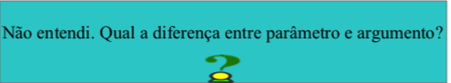

# Capítulo 6

<p align="justify">

</p>

## Sub-rotinas e programação com arquivos

<p align="justify">
Vamos conhecer neste capítulo os conceitos de sub- rotinas que nada mais são do que partes do nosso algoritmo que podem ser reaproveitadas sem termos que reescreve-las diversas vezes sempre que necessário, facilitando a depuração, manutenção e aumentando a legibilidade do nosso código. Para entender estes conceitos também será necessário compreender o escopo das variáveis, como variáveis globais e locais, tema que também será abordado neste capítulo.
</p>

<p align="justify">
Outro ponto a ser estudado neste capítulo será a manipulação de arquivos com Python, abordando elementos de inserção, leitura e remoção de dados oriundos de um arquivo guardado no disco rígido do seu computador, permitindo assim que os dados que trabalhamos fiquem armazenados de forma permanente.
</p>

## Sub-rotinas

<p align="justify">
Uma sub-rotina é uma parte do algoritmo que pode ser utilizada diversas vezes sem que tenhamos que reescrever o código cada vez que seja necessário executar uma determinada tarefa. Ascencio e Campos (2010, p. 230) define as sub-rotinas como “blocos de instruções que realizam tarefas específicas”. Leal (2016a, p. 166) comenta que as sub-rotinas são responsáveis por diminuir a complexidade de determinados problemas, desta forma reduzimos um grande problema em pequenas partes, ou subproblemas, facilitando sua resolução. Desta forma utiliza-se as sub-rotinas para executar os subproblemas tratando cada parte complexa individualmente.
</p>

><small>Uma sub-rotina é carregada apenas uma vez e pode ser executada quantas vezes for necessário, podendo ser utilizada para economizar espaço e tempo de programação. Em cada sub- rotina, além de ter acesso às variáveis do programa que o chamou (variáveis globais), pode ter suas próprias variáveis (variáveis locais), que existem apenas durante sua chamada. (LEAL, 2016a)
</small>


<p align="justify">
Na literatura encontramos as sub-rotinas em duas formas: Procedimentos e Funções, vamos analisar ambas as formas destacando suas características e como utilizá-las em Python.
</p>

## Procedimentos

<p align="justify">
Um procedimento é uma sub-rotina que contém um bloco de instruções a serem executadas a qualquer momento
desejado. Assim como as variáveis, os procedimentos devem possuir um identificador para ser usado na hora de sua chamada. Ao ser chamado durante a execução de um algoritmo, o procedimento executa seus comandos e retorna para o fluxo normal do algoritmo logo após sua chamada, dando continuidade ao programa em execução. O procedimento caracteriza-se por não retornar nenhum valor após sua execução, ele simplesmente executa suas instruções e segue para o próximo comando do algoritmo após ter sido chamado. A sintaxe para declarar um procedimento em Python é a seguinte:
</p>

```python
def identificador( ):
    # bloco de instruções
```

<p align="justify">
A palavra-chave def é utilizada para definir o procedimento, no identificador atribuímos um nome para o procedimento, seguindo as regras para nomenclatura de identificadores já abordado no início deste livro, em seguida abrimos e fechamos parênteses para caracterizar o procedimento e finalizamos com dois pontos (:). Após os dois pontos serão declaradas as instruções do procedimento, estas deverão ser indentadas para que o Python reconheça que as instruções pertencem ao bloco do procedimento. Veja um exemplo em Python para um procedimento que exibe a mensagem “Ola mundo”:
</p>

```python
def olamundo(): # definimos um procedimento
    print("Ola mundo") # instrução do procedimento

olamundo() # chamada do procedimento
```

<p align="justify">
Definimos um procedimento chamado olamundo( ), no seu bloco de comandos temos a instrução print( ). O procedimento executa a instrução print( ) declarada em seu bloco de comandos quando houver a chamada para sua execução. Para chamar um procedimento basta escrevermos seu nome no programa, como no exemplo anterior. Ao chamarmos o procedimento olamundo( ) obtemos a execução dos seus comandos internos, neste caso uma mensagem:
</p>

```
Ola mundo
>>>
```

<p align="justify">
É possível no momento da definição do nosso procedimento, especificar parâmetros para execução do procedimento, estes parâmetros são fornecidos dentro dos parênteses em sua definição, e devem obrigatoriamente ser utilizados no bloco de comandos. Ao chamar o procedimento fornecemos um argumento para o procedimento, os argumentos serão substituídos pelos parâmetros listados na definição e as instruções utilizarão os argumentos na execução do procedimento.
</p>

```python
def cumprimento(nome):
	print("Ola %s, prazer em conhecê-lo" % nome)

cumprimento("Bruno")
```

<p align="justify">
Veja que ao definirmos o procedimento, dentro dos parênteses declaramos um parâmetro chamado nome, este parâmetro está sendo utilizado na mensagem dentro do procedimento. Quando chamamos o procedimento fornecemos um argumento que substituirá o parâmetro nome para ser utilizado na mensagem.
</p>

```
Ola Bruno, prazer em conhecê-lo
>>>
```

<p align="center"></p>

<p align="justify">
De acordo com Matthes (2016, p. 187),
parâmetro é um valor que deve ser fornecido para a sub-rotina na hora de sua definição, já o argumento é um valor passado para a chamada da sub-rotina durante a execução do algoritmo. Neste caso, nome é o parâmetro, pois foi declarado no procedimento durante sua definição, e a string 'Bruno' é um argumento que foi passado para o procedimento durante sua chamada na execução do algoritmo.
</p>

<p align="justify">
Leal(2016a) coloca uma distinção entre parâmetros que apresenta os mesmos conceitos acima, como sendo os parâmetros formais aqueles declarados juntamente à sub-rotina e os parâmetros reais aqueles que substituem os parâmetros formais ao chamar a sub-rotina no programa principal (os argumentos). Na literatura estes conceitos caracterizam a distinção entre parâmetro e argumento, ou parâmetro formal e parâmetro real. Vamos exemplificar com mais um procedimento que realiza a soma ou a subtração de dois números:
</p>

```python
def soma(a, b):
	print("O resultado da soma é ", a+b)

def subt(a, b):
	print("O resultado da subtração é ", a-b)

num1 = int(input("Insira o primeiro número: "))
num2 = int(input("Insira o segundo número: "))

print("Qual operação deseja realizar?")
print("[1] Soma\n[2] Subtração")
escolha = int(input())

if escolha == 1:
	soma(num1, num2)

elif escolha == 2:
	subt(num1, num2)

else:
	print("Escolha inválida")

```

<p align="justify">
Definimos inicialmente os procedimentos do algoritmo, ambos recebem dois parâmetros a e b, e quando chamados exibem uma mensagem informando o resultado da operação entre os parâmetros. As primeiras instruções do algoritmo solicitam dois números ao usuário, então pedimos para que faça uma escolha entre soma e subtração, e caso a escolha seja correspondente a soma então chamamos o procedimento de soma e fornecemos os números de entrada como argumentos, ou se a escolha corresponder à subtração então chamamos o procedimento de subtração fornecendo as entradas como argumentos.
</p>

```
Insira o primeiro número: 5
Insira o segundo número: 3
Qual operação deseja realizar?
[1] Soma
[2] Subtração
1
O resultado da soma é  8
>>>
Insira o primeiro número: 5
Insira o segundo número: 3
Qual operação deseja realizar?
[1] Soma
[2] Subtração
2
O resultado da subtração é  2
>>>
```

<p align="justify">
Você já conheceu aqui algumas formas interessantes de se construir algoritmos, implemente este último exemplo adicionando dois novos procedimentos para divisão e multiplicação. Implemente também um laço que pergunta ao usuário se gostaria de realizar outra operação ao final do algoritmo. Implemente também um laço que verifica se a entrada do usuário é válida (um valor numérico) e caso seja inválido fique repetindo a solicitação até que um valor válido seja inserido.
</p>

## Funções

<p align="justify">
As funções são sub-rotinas idênticas aos procedimentos,
a declaração das funções é exatamente igual e sua estrutura é a mesma dos procedimentos assim como também podem possuir parâmetros. A única diferença entre uma função e um procedimento é que as funções sempre retornam valores.
</p>

> <small>Uma função nem sempre precisa exibir sua saída diretamente. Em vez disso, ela pode processar alguns dados e então devolver um valor ou um conjunto de valores. O valor devolvido pela função é chamado de valor de retorno. A instrução return toma um valor que está em uma função e o envia de volta à linha que
a chamou. Valores de retorno permitem passar boa parte do trabalho pesado de um programa para funções, o que pode simplificar o corpo de seu programa. (MATTHES, 2016)</small>

## Parâmetros

<p align="center">
Um valor de retorno pode ser armazenado em um
variável e ser processado ou manipulado por outras partes do algoritmo como operações aritméticas, lógicas, condicionais e até mesmo ser utilizado como argumento em outra função. Veja um exemplo que retorna o quadrado de um número:
</p>

```python
# a definição de uma função é idêntia a de um procedimento
def quadrado(numero):
    # utiliza-se a instrução return para retornar um valor
    return numero ** 2

entrada = int(input("Insira um número: "))

# chamamos a função guardando seu retorno em uma variável
quad = quadrado(entrada)

# exibimos o resultado
print("O quadrado de %i é %i" % (entrada, quad))

# o retorno também pode ser impresso
print("O quadrado do quadrado é ", quadrado(quad))
```

<p align="center">
Primeiramente definimos nossa função, da mesma
forma como o procedimento, porém damos a instrução return para retornar o valor na hora de sua chamada. Então pedimos um valor inteiro ao usuário que será passado como argumento para a nossa função. Veja que ao chamar a função também
atribuímos a mesma em uma variável chamada quad. Perceba que neste momento não estamos armazenando uma função em uma variável e sim o valor retornado por esta função. O resultado armazenado na variável quad é exibido na primeira
instrução print( ), e também é utilizado como argumento em uma nova chamada à função quadrado( ) que definimos, retornando um novo valor resultante da operação interna da nossa função. Quando retornamos um valor não precisamos
utilizar uma função print( ) dentro da função para exibir o valor, ele poderá ser exibido se chamarmos a função dentro da
instrução print( )
</p>

```
Insira um número: 2
O quadrado de 2 é 4
O quadrado do quadrado é  16
>>>
```

Vamos para outro exemplo, adaptado de Matthes(2016). Vamos escrever uma função que possui dois parâmetros que devem ser literais correspondentes ao nome e sobrenome de uma pessoa, essa função deve retornar o nome completo e
formatado.

```python
def formatar(nome, sobrenome):          # Definimos a função
    formatado = nome + " " + sobrenome  # Processamento da função
	return formatado.title()            # retorno da função

meu_nome = "bruno"
meu_sobrenome = "LuVIZotTo CaRLI"

nome_completo = formatar(meu_nome, meu_sobrenome)
print("Meu nome é ", nome_completo)
```

<p align="justify">
Definimos a função para receber dois parâmetros, no
processamento fazemos a soma das strings, este processo é de unir strings é denominado concatenação. Retornamos as strings concatenadas e com a primeira letra de cada palavra com letra maiúscula. Definimos um nome e um sobrenome para ser fornecido à função, e seu retorno é atribuído à variável nome_completo que é em seguida exibida.
</p>

```
Meu nome é  Bruno Luvizotto Carli
>>>
```

## Parâmetros

<p align="center">
Os parâmetros como vimos, são valores abstratos
declarados em uma sub-rotina, no momento da chamada à subrotina fornecemos um valor real para os parâmetros denominados argumentos. Quando declaramos parâmetros em uma sub-rotina, obrigatoriamente devemos fornecer os argumentos em sua chamada, do contrário teríamos um erro:
</p>

```python
# definimos uma função que retorna o produto de dois números
def multiplica(a, b):
    return a * b

# declaramos dois números
x = 2
y = 5

# mas fornecemos somente um na chamada da função
print(multiplica(x))
```

Saída:

```
Traceback (most recent call last):
  File "run.py", line 10, in <module>
    print(multiplica(x))
TypeError: multiplica() missing 1 required positional argument: 'b'
>>>
```

<p align="justify">
Se não fornecermos os argumentos necessários
obteremos um <i>Traceback</i> informando que na chamada à função multiplica( ) está faltando um argumento. Isto é porque os parâmetros definidos na função são obrigatórios, porém é possível definir parâmetros optativos no Python, basta
inicializar o parâmetro na definição da sub-rotina. Veja:
</p>

```python
# Inicializamos o parâmetro b com o valor 1
def multiplica(a, b):
    return a * b

# declaramos dois números
x = 2
y = 5

# mas fornecemos somente um na chamada da função
print(multiplica(x))
```

<p align="justify">
Declaramos a mesma função do exemplo anterior, mas
desta vez inicializamos o segundo parâmetro com o valor 1, desta forma o parâmetro se torna optativo, e se não fornecermos o segundo valor a função utilizará o valor inicializado, retornando a multiplicação pelo valor 1:
</p>

```
2
>>>
```

<p align="justify">
E no caso de fornecermos um argumento para um
parâmetro inicializado, a sub-rotina irá utilizar o valor fornecido como parâmetro no lugar do valor inicializado:
</p>

```python
# Inicializamos o parâmetro b com o valor 1
def multiplica(a, b):
    return a * b

# declaramos dois números
x = 2
y = 5

# mas fornecemos somente um na chamada da função
print(multiplica(x, y))
```

Saída:

```
10
>>>
```

## Escopo das variáveis

<p align="center">
Quando trabalhamos com sub-rotinas devemos ficar
atentos ao escopo das variáveis, se você declarar uma variável dentro de uma sub-rotina não poderá acessá-la no programa principal, mas poderá acessar as variáveis do programa principal dentro da sub-rotina, porém não poderá modificar seu valor a não ser que declare-a como global. As variáveis declaradas dentro das sub-rotinas são denominadas variáveis locais e as variáveis declaradas no programa principal são
denominadas variáveis globais. Veja, vamos demonstrar com um exemplo:
</p>

```python
# Essa subrotina mostra o valor de x
def sub():
    x = 2
    print(x)

# Definimos um valor para uma variável x
x = 12

# chamada para a subrotina
sub()

# Mostra o valor de x
print(x)
```

<p align="justify">
Definimos uma função chamada sub( ), nela possuímos
uma variável x com valor 2, mas no programa principal
também temos uma variável x com valor 12, ao chamar a subrotina é impresso o valor da variável local da sub-rotina, porém o valor de x permanece 12:
</p>

```
2
12
>>>
```

<p align="justify">
Isto se dá porque não informamos ao Python na
definição da sub-rotina que x deveria ser referenciado como uma variável global. Veja:
</p>

```python
# subrotina que mostra o valor de x
def sub():
    # Chamamos a variável global x
    global x

    # redefinimos seu valor para 2
    x = 2
    print(x)

x = 12
sub()
print(x)
```

<p align="justify">
Desta vez informamos que a variável x é uma variável
global, assim podemos modificar seu valor dentro da subrotina:
</p>

```
2
2
>>>
```

<p align="justify">
Se tentarmos modificar uma variável declarada dentro
da sub-rotina vamos levantar um erro, pois esta variável não pode ser utilizada no decorrer do algoritmo principal:
</p>

```python
def sub():
    # Variável local da subrotina sub()
    x = 5
    print("x = ", x)

# Chamada para a subrotina
sub()

# Operação sobre variável definida dentro da subrotina
if x < 10:
    print("x é menor que 10")
```

A variável x só existe dentro da sub-rotina:

```
x =  5
Traceback (most recent call last):
  File "run.py", line 10, in <module>
    if x < 10:
NameError: name 'x' is not defined
>>>
```

<p align="justify">
Lembra-se deste erro? A variável de nome x não foi
definida. Isto porque quando declaramos uma variável local em uma sub-rotina, esta somente existirá durante o processamento da sub-rotina. Ou seja, quando chamamos uma sub-rotina no algoritmo esta será executada e as variáveis ali declaradas
serão inicializadas na memória, quando todos os comandos da sub-rotina tiverem sido executados e ela chegar ao fim de sua execução, suas variáveis locais serão destruídas. Isto é um método eficiente para poupar o uso de memória. As variáveis globais permanecerão ativas na memória enquanto seu
algoritmo estiver executando, sempre que possível processe diversas variáveis em uma função e de um retorno para o programa principal, isto irá aumentar a eficiência do seu código.
</p>

## ~~Recursividade~~

## ~~Arquivos~~

## ~~Bibliotecas e módulos~~
