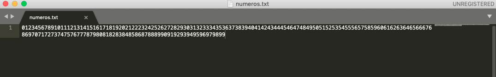
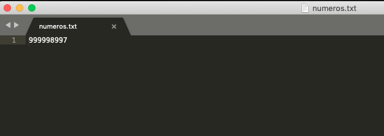
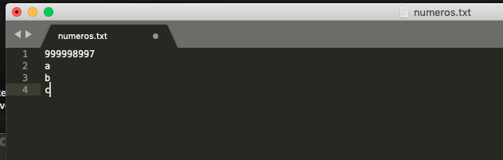
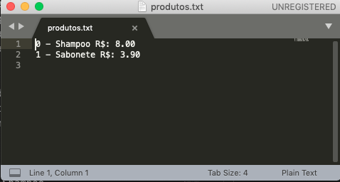
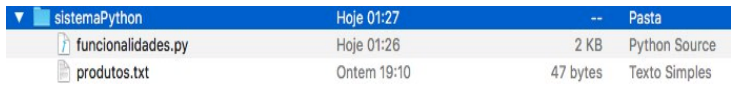
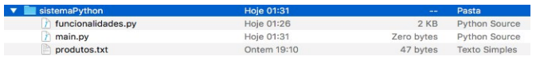

# Capítulo 6

<p align="justify">

</p>

## Sub-rotinas e programação com arquivos

<p align="justify">
Vamos conhecer neste capítulo os conceitos de sub- rotinas que nada mais são do que partes do nosso algoritmo que podem ser reaproveitadas sem termos que reescreve-las diversas vezes sempre que necessário, facilitando a depuração, manutenção e aumentando a legibilidade do nosso código. Para entender estes conceitos também será necessário compreender o escopo das variáveis, como variáveis globais e locais, tema que também será abordado neste capítulo.
</p>

<p align="justify">
Outro ponto a ser estudado neste capítulo será a manipulação de arquivos com Python, abordando elementos de inserção, leitura e remoção de dados oriundos de um arquivo guardado no disco rígido do seu computador, permitindo assim que os dados que trabalhamos fiquem armazenados de forma permanente.
</p>

## Sub-rotinas

<p align="justify">
Uma sub-rotina é uma parte do algoritmo que pode ser utilizada diversas vezes sem que tenhamos que reescrever o código cada vez que seja necessário executar uma determinada tarefa. Ascencio e Campos (2010, p. 230) define as sub-rotinas como “blocos de instruções que realizam tarefas específicas”. Leal (2016a, p. 166) comenta que as sub-rotinas são responsáveis por diminuir a complexidade de determinados problemas, desta forma reduzimos um grande problema em pequenas partes, ou subproblemas, facilitando sua resolução. Desta forma utiliza-se as sub-rotinas para executar os subproblemas tratando cada parte complexa individualmente.
</p>

><small>Uma sub-rotina é carregada apenas uma vez e pode ser executada quantas vezes for necessário, podendo ser utilizada para economizar espaço e tempo de programação. Em cada sub- rotina, além de ter acesso às variáveis do programa que o chamou (variáveis globais), pode ter suas próprias variáveis (variáveis locais), que existem apenas durante sua chamada. (LEAL, 2016a)
</small>


<p align="justify">
Na literatura encontramos as sub-rotinas em duas formas: Procedimentos e Funções, vamos analisar ambas as formas destacando suas características e como utilizá-las em Python.
</p>

## Procedimentos

<p align="justify">
Um procedimento é uma sub-rotina que contém um bloco de instruções a serem executadas a qualquer momento
desejado. Assim como as variáveis, os procedimentos devem possuir um identificador para ser usado na hora de sua chamada. Ao ser chamado durante a execução de um algoritmo, o procedimento executa seus comandos e retorna para o fluxo normal do algoritmo logo após sua chamada, dando continuidade ao programa em execução. O procedimento caracteriza-se por não retornar nenhum valor após sua execução, ele simplesmente executa suas instruções e segue para o próximo comando do algoritmo após ter sido chamado. A sintaxe para declarar um procedimento em Python é a seguinte:
</p>

```python
def identificador( ):
    # bloco de instruções
```

<p align="justify">
A palavra-chave def é utilizada para definir o procedimento, no identificador atribuímos um nome para o procedimento, seguindo as regras para nomenclatura de identificadores já abordado no início deste livro, em seguida abrimos e fechamos parênteses para caracterizar o procedimento e finalizamos com dois pontos (:). Após os dois pontos serão declaradas as instruções do procedimento, estas deverão ser indentadas para que o Python reconheça que as instruções pertencem ao bloco do procedimento. Veja um exemplo em Python para um procedimento que exibe a mensagem “Ola mundo”:
</p>

```python
def olamundo(): # definimos um procedimento
    print("Ola mundo") # instrução do procedimento

olamundo() # chamada do procedimento
```

<p align="justify">
Definimos um procedimento chamado olamundo( ), no seu bloco de comandos temos a instrução print( ). O procedimento executa a instrução print( ) declarada em seu bloco de comandos quando houver a chamada para sua execução. Para chamar um procedimento basta escrevermos seu nome no programa, como no exemplo anterior. Ao chamarmos o procedimento olamundo( ) obtemos a execução dos seus comandos internos, neste caso uma mensagem:
</p>

```
Ola mundo
>>>
```

<p align="justify">
É possível no momento da definição do nosso procedimento, especificar parâmetros para execução do procedimento, estes parâmetros são fornecidos dentro dos parênteses em sua definição, e devem obrigatoriamente ser utilizados no bloco de comandos. Ao chamar o procedimento fornecemos um argumento para o procedimento, os argumentos serão substituídos pelos parâmetros listados na definição e as instruções utilizarão os argumentos na execução do procedimento.
</p>

```python
def cumprimento(nome):
	print("Ola %s, prazer em conhecê-lo" % nome)

cumprimento("Bruno")
```

<p align="justify">
Veja que ao definirmos o procedimento, dentro dos parênteses declaramos um parâmetro chamado nome, este parâmetro está sendo utilizado na mensagem dentro do procedimento. Quando chamamos o procedimento fornecemos um argumento que substituirá o parâmetro nome para ser utilizado na mensagem.
</p>

```
Ola Bruno, prazer em conhecê-lo
>>>
```

<p align="center"></p>

<p align="justify">
De acordo com Matthes (2016, p. 187),
parâmetro é um valor que deve ser fornecido para a sub-rotina na hora de sua definição, já o argumento é um valor passado para a chamada da sub-rotina durante a execução do algoritmo. Neste caso, nome é o parâmetro, pois foi declarado no procedimento durante sua definição, e a string 'Bruno' é um argumento que foi passado para o procedimento durante sua chamada na execução do algoritmo.
</p>

<p align="justify">
Leal(2016a) coloca uma distinção entre parâmetros que apresenta os mesmos conceitos acima, como sendo os parâmetros formais aqueles declarados juntamente à sub-rotina e os parâmetros reais aqueles que substituem os parâmetros formais ao chamar a sub-rotina no programa principal (os argumentos). Na literatura estes conceitos caracterizam a distinção entre parâmetro e argumento, ou parâmetro formal e parâmetro real. Vamos exemplificar com mais um procedimento que realiza a soma ou a subtração de dois números:
</p>

```python
def soma(a, b):
	print("O resultado da soma é ", a+b)

def subt(a, b):
	print("O resultado da subtração é ", a-b)

num1 = int(input("Insira o primeiro número: "))
num2 = int(input("Insira o segundo número: "))

print("Qual operação deseja realizar?")
print("[1] Soma\n[2] Subtração")
escolha = int(input())

if escolha == 1:
	soma(num1, num2)

elif escolha == 2:
	subt(num1, num2)

else:
	print("Escolha inválida")

```

<p align="justify">
Definimos inicialmente os procedimentos do algoritmo, ambos recebem dois parâmetros a e b, e quando chamados exibem uma mensagem informando o resultado da operação entre os parâmetros. As primeiras instruções do algoritmo solicitam dois números ao usuário, então pedimos para que faça uma escolha entre soma e subtração, e caso a escolha seja correspondente a soma então chamamos o procedimento de soma e fornecemos os números de entrada como argumentos, ou se a escolha corresponder à subtração então chamamos o procedimento de subtração fornecendo as entradas como argumentos.
</p>

```
Insira o primeiro número: 5
Insira o segundo número: 3
Qual operação deseja realizar?
[1] Soma
[2] Subtração
1
O resultado da soma é  8
>>>
Insira o primeiro número: 5
Insira o segundo número: 3
Qual operação deseja realizar?
[1] Soma
[2] Subtração
2
O resultado da subtração é  2
>>>
```

<p align="justify">
Você já conheceu aqui algumas formas interessantes de se construir algoritmos, implemente este último exemplo adicionando dois novos procedimentos para divisão e multiplicação. Implemente também um laço que pergunta ao usuário se gostaria de realizar outra operação ao final do algoritmo. Implemente também um laço que verifica se a entrada do usuário é válida (um valor numérico) e caso seja inválido fique repetindo a solicitação até que um valor válido seja inserido.
</p>

## Funções

<p align="justify">
As funções são sub-rotinas idênticas aos procedimentos,
a declaração das funções é exatamente igual e sua estrutura é a mesma dos procedimentos assim como também podem possuir parâmetros. A única diferença entre uma função e um procedimento é que as funções sempre retornam valores.
</p>

> <small>Uma função nem sempre precisa exibir sua saída diretamente. Em vez disso, ela pode processar alguns dados e então devolver um valor ou um conjunto de valores. O valor devolvido pela função é chamado de valor de retorno. A instrução return toma um valor que está em uma função e o envia de volta à linha que
a chamou. Valores de retorno permitem passar boa parte do trabalho pesado de um programa para funções, o que pode simplificar o corpo de seu programa. (MATTHES, 2016)</small>

## Parâmetros

<p align="justify">
Um valor de retorno pode ser armazenado em um
variável e ser processado ou manipulado por outras partes do algoritmo como operações aritméticas, lógicas, condicionais e até mesmo ser utilizado como argumento em outra função. Veja um exemplo que retorna o quadrado de um número:
</p>

```python
# a definição de uma função é idêntia a de um procedimento
def quadrado(numero):
    # utiliza-se a instrução return para retornar um valor
    return numero ** 2

entrada = int(input("Insira um número: "))

# chamamos a função guardando seu retorno em uma variável
quad = quadrado(entrada)

# exibimos o resultado
print("O quadrado de %i é %i" % (entrada, quad))

# o retorno também pode ser impresso
print("O quadrado do quadrado é ", quadrado(quad))
```

<p align="justify">
Primeiramente definimos nossa função, da mesma
forma como o procedimento, porém damos a instrução return para retornar o valor na hora de sua chamada. Então pedimos um valor inteiro ao usuário que será passado como argumento para a nossa função. Veja que ao chamar a função também
atribuímos a mesma em uma variável chamada quad. Perceba que neste momento não estamos armazenando uma função em uma variável e sim o valor retornado por esta função. O resultado armazenado na variável quad é exibido na primeira
instrução print( ), e também é utilizado como argumento em uma nova chamada à função quadrado( ) que definimos, retornando um novo valor resultante da operação interna da nossa função. Quando retornamos um valor não precisamos
utilizar uma função print( ) dentro da função para exibir o valor, ele poderá ser exibido se chamarmos a função dentro da
instrução print( )
</p>

```
Insira um número: 2
O quadrado de 2 é 4
O quadrado do quadrado é  16
>>>
```

Vamos para outro exemplo, adaptado de Matthes(2016). Vamos escrever uma função que possui dois parâmetros que devem ser literais correspondentes ao nome e sobrenome de uma pessoa, essa função deve retornar o nome completo e
formatado.

```python
def formatar(nome, sobrenome):          # Definimos a função
    formatado = nome + " " + sobrenome  # Processamento da função
	return formatado.title()            # retorno da função

meu_nome = "bruno"
meu_sobrenome = "LuVIZotTo CaRLI"

nome_completo = formatar(meu_nome, meu_sobrenome)
print("Meu nome é ", nome_completo)
```

<p align="justify">
Definimos a função para receber dois parâmetros, no
processamento fazemos a soma das strings, este processo é de unir strings é denominado concatenação. Retornamos as strings concatenadas e com a primeira letra de cada palavra com letra maiúscula. Definimos um nome e um sobrenome para ser fornecido à função, e seu retorno é atribuído à variável nome_completo que é em seguida exibida.
</p>

```
Meu nome é  Bruno Luvizotto Carli
>>>
```

## Parâmetros

<p align="justify">
Os parâmetros como vimos, são valores abstratos
declarados em uma sub-rotina, no momento da chamada à subrotina fornecemos um valor real para os parâmetros denominados argumentos. Quando declaramos parâmetros em uma sub-rotina, obrigatoriamente devemos fornecer os argumentos em sua chamada, do contrário teríamos um erro:
</p>

```python
# definimos uma função que retorna o produto de dois números
def multiplica(a, b):
    return a * b

# declaramos dois números
x = 2
y = 5

# mas fornecemos somente um na chamada da função
print(multiplica(x))
```

Saída:

```
Traceback (most recent call last):
  File "run.py", line 10, in <module>
    print(multiplica(x))
TypeError: multiplica() missing 1 required positional argument: 'b'
>>>
```

<p align="justify">
Se não fornecermos os argumentos necessários
obteremos um <i>Traceback</i> informando que na chamada à função multiplica( ) está faltando um argumento. Isto é porque os parâmetros definidos na função são obrigatórios, porém é possível definir parâmetros optativos no Python, basta
inicializar o parâmetro na definição da sub-rotina. Veja:
</p>

```python
# Inicializamos o parâmetro b com o valor 1
def multiplica(a, b):
    return a * b

# declaramos dois números
x = 2
y = 5

# mas fornecemos somente um na chamada da função
print(multiplica(x))
```

<p align="justify">
Declaramos a mesma função do exemplo anterior, mas
desta vez inicializamos o segundo parâmetro com o valor 1, desta forma o parâmetro se torna optativo, e se não fornecermos o segundo valor a função utilizará o valor inicializado, retornando a multiplicação pelo valor 1:
</p>

```
2
>>>
```

<p align="justify">
E no caso de fornecermos um argumento para um
parâmetro inicializado, a sub-rotina irá utilizar o valor fornecido como parâmetro no lugar do valor inicializado:
</p>

```python
# Inicializamos o parâmetro b com o valor 1
def multiplica(a, b):
    return a * b

# declaramos dois números
x = 2
y = 5

# mas fornecemos somente um na chamada da função
print(multiplica(x, y))
```

Saída:

```
10
>>>
```

## Escopo das variáveis

<p align="justify">
Quando trabalhamos com sub-rotinas devemos ficar
atentos ao escopo das variáveis, se você declarar uma variável dentro de uma sub-rotina não poderá acessá-la no programa principal, mas poderá acessar as variáveis do programa principal dentro da sub-rotina, porém não poderá modificar seu valor a não ser que declare-a como global. As variáveis declaradas dentro das sub-rotinas são denominadas variáveis locais e as variáveis declaradas no programa principal são
denominadas variáveis globais. Veja, vamos demonstrar com um exemplo:
</p>

```python
# Essa subrotina mostra o valor de x
def sub():
    x = 2
    print(x)

# Definimos um valor para uma variável x
x = 12

# chamada para a subrotina
sub()

# Mostra o valor de x
print(x)
```

<p align="justify">
Definimos uma função chamada sub( ), nela possuímos
uma variável x com valor 2, mas no programa principal
também temos uma variável x com valor 12, ao chamar a subrotina é impresso o valor da variável local da sub-rotina, porém o valor de x permanece 12:
</p>

```
2
12
>>>
```

<p align="justify">
Isto se dá porque não informamos ao Python na
definição da sub-rotina que x deveria ser referenciado como uma variável global. Veja:
</p>

```python
# subrotina que mostra o valor de x
def sub():
    # Chamamos a variável global x
    global x

    # redefinimos seu valor para 2
    x = 2
    print(x)

x = 12
sub()
print(x)
```

<p align="justify">
Desta vez informamos que a variável x é uma variável
global, assim podemos modificar seu valor dentro da subrotina:
</p>

```
2
2
>>>
```

<p align="justify">
Se tentarmos modificar uma variável declarada dentro
da sub-rotina vamos levantar um erro, pois esta variável não pode ser utilizada no decorrer do algoritmo principal:
</p>

```python
def sub():
    # Variável local da subrotina sub()
    x = 5
    print("x = ", x)

# Chamada para a subrotina
sub()

# Operação sobre variável definida dentro da subrotina
if x < 10:
    print("x é menor que 10")
```

A variável x só existe dentro da sub-rotina:

```
x =  5
Traceback (most recent call last):
  File "run.py", line 10, in <module>
    if x < 10:
NameError: name 'x' is not defined
>>>
```

<p align="justify">
Lembra-se deste erro? A variável de nome x não foi
definida. Isto porque quando declaramos uma variável local em uma sub-rotina, esta somente existirá durante o processamento da sub-rotina. Ou seja, quando chamamos uma sub-rotina no algoritmo esta será executada e as variáveis ali declaradas
serão inicializadas na memória, quando todos os comandos da sub-rotina tiverem sido executados e ela chegar ao fim de sua execução, suas variáveis locais serão destruídas. Isto é um método eficiente para poupar o uso de memória. As variáveis globais permanecerão ativas na memória enquanto seu
algoritmo estiver executando, sempre que possível processe diversas variáveis em uma função e de um retorno para o programa principal, isto irá aumentar a eficiência do seu código.
</p>

## Recursividade

<p align="justify">
A recursividade, em linguagem de programação é a
capacidade de uma sub-rotina de chamar-se a si própria,
fundamentando este conceito, Leal(2016a) afirma que “a
recursividade é um mecanismo que permite uma função
chamar a si mesma direta ou indiretamente”. Chamar a si
mesma remete a função à execução de um loop, por isto
precisamos definir em uma função recursiva:
</p>

- Uma chamada recursiva;
- Uma parada;

<p align="justify">
Um exemplo clássico de chamada recursiva é o cálculo
do fatorial de um número. O fatorial é calculado pelo número multiplicado por todos seus antecessores. Por exemplo o fatorial de 5! é 5 x 4 x 3 x 2 x 1 que resulta em 120. Veja neste exemplo de algoritmo Python para o cálculo fatorial de um número:
</p>

```python
# Define a função
def fatorial(numero):
    # Aqui temos uma condição de parada
    if numero == 0:
        return 1
    # E aqui a chamada recurisiva
    else:
        return numero * fatorial(numero - 1)

# Chamamos a função fornecendo o valor 5 como argumento
x = fatorial(5)

print(x)
```

<p align="justify">
Definimos dentro da função uma condição de parada,
neste caso quando a variável local número chegar à 0. Até que chegue em zero continuaremos retornando a própria função subtraindo 1 do número em seu argumento e multiplicando pelo próprio número.
</p>

```
120
>>>
```

<p align="justify">
Modifique este algoritmo para que ele receba uma
entrada de usuário que seja um número e calcule o fatorial deste número, exibindo uma mensagem elegante na tela informando o resultado do fatorial.
</p>

## Arquivos

<p align="justify">
Arquivos são formas de gravar dados de forma permanente em seu computador. Ao criarmos um arquivo
podemos inserir dados processados através de um algoritmo, ou podemos utilizar um algoritmo para buscar dados em um arquivo escrito, também podemos utilizar algoritmos para escrever novos dados em arquivos escritos, entre outras possibilidades.

Em Python utilizamos a instrução <code>open()</code> para abrir um
arquivo, devemos fornecer um argumento literal com o nome e extensão do arquivo. Se o arquivo estiver salvo no mesmo diretório do programa.py que você estiver executando basta fornecer o nome e extensão do arquivo como por exemplo 'lista_de_compra.txt', caso esteja em outro diretório você precisará fornecer o caminho completo par ao arquivo como por exemplo <code>c:windows/desktop/pasta/lista_de_compras.txt</code> ou <code>/tmp/my_files/lista_de_compras.txt</code>.

Sempre que abrirmos um arquivo com <code>open()</code>,
devemos fecha-lo com <code>close()</code>. 
</p>


```python
arquivo = open('lista.txt')

# Faça algo com o arquivo depois feche-o

arquivo.close()
```

<p align="justify">
É importante que o arquivo exista e que você tenha
informado corretamente o nome ou caminho ao utilizar o
exemplo anterior, ou você irá se deparar com um erro
informando que o arquivo não existe:
</p>

```
Traceback (most recent call last):
  File "run.py", line 1, in <module>
    arquivo = open('lista.txt')
FileNotFoundError: [Errno 2] No such file or directory: 'lista.txt'
>>>
```

<p align="justify">
A instrução <code>open()</code> aceita alguns parâmetros adicionais que especificam o modo de abertura do arquivo, assim poderemos informar se o arquivo deve ser aberto em modo de escrita, leitura, leitura e escrita, etc. A tabela a seguir mostra os parâmetros aceitos pela instrução <code>open()</code>:
</p>

| **Parâmetro** | **Operação**                                                                                                                  |
|---------------|-------------------------------------------------------------------------------------------------------------------------------|
| `r`           | Abre o arquivo em modo leitura (default).                                                                                     |
| `w`           | Abre o arquivo em modo de escrita, sobrescreve todos os dados do arquivo anterior.                                            |
| `x`           | Abre em modo exclusivo. Falha se o arquivo ja existir.                                                                        |
| `a`           | Abre para escrita *append*, adicionando dados ao final do arquivo existente.                                                  |
| `b`           | Abre em modo binário                                                                                                          |
| `t`           | Abre em modo texto (default)                                                                                                  |
| `+`           | Abre um arquivo de disco para atualização (leitura e escrita)                                                                 |
| `U`           | Abre em modo <a href="https://docs.python.org/3/glossary.html#term-universal-newlines">universal newlines</a> (Descontinuado) |

Fonte: <https://docs.python.org/3/library/functions.html#open>

Ao fornecer o modo de abertura devemos utilizar a seguinte sintaxe:

`variável = open("nome_do_arquivo", "modo_de_abertura")`

<p align="justify">
Onde variável é a variável que irá armazenar o
conteúdo do arquivo, nome_do_arquivo deve ser o valor literal contendo o nome do arquivo a ser aberto e modo_de_abertura deve ser um dos valores da tabela anterior. Veja no exemplo a seguir vamos criar uma lista de números e salvá-la em um arquivo com a instrução <code>write()</code>:
</p>

```python
# Criamos uma lista com 100 números
numeros = list(range(100))

# Criamos um arquivo 0km em modo de escrita
arquivo = open('numeros.txt', 'w')

# Para cada número na lista de números
for numero in numeros:
    # Escreva cada número em forma de string no arquivo
    arquivo.write(str(numero))

# Feche o arquivo
arquivo.close()
```

<p align="justify">
Primeiro criamos uma lista com cem números para
testar, então abrimos o arquivo <code>'numeros.txt'</code>, este arquivo na verdade não existe no computador mas como fornecemos o modo de abertura <code>'w'</code> (modo de escrita) o Python irá criar automaticamente este arquivo no diretório local, caso um arquivo com este nome existisse ele seria apagado e sobrescrito. Com um laço iteramos pela nossa lista escrevendo cada número dela no arquivo, note que não podemos escrever números em um arquivo, somente dados do tipo literal podem ser escritos em arquivos, então convertemos cada número para literal com <code>str()</code> no momento de escreve-lo no arquivo. É importante fechar o arquivo no final de seu algoritmo para que este não permaneça aberto na memória do computador, isto poderá corromper os dados do arquivo.

Ótimo, agora vamos escrever um algoritmo para ler os
dados no arquivo que acabamos de criar:
</p>

```python
# Abrimos o arquivo em modo leitura
arquivo = open('numeros.txt', 'r')

# Para cada linha do arquivo
for linha in arquivo:
    print(linha)

arquivo.close()
```

Saída:

```
0123456789101112131415161718192021222324252627282930313233343536373839404142434445464748495051525354555657585960616263646566676869707172737475767778798081828384858687888990919293949596979899
>>>
```

<p align="justify">
Perceba que se você abrir o arquivo texto em um editor
de texto padrão os dados estarão praticamente da mesma
forma:
</p>

<p align="center">Figura 22 - Arquivo Gerado</p>

<p align="center"></p>

<p align="center">Fonte: O autor.</p>

<p align="justify">
Se tentarmos abrir novamente o mesmo arquivo em
modo de escrita para tentar escrever novos dados vamos apagar os dados existentes no arquivo atual, veja:
</p>

```python
arquivo = open('numeros.txt', 'w')

# Novos números a serem adicionados
numeros = [999, 998, 997]

for numero in numeros:
    arquivo.write(str(numero))

# feche o modo de escrita
arquivo.close()

# Abra em modo de leitura
arquivo = open('numeros.txt', 'r')

for linha in arquivo:
    print(linha)

arquivo.close()
```

Saída:

```
999998997
```

Veja que no arquivo no diretório os dados também são
modificados:

<p align="center">Figura 23 - Arquivo sobrescrito</p>

<p align="center"></p>

<p align="center">Fonte: O autor.</p>

<p align="justify">
Isto ocorre quando abrimos um arquivo existente em modo de escrita <code>'w'</code>, este modo cria um novo arquivo em branco para escrita, e se algum arquivo já existir com o nome declarado ele será apagado e sobrescrito. Para adicionarmos dados em um arquivo sem apagar o arquivo anterior precisamos abrir em modo <i>append</i>, um modo de escrita que permite adicionar dados à um arquivo já existente, o parâmetro para este modo é o <code>'a'</code>, veja:
</p>

```python
# Abre o arquivo em modo append
arquivo = open('numeros.txt', 'a')

# Novos itens a serem adicionados
letras = ['a', 'b', 'c']

for letra in letras:
    arquivo.write('\n' + letra)

# Feche o arquivo
arquivo.close()

# Abra em modo de leitura
arquivo = open('numeros.txt', 'r')
for linha in arquivo:
    print(linha)

arquivo.close()
```

Saída:

```
999998997

a

b

c
```

<p align="justify">
Desta vez adicionamos algumas letras pulando linha, sim podemos utilizar o <code>\n</code> para pular linhas em arquivos, perceba que o arquivo original não foi apagado, mas novos
dados foram adicionados a ele:
</p>

<p align="center">Figura 24 - Arquivo com dados adicionados ao final</p>

<p align="center"></p>

<p align="center">Fonte: O autor.</p>

<p align="justify">
Existe ainda um modo seguro de abrir um arquivo, utilizando as palavras reservadas <code>with</code> e <code>as</code>. Com with abrimos o arquivo sem que seja necessário fechá-lo com <code>open()</code>, garantindo a segurança do arquivo, a palavra reservada as define o identificador da variável que conterá o arquivo, veja:
</p>

```python
with open('numeros.txt', 'r') as arquivo:
    for linha in arquivo:
        print(linha)
```

Este é um modo prático e eficiente de se trabalhar com arquivos em Python, veja a saída:

```
999998997

a

b

c
```

<p align="jusitify">
Legal, agora que sabemos ler e escrever em arquivos permanentes vamos criar um pequeno algoritmo comercial, ele deve possuir uma sub-rotina a ser chamada para cadastrar produtos com seu devido valor e código do produto em um arquivo. Também vamos ter uma sub-rotina para mostrar os produtos disponíveis, uma para buscar um produto específico e uma que calcule a compra.

Primeiro crie um arquivo chamado <code>produtos.txt</code> através do seu sistema de arquivos ou dos algoritmos que aprendemos, então criamos um procedimento para cadastrar produtos no arquivo:
</p>

```python
def cadastro():
    # Abre o arquivo em modo de leitura e escrita
    with open('produtos.txt', 'r+') as produtos:
        # Recebe um novo produto
        produto = input("Insira o nome do produto: ")

        # Recebe o valor do produto
        preco = input("Insira o valor de venda do produto: ")

        # Codigo para o produto
        codigo = 0

        # O codigo é definido pelo número de linhas do arquivo
        for _ in produtos:
            codigo += 1
        
        # Insira o produto no arquivo
        produtos.write(str(codigo) + " - " + produto + " R$: " + str(preco) + "\n")

# Cadastre alguns produtos
cadastro()
```

<p align="justify">
Primeiro definimos o procedimento <code>cadastro()</code> e nele abrimos o arquivo <code>'produtos.txt'</code> em modo de leitura e escrita <code>'r+'</code>, desta forma podemos ler e escrever no arquivo, como este
ainda não existia no diretório atual, o Python nos fez a
gentileza de criá-lo para nós. Então solicitamos a entrada de um produto e seu valor, também precisamos criar um código para cada produto, mas como isto pode vir a ser um valor variável que não pode se repetir vamos inicializar um código de valor zero e incrementá-lo em 1 para cada linha do arquivo de produtos, desta forma cada vez que inserir-mos um novo produto o arquivo ganhará uma nova linha, e consequentemente o código será incrementado, assim temos que o código é gerado automaticamente para cada produto, legal não? Para testar adicionei dois produtos aleatórios em minha lojinha:
</p>

```
Insira o nome do produto: Shampoo
Insira o valor de venda do produto: 8.00
>>>

Insira o nome do produto: Sabonete
Insira o valor de venda do produto: 3.90
>>>
```

<p align="justify">
Veja como o código do produto fica no arquivo gerado,
podemos ver que ele inicia em 0 e na segunda linha o código é 1, e para cada produto que inserirmos o código irá ser incrementado. Você pode alterar o código para iniciar em números maiores como 100 e ser incrementado de 10 em 10 por exemplo, tente fazer isto.
</p>

<p align="center">Figura 24 - Arquivo de produtos</p>

<p align="center"></p>

<p align="center">Fonte: O autor.</p>

<p align="justify">
No final escrevemos o código seguido do produto e seu valor de uma forma padrão, e sempre que precisarmos incluir um novo produto basta chamarmos o procedimento <code>cadastro()</code>.

Agora vamos elaborar uma sub-rotina que mostre todos os arquivos cadastrados:
</p>

```python
def ver_produtos():
    with open('produtos.txt', 'r') as produtos:
        for linha in produtos:
            print(linha)

ver_produtos()
```

<p align="justify">
Este é simples, basta abrirmos o arquivo em modo leitura e através de um laço de repetição mostrar cada linha do arquivo, como cada produto está em uma linha do arquivo, vamos mostrar todos os produtos da lista
</p>

```
0 - Shampoo R$: 8.00

1 - Sabonete R$: 3.90
```

<p align="justify">
Mas e se a lista de produtos tiver cem mil produtos
cadastrados? Ja pensou ter que imprimir todos estes? Vamos fazer uma sub-rotina que pesquise no arquivo um determinado produto pelo nome:
</p>

```python
def busca_produto():
    with open('produtos.txt', 'r') as produtos:
        # O produto precisa ser encontrado
        achou = False

        # Solicite pelo nome do produto
        produto = input('Insira o nome do produto: ')

        # Busca em cada linha do arquivo
        for linha in produtos:
            # Se o produto estiver nesta linha
            if produto in linha:
                # Esvcreva esta linha
                print(linha)
                
                # Achamos o produto
                achou = True

        # Se não achou o produto
        if not achou:
            # Informamos que o produto não existe
            print('Produto não cadastrado!')

busca_produto()
```

<p align="justify">
Aqui precisamos de uma variável que nomeamos de
achou e inicializamos ela com False pois ainda não
encontramos o produtos a ser buscado. Solicitamos o produto a ser buscado e verificamos cada linha do arquivo, se uma delas conter o produto atribuímos True para a variável achou e escrevemos a linha que contém o produto na tela. Caso o produto não seja encontrado no arquivo devemos informar que o produto não se encontra cadastrado no arquivo. Veja no exemplo buscamos pelo produto sabonete que foi cadastrado sob código 1, mas ao buscar a caneta o programa nos diz que esta não foi cadastrada:
</p>

```
Insira o nome do produto: Sabonete
1 - Sabonete R$: 3.90
>>>
Insira o nome do produto: Caneta
Produto não cadastrado!
>>>
```

Vamos para agora escrever a sub-rotina que calcula o
valor da compra:

```python
def compra():
    total = 0     # Variável com o valor total a pagar
    lista = []    # Lista de preços dos produtos
    compras = []  # Lista de compras

    while True:   # Loop para receber vários produtos
        item = input('Insira o nome do produto: ')

        # O loop funciona até que seja inserido "fim"
        if item == 'fim':
            break
        else:
            # Busca o produto desejado no arquivo
            with open('produtos.txt', 'r') as produtos:
                for linha in produtos:
                    if item in linha:
                        # Adiciona o produto na lista de compras
                        compras.append(linha)

                        # Adiciona somente o valor do produto na lista de preços
                        lista.append(float(linha[-5:]))
    
    # Somamos o total a pagar
    total = sum(lista)

    print('Lista de compras: ')
    for produto in compras:
        print(produto)

    print('TOTAL A PAGAR: R$ %.2f' % total)

compra()
```

<p align="justify">
Definimos um procedimento <code>compra()</code> e inicializamos três variáveis, uma para o valor total a pagar, uma para guardar a lista de preços dos produtos adquiridos e uma lista que guardará os dados do produto vindas do arquivo (código, nome e valor). Iniciamos um loop que inicia solicitando um produto cadastrado, o programa pode aceitar o nome ou o código do item, caso o valor inserido seja <code>'fim'</code> o loop encerra, do contrário ficará recebendo produtos. Quando um produto for inserido procuramos no arquivo o produto e adicionamos seus dados a lista de compras e somente os últimos caracteres contidos no arquivo (correspondentes ao preço) serão convertidos para real e adicionados à lista de valores. Quando o loop se encerrar somamos todos os valores da lista de valores e atribuímos à variável total, fornecemos a saída final que consiste na iteração pela lista de compras exibindo os dados das compras na tela e a exibição do total a pagar em uma string formatada. Veja na saída que o programa aceita tanto o nome do produto (shampoo) como o código (1 para o sabonete):
</p>

```
Insira nome do produto: Shampoo
Insira nome do produto: Sabonete
Insira nome do produto: fim
Lista de compras:
0 - Shampoo R$: 8.00

1 - Sabonete R$: 3.90

TOTAL A PAGAR: R$ 11.90
```

<p align="justify">
Legal agora que temos todas as sub-rotinas vamos
juntá-las em um sistema útil! Faça o seguinte, crie uma nova pasta em seu computador chamada <code>sistemaPython</code>, abra um novo arquivo no <i>Idle</i> e copie cada uma das sub-rotinas criadas anteriormente:
</p>

```python
def cadastro():
    # Procedimento para cadastro
    with open('produtos.txt', 'r+') as produtos:
        produto = input("Insira o nome do produto: ")
        preco = input("Insira o valor de venda do produto: ")
        codigo = 0
        for _ in produtos:
            codigo += 1

        produtos.write(str(codigo) + " - " + produto + " R$: " + str(preco) + "\n")

# Procedimento para ver lista de produtos
def ver_produtos():
    with open('produtos.txt', 'r') as produtos:
        for linha in produtos:
            print(linha)

# Procedimento para buscar um produto
def busca_produto():
    with open('produtos.txt', 'r') as produtos:
        achou = False
        produto = input('Insira o nome do produto: ')

        for linha in produtos:
            if produto in linha:
                print(linha)
                achou = True

        if not achou:
            print('Produto não cadastrado!')

# Procedimento para compra de produto
def compra():
    total = 0
    lista = []
    compras = []

    while True:
        item = input('Insira o nome do produto: ')
        if item == 'fim':
            break
        else:
            with open('produtos.txt', 'r') as produtos:
                for linha in produtos:
                    if item in linha:
                        compras.append(linha)
                        lista.append(float(linha[-5:]))

    total = sum(lista)
    print('Lista de compras: ')
    for produto in compras:
        print(produto)

    print('TOTAL A PAGAR: R$ %.2f' % total)
```

<p align="justify">
Salve este arquivo na pasta <code>sistemaPython</code> com um nome que desejar, aqui será salvo como <code>funcionalidades.py</code>. Neste mesmo diretório copie o arquivo <code>'produtos.txt'</code>, de modo que seu diretório fique parecido com este:
</p>

<p align="center">Figura 26 - Diretório Sistema Python</p>

<p align="center"></p>

<p align="center">Fonte: O autor.</p>

<p align="justify">
Muito bem agora crie um novo arquivo em branco no Idle e salve-o na mesma pasta com o nome <code>main.py</code> (ou outro
que lhe agrade), vamos utilizar o nome main por ser o programa principal, muitas linguagens de programação possuem um programa principal onde as outras funcionalidades
criadas são chamadas para um propósito principal, isto não é obrigatório em Python, mas torna seu código mais fácil de se
compreender, seu diretório irá ficar parecido com este:
</p>

<p align="center">Figura 27 - Diretório Sistema Python final</p>

<p align="center"></p>

<p align="center">Fonte: O autor.</p>

<p align="justify">
Agora podemos escrever o programa principal que une todas as funcionalidades que acabamos de criar.
</p>

## Bibliotecas e módulos

<p align="justify">
A maioria das linguagens de programação possuem
bibliotecas contendo códigos pré-existentes que realizam uma ampla variedade de cálculos e tarefas. Estas bibliotecas quando fazem parte da linguagem são chamadas de Biblioteca Padrão,vtambém temos as Bibliotecas Externas que são partes devcódigo que baixamos de alguma fonte. No Python é comum se
referir às bibliotecas como módulos, podemos escrever nossos próprios módulos e importa-los para nosso algoritmo (como vamos fazer com nosso sistemaPython) ou podemos utilizar as pré-existentes no Python (que são muitos, Python é conhecido por ter baterias inclusas, o que quer dizer que ele já vem com várias bibliotecas com funcionalidades para uma ampla variedade de tarefas.

Vamos fazer o seguinte, abra seu arquivo <code>main.py</code> e escreva o seguinte:
</p>

```python
# Inclui o módulo de funcionalidades que criamos
import funcionalidades

# Chamamos o procedimento de cadastro
funcionalidades.cadastro()
```

<p align="justify">
A instrução <code>import</code> diz ao Python para usar neste algoritmo o que estiver no modulo funcionalidades. O modulo funcionalidades é nada mais nada menos que nosso arquivo <code>funcionalidades.py</code> (ou o nome que você salvou o arquivo com as sub-rotinas na pasta <code>sistemaPython</code>). Para utilizar uma das funcionalidades do modulo importado use a sintaxe:
</p>

<p align="center"><code>modulo.funcionalidade()</code></p>

Utilize o operador <code>.</code> para usar a funcionalidade desejada do modulo desejado, assim a funcionalidade será executada. Há outras formas de importar um módulo, veja a tabela abaixo:

| **Declaração**                                   | **Tradução**                                    | Descrição                                                                                                                                  |
|--------------------------------------------------|-------------------------------------------------|--------------------------------------------------------------------------------------------------------------------------------------------|
| `import` modulo                                  | Importe o módulo                                | Importa um modulo todo para o escopo atual. Você deve referenciar a funcionalidade pela sintaxe `modulo.funcionalidade()`                  |
| `from` modulo `import` funcionalidade            | Do módulo importe esta funcionalidade           | Importa uma funcionalidade específica de um módulo. Desta forma você pode chamar a funcionalidade diretamente pelo nome `funcionalidade()` |
| `from` modulo `import` funcionalidade `as` nome  | Do módulo importe esta funcionalidade como nome | Cria um alias (apelido) para a funcionalidade importada. Desta forma você pode chamar a funcionalidade por um nome desejado.               |
| `from` modulo `import *`                         | Do módulo importe tudo                          | Importa todas as funcionalidades do modulo.                                                                                                |


<p align="justify">
Você pode utilizar a forma como for mais conveniente,
muitas vezes precisamos somente de uma ou algumas
funcionalidades de um módulo, então não precisamos importar todas, isto aumenta a eficiência de seu algoritmo.

Agora que sabemos sobre a importação de módulos
vamos finalizar a implementação do nosso sistemaPython:
</p>


```python
# importa o módulo de funcionalidades de criamos
import funcionalidades

# Criamos um loop para o programa
while True:
    # Criamos um menu para o programa
    print('#' * 34)
    print('>' * 11, 'BEM VINDO', '<' * 11)
    print('Escolha a operação desejada')
    print('[1] Cadastrar produto')
    print('[2] Verificar produtos cadastrados')
    print('[3] Buscar produto')
    print('[4] Compra')
    print('[5] Sair do sistema')
    print('#' * 34)

    entrada = input()

    # Fornece a funcionalidade de acordo com a opção
    if entrada == '1':
        funcionalidades.cadastro()
    elif entrada == '2':
        funcionalidades.ver_produtos()
    elif entrada == '3':
        funcionalidades.busca_produto()
    elif entrada == '4':
        funcionalidades.compra()
    elif entrada == '5':
        print('#' * 34)
        print('Encerrando Sistema')
        print('Até logo')
        print('#' * 34)
        break
    else:
        print('#' * 34)
        print('Opção inválida')
        print('#' * 34)
```

<p align="justify">
Colocamos tudo dentro de um laço while para que o
programa fique rodando até que seja solicitado para encerrar, fornecemos as opções disponíveis, uma para cada funcionalidade do sistema e caso o usuário insira uma opção inválida o alertaremos disto.
</p>

```
##################################
>>>>>>>>>>> BEM VINDO <<<<<<<<<<<
Escolha a operação desejada
[1] Cadastrar produto
[2] Verificar produtos cadastrados
[3] Buscar produto
[4] Compra
[5] Sair do sistema
##################################
1
Insira o nome do produto: Caneta
Insira o valor de venda do produto: 1.00
##################################
>>>>>>>>>>> BEM VINDO <<<<<<<<<<<
Escolha a operação desejada
[1] Cadastrar produto
[2] Verificar produtos cadastrados
[3] Buscar produto
[4] Compra
[5] Sair do sistema
##################################
2
0 - Shampoo R$: 8.00

1 - Sabonete R$: 3.90

2 - Caneta R$: 1.00

##################################
##################################
>>>>>>>>>>> BEM VINDO <<<<<<<<<<<
Escolha a operação desejada
[1] Cadastrar produto
[2] Verificar produtos cadastrados
[3] Buscar produto
[4] Compra
[5] Sair do sistema
##################################
4
Insira nome do produto: Caneta
Insira nome do produto: Sabonete
Insira nome do produto: Sabonete
Insira nome do produto: fim
Lista de compras:
2 - Caneta R$: 1.00

1 - Sabonete R$: 3.90

1 - Sabonete R$: 3.90

TOTAL A PAGAR: R$ 8.80
##################################
>>>>>>>>>>> BEM VINDO <<<<<<<<<<<
Escolha a operação desejada
[1] Cadastrar produto
[2] Verificar produtos cadastrados
[3] Buscar produto
[4] Compra
[5] Sair do sistema
##################################
5
##################################
Encerrando Sistema
Até logo
##################################
```

<p align="justify">
Começamos cadastrando um novo item no sistema, e ao
ver a lista de produtos é possível perceber que o novo item já encontra-se cadastrado e com um código válido. Realizamos a compra deste novo item e o programa nos revela o total da compra, excelente não?

Python possui muitas outras bibliotecas que não foram
abordadas aqui, como por exemplo o módulo <code>math</code> que possui várias ferramentas para cálculos matemáticos ou ainda o módulo <code>sqlite3</code> que permite a manipulação de bancos de dados, este por exemplo seria uma forma muito mais eficiente e segura de guardar dados como em um sistema comercial. Procure em outras fontes sobre este modulo e tente implementar este sistemaPython com um banco de dados. 
</p>

<i>Exercícios propostos:</i>

1) Um supermercado popular próximo à sua casa está
trabalhando em um novo sistema de cadastro de produtos.
Desenvolva um cadastro de produtos que contenha código,
descrição, unidade e preço para 20 produtos para o
supermercado. Defina um menu com as seguintes opções:
- Cadastrar os 20 registros;
- Pesquisar um produto pelo código;
- Classificar alfabeticamente os registros;
- apresentar todos os registros;
- sair do programa de cadastro;

2) Uma balada top da sua cidade vai dar entrada livre e double
drink para os 10 primeiros clientes que inserirem o nome
em uma lista eletrônica contendo seu o algoritmo com o seu
programa. Elabore um algoritmo para o cadastro de 10
pessoas contendo as seguintes informações: nome, idade,
RG, telefone, endereço. Caso a idade do cliente seja menor
que 18 anos ele não pode entrar na festa e deve ser excluído
da lista. O menu deve conter opções de cadastrar, excluir e
mostrar a lista completa de VIPs.

3) Você já foi em algum desses restaurantes fast food onde você
pode montar seu próprio lanche? Você escolhe o tipo de
pão(integral, italiano, com gergelim) o tamanho do sandúba
(30cm , 50cm), o tipo de recheio (queijo e calabresa, carne
bovina, almôndegas, vegetariano), o tipo de queijo(provolone,
parmesão, cheddar), o tipo de salada(alface, tomates, cebola,
ervilhas), o tipo de molho (ketchup, mostarda, barbecue), se
quer quente ou frio e então voilà, você tem um sanduíche a seu
gosto. Monte um algoritmo que simule a montagem de um
sanduíche, Os sabores de queijo e calabresas e vegetaria
custam R$ 9.00, os outros sabores custam R$ 12.00, o tamanho
de 50cm custa o valor do sabor mais 75% do seu valor insira
uma função que pergunta se o usuário aceita o dobro de queijo
por um adicional de R$ 2.00. No final mostre na tela o
sanduíche completo e o valor a pagar pelo sanduíche.
