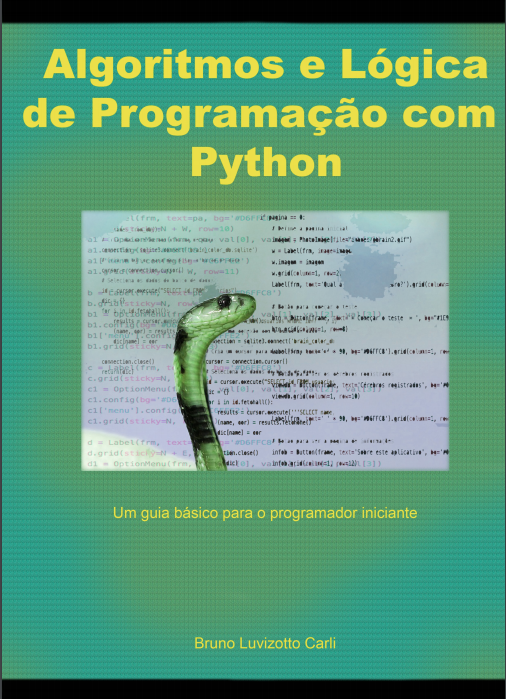

  

© 2017 by Bruno Luvizotto Carli

 

 

 

Esta obra é licenciada sob a Licença Creative Commons
Atribuição–Não Comercial 2.5 Brasil. Você pode
compartilhar e adaptar o conteúdo deste material desde
que os devidos créditos sejam dados ao autor do trabalho.
Para ver uma cópia desta licença, visite
http://creativecommons.org/licenses/by-ncsa/2.5/br/ ou
envie uma carta para Creative Commons, 171 Second
Street, Suite 300, San Francisco, California 94105, USA.

Índices para catálogo sistemático:

1. Computadores: Programação;
2. Programação de computadores;
3. Algoritmos;
4. Linguagem de Programação;

    

2˚ Edição

  

CAPA: Bruno L. Carli.
Adaptado de: https://pixabay.com/pt/animal-a-fotografiaanimal-close-up-1853944/

       

Contato: brunolcarli@gmail.com

           

 

       

BRUNO LUVIZOTTO CARLI

      

Algoritmos e lógica de
programação com Python

      

2˚ Edição 

      

Curitiba, PR

Edição do Autor

2018

  

      
      

> <small>Para meu pai, que me disse
que computação era besteira...</small>

      
      

 

# Sumário

* [Apresentação](sessions/apresentacao.md)
* [Capítulo 1](sessions/ch1.md)
    - [Conceito de Algoritmo](sessions/ch1.md#conceito-de-algoritmo)
    - [Algoritmos para a lógica de programação](sessions/ch1.md#algoritmos-para-a-logica-de-programacao) 
    - [Tipos de algoritmo](sessions/ch1.md#tipos-de-algoritmos)
    - [Python](sessions/ch1.md##python)
* [Capítulo 2](sessions/ch2.md)
    - [Construindo algoritmos com Python](sessions/ch2.md#construindo-algoritmos-com-python)
    - [Variáveis e tipos de dados](sessions/ch2.md#variaveis-e-tipos-de-dados)
    - [Variáveis em Python](sessions/ch2.md#variaveis-em-python)
    - [Constantes](sessions/ch2.md#constantes)
    - [Expressões](sessions/ch2.md#expressões)
    - [Funções Intrínsecas](sessions/ch2.md#funcões-intrinsecas)
    - [Entrada de dados](sessions/ch2.md#entrada-de-dados)
* [Capítulo 3](sessions/ch3.md)
    - [Comentários](sessions/ch3.md#comentarios)
    - [Estruturas Condicionais](sessions/ch3.md#estruturas-condicionais)
    - [Estrutura condicional simples](sessions/ch3.md#estrutura-condicional-simples)
    - [Estrutura condicional composta](sessions/ch3.md#estrutura-condicional-composta)
    - [Estrutura condicional aninhada](sessions/ch3.md#estrutura-condicional-aninhada)
* [Capítulo 4](sessions/ch4.md)
    - [Estruturas de repetição](sessions/ch4.md#estruturas-de-repeticao)
    - [Estrutura for](sessions/ch4.md#estrutura-for)
    - [Estrutura while](sessions/ch4.md#estrutura-while)
    - [Estruturas de repetição aninhadas](sessions/ch4.md#estruturas-de-repeticão-aninhadas)
* [Capítulo 5](sessions/ch5.md)
    - [Estruturas de dados](sessions/ch5.md#estruturas-de-dados)
    - [Estruturas de dados unidimensionais](sessions/ch5.md#estruturas-de-dados-unidimensionais)
    - [Estruturas de dados multidimensionais](sessions/ch5.md#estruturas-de-dados-multidimensionais)
    - [Tuplas](sessions/ch5.md#tuplas) `new`
    - [Dicionários](sessions/ch5.md#dicionarios) `new`
* [Capítulo 6](sessions/ch6.md)
    - [~~Sub-rotinas e programação com arquivos~~](sessions/ch6.md#sub-rotinas-e-programaca-com-arquivos)
    - [~~Sub-rotinas~~](sessions/ch6.md#sub-rotinas)
    - [~~Procedimentos~~](sessions/ch6.md#procedimentos)
    - [~~Funções~~](sessions/ch6.md#funcoes)
    - [~~Parâmetros~~](sessions/ch6.md#parametros)
    - [~~Escopo das variáveis~~](sessions/ch6.md#escopo-das-variaveis)
    - [~~Recursividade~~](sessions/ch6.md#recursividade)
    - [~~Arquivos~~](sessions/ch6.md#arquivos)
    - [~~Bibliotécas e módulos~~](sessions/ch6.md#bibliotecas-e-modulos)
* [Referências Bibliográfcas](sessions/referencias.html)

